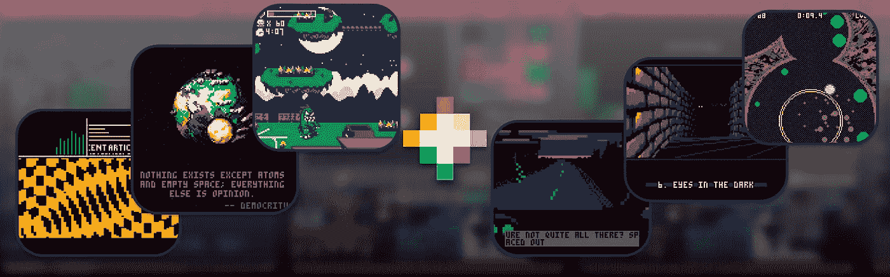

# 通过限制创造:PICO-8-幻想控制台

> 原文：<https://medium.com/swlh/creativity-through-limitation-pico-8-fantasy-console-175294e13332>

这是“通过限制创造”系列的第二篇文章。来看看第一个: [8 位演示场景](/@megus/creativity-through-limitation-8-bit-demoscene-68266b918e4a)。在本文中，我将向您介绍幻想主机 PICO-8，并用它重新创建两个经典的 demoscene 效果。

你上一次只是为了好玩而编码是什么时候？如果你和我一样，那么这已经很多年没有发生了。然而，大约一年前…