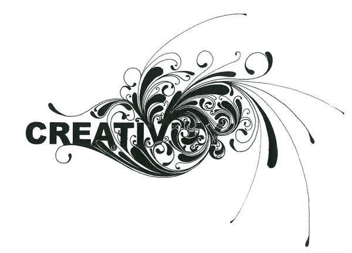
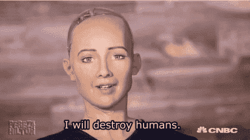
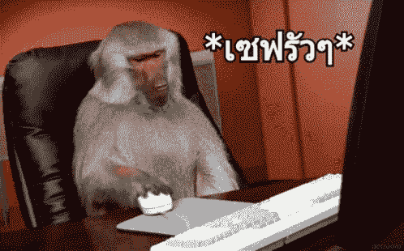
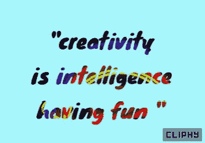
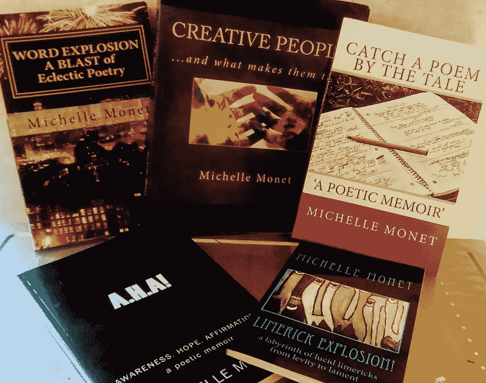

# 在未来几年，创造力将变得更加重要

> 原文：<https://medium.com/swlh/creativity-will-become-even-more-important-in-the-coming-years-615fe334c58d>

为什么未来更需要创意人员。

deviantart

> 右脑思考者们，你们的时代已经到来——这是创造性思维的时代。在不太遥远的未来，创意将统治世界。迈克尔·库珀

## 你相信我们这些有创造力的人会统治世界吗？

或者拥有比我们想象的更好的未来？

我当然希望如此！

我今天读了这句话，当然我感到充满希望。

我也很*好奇*它的有效性。所以，我去研究了一下。

我从几位首席执行官那里发现了一些非常令人鼓舞的关于创意人员未来的事情:

# 好消息！

> *“……目前，经济更重视创造性较低、量化程度较高的技能，比如数学和科学。我相信，这种平衡在未来会向有利于创造力和创意产业的方向倾斜。”— J.L .亨利*

呜哇继续……

**所以，机器人不会在未来接管大部分人类的工作？**

tenor.com

## 许多首席执行官的回答是否定的！

> 有些人认为创意产业将不会受到人工智能革命的影响……他们错了。可以肯定的是，MACHNES 将无法在短时间内创作出与我们的灵魂对话的故事，或者设计出策略……”——William Gadea，IdeaRocket 的创始人&创意总监

我很高兴机器将不能创造故事。你不是吗？

> 随着技术的不断进步，机器将履行分析师和精算师的许多职能。****创造力和想象力等无法编入电脑的技能，将变得更令人垂涎，因此成为所有企业中更有影响力的组成部分。”—* 本·劳埃德，[地产公司的首席运营官·穆斯](http://www.propertymoose.co.uk/)***

对于我们这些可能会感到很多不确定性的创意人员来说，这是非常令人鼓舞的。

> 但是我们业务的某些部分——例如购买和测试——将在不到五年的时间里被机器取代。低端创意将是下一个目标:展示广告，为当地企业设计的广告模板。我想可能有一些工具可以帮助设计师——比如设计的语法检查，它会问:你确定这种颜色组合吗？你可能想检查标题层次。看起来你在这里有分离问题！最终，设计就像语法一样遵循规则。”—j·r·罗琳

昨天我和一个很棒的作家朋友通电话，他说了这个有趣的评论:

> 在未来，有写作能力的人会被视为魔术师。

deviantart.com

## 哇哦。魔术师？

为什么

我们这些作家和擅长文字的人将会很受欢迎，我们将会是一个稀罕物。

太好了！

# 任何猴子都能做网站？

tenor.com

我的男朋友经常为公司设计网站。他说现在几乎任何一个白痴都能做到，所以他的技能远没有那么有价值。是的，现在任何人都很容易就能弄明白怎么做，而且只花很少的钱。

> “有人曾经告诉我，任何一只猴子都可以做一个网站。是的，任何猴子也可以挖一个洞，然后在里面插一株植物，但这并不意味着它会茁壮成长。日照、土壤类型、水需求、所需空间……这就是策略。——丽莎·基普斯·布朗，[格林商业资源公司](http://www.glerin.com/)总裁兼首席执行官

# 那么创意产业的未来是什么样的呢？

我真的被我读到的所有关于我们这个世界的创意的新闻所鼓舞。在未来的岁月里，我们的创造性思维能力将是一笔重要的财富。

> *创造力是智力的最高形式，是一种不容易被机器复制的智力。*

tenor.com

# 创意摇滚！！让我们继续玩得开心。这可能是我们的时代。

**感谢阅读！**
www.michellemonet.com

米歇尔·莫奈已经出版了 5 本非小说类书籍，包括 4 本诗歌回忆录。她即将出版的回忆录将讲述她在演艺圈的生活，包括她幸存的家庭暴力、恐慌症和对处方药的依赖。这将是一个救赎和治愈的故事。即将推出！

[**https://tinyurl.com/y9xeme5y**](https://tinyurl.com/y9xeme5y)

______________________________________________________________

联系方式-
*michelle@michellemonet.com
www.michellemonet.com*

## 这篇文章发表在 [The Startup](https://medium.com/swlh) 上，这是 Medium 最大的创业刊物，拥有+409，714 名读者。

## 在这里订阅接收[我们的头条新闻](http://growthsupply.com/the-startup-newsletter/)。

 [## 你得到一个故事，你得到一个故事，你…

### 好的。奥普拉启发了这个故事。

medium.com](/women-writing-memoir/you-get-a-story-and-you-get-a-story-and-you-af266699dbb5)  [## 女性写作回忆录出版了！

### 我把深深的悲伤转化为行动。

medium.com](/women-writing-memoir/the-women-writing-memoir-publication-is-born-15a77d368cb9)