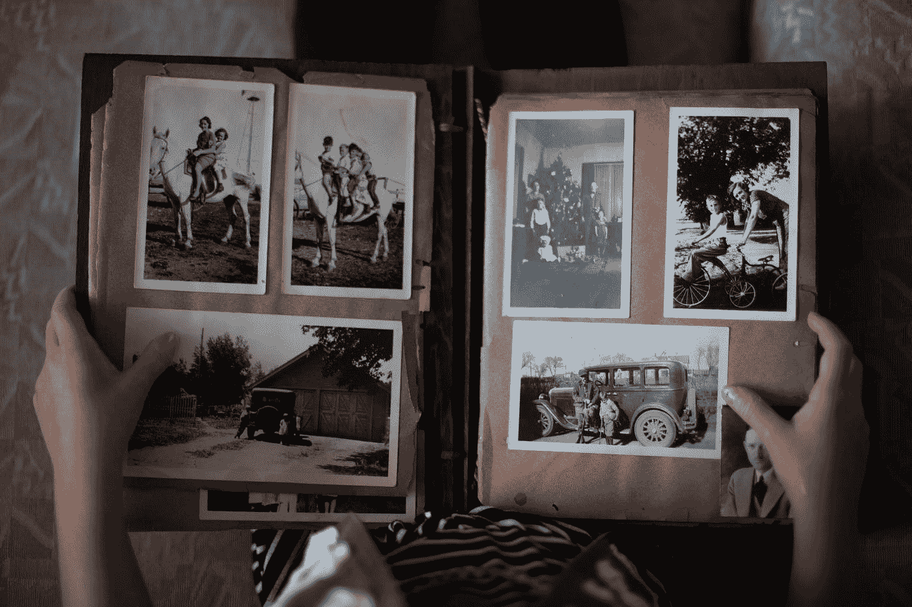

# 创作者:如何让遗产发挥作用，为什么它比以往任何时候都重要

> 原文：<https://medium.com/swlh/creators-how-to-create-legacy-work-and-why-it-matters-more-than-ever-a2422c6b4047>

传统水平作品的重要性，即使商店买的味道更好

Photo by [Laura Fuhrman](https://unsplash.com/@lauracathleen?utm_source=medium&utm_medium=referral) on [Unsplash](https://unsplash.com?utm_source=medium&utm_medium=referral)

他的故事更像是一个寓言。这是对工艺和遗产之间关系的讨论，与烹饪关系不大，一切都与遗产有关。如果你希望给你的作品留下遗产，请继续阅读。