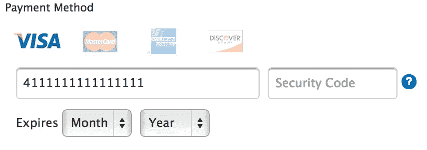

# Javascript、Ruby 和 C 中的信用卡验证

> 原文：<https://medium.com/swlh/credit-card-validation-in-javascript-ruby-and-c-4b0a9b245766>


说到编程，我遇到的每一种语言都有其独特的怪癖和优点。我想通过编写一个信用卡检查器来比较几种常见语言的语法差异。这个应用程序的目标是接受信用卡号码的输入，然后识别信用卡号码在语法上是否有效。这篇文章主要是比较低级语言和高级语言。如果你想看看我是如何实现信用卡检查器的，请在这里查看我在 [C](https://gist.github.com/joel29dec/62b2b256e4a51353d4014c43504c5ff6) 、 [Ruby](https://gist.github.com/joel29dec/44fa82a9a522ed27a66a4255f9e0ecd8) 或 [Javascript](https://gist.github.com/joel29dec/4e95cefe8dfeb112ff64900f76e5bd3d) 中的代码。



Credit Card Payment Method

我们大多数人在为网上购物付款时都遇到过这个屏幕。通常在前端，Javascript 将处理验证，在调用被发送到服务器之前检查信用卡是否是有效的卡。验证检查的过程基于 Hans Peter Luhn 创建的校验和算法。下面是对 Luhn 算法的一个简单分解。

## 卢恩校验和算法

> 从数字的倒数第二个数字开始，每隔一个数字乘以 2，然后将这些乘积的数字相加。
> 
> 将总和加到没有乘以 2 的数字的总和上。
> 
> 如果总数的最后一位是 0，则该数字有效！
> 
> 以下面的美国运通号码 378734493671000 为例。从倒数第二个数字开始，将最后一个数字乘以 2。
> 
> 7*2 + 7*2 + 4*2 + 9*2 + 6*2 + 1*2 + 0*2
> 
> 结果是:
> 
> 14 + 14 + 8 + 18 +12 + 2 + 0
> 
> 添加产品数字:
> 
> 1 + 4 + 1 + 4 + 8 + 1 + 8 +1 + 2 + 2 + 0 = 32
> 
> 最后将没有相乘的数字相加
> 
> 32 + 3 + 8 + 3 + 4 + 3 + 7 + 0 + 0 = 60
> 
> 校验和 60 以数字 0 结尾，因此它是语法上正确的信用卡号

## 识别信用卡类型

除了校验和之外，信用卡号码也可以识别信用卡公司的类型。Visa 卡以数字 4 开头。万事达卡以数字 51、52、53、54 或 55 开头。美国运通以数字 34 或 37 开头。

# 大局

该解决方案可以分为两部分:

1.  检查卡号是否有效。
2.  识别信用卡的类型。

让我们看看 C 语言的语法，并演练一下代码。

# 卡片长度验证

为了检查卡号是否有效，我们可以在计算校验和之前进行初步检查。我们知道信用卡号码只能是 13、15 或 16。我们可以用一个简单的 while 或 for 循环来实现。

用户的卡号存储在可变卡号中，并且在每次迭代该号码的长度时，最后一位数字将被移除并计数。然后，将检查数字长度的计数是 13、15 还是 16 位。

Javascript 和 Ruby 都有高阶函数，简化了确定变量长度的过程。本质上，在方法或函数长度的掩护下，正在利用类似的过程。

# 校验和验证

通过第一个测试后，下一步是检查校验和是否有效。我们将再次看看 c 语言的语法。

在此示例中，声明了数组编号，并通过枚举了卡号，每个数字都保存在数组编号中。使用此方法存储在数组中的数字与原始卡号相反，因为首先删除最后一个数字并将其存储在第一个索引中。

举个例子，信用卡号码是 4012 8888 8888 1881。使用取模并除以 10 的方法存储数组，得到的数组将是[1，8，8，1，8，8，8，8，8，8，2，1，0，4]。

在 Javascript 中，如果使用高阶函数转换一个数字，在使用高阶函数转换为数组之前，需要先将数字转换为字符串。

可以注意到，当使用 Ruby 方法转换为数组时，转换为特定数据类型的概念也是类似的。Ruby 和 Javascript 的相似之处在于，它们都要求数据是某种特定的类型，并且通常需要将数据强制转换成可用的类型，然后才能使用更高阶的函数对数据类型进行操作。你可以注意到，在我的 Javascript(上图)和 Ruby(下图)的例子中，整数被转换成一个字符串，创建成一个数组，然后映射回整数。

C 的校验和实现起来更干净，因为操作数据所需的类型转换更少。数组使用简单的 for 循环和条件语句来验证数字。

在上面的 C 代码中，创建了一个新数组来克隆数字数组，并从倒数第二个值开始将该值乘以 2。

大部分验证发生在这个嵌套的 if 语句中。首先确定卡号的长度。然后将数组中的数字相加，并检查这一行中的校验和是否有效。

```
sumdigit = (number[i] % 10) + (number[i]/10 % 10);
```

通过检查数组的第一个和第二个索引来验证卡的类型。在这个例子中，Visa 卡以数字 4 开始。

```
cardarray[12] == 4 && accumulator % 10 == 0
```

通过使用高阶函数在 ruby 和 javascript 中实现验证器使它变得相当冗长。Javascript 和 Ruby 中的 C 程序完全有可能使用相同的算法。然而，我想利用语言的高阶功能。

为了在 C 中拆分数组，卡号被克隆并使用两个 for 循环相乘。在 Javascript 中，我发现可以使用 filter 函数将初始数组分成两个数组，每隔一个数字，然后在第一个数组上进行简单的映射，使数字加倍。

然后对乘以 2 的数组求和，并使用 reduce 方法将其添加到未相乘的数组中。如果校验和通过，则对卡阵列的前两位进行切片，以检查卡的类型。卡类型检查的实现类似于 C 语法。通过使用条件语句，然后对每种类型的卡片数组的数字进行评估。

# 总结想法

这篇文章更多的是对低级语言和高级语言编程差异的自我反思。在尝试创建信用卡检查器时，我发现低级语言的语法在解决问题时更简洁，而使用高级语言需要数据类型转换才能使用高阶函数。

如果您想创建一个信用卡检查器并测试您自己的代码。我使用 Paypal 的虚拟信用卡号码来测试校验和以及信用卡类型。如果你想看看，这里有链接。[https://developer . paypal . com/docs/classic/pay flow/pay flow-pro/pay flow-pro-testing/#用于测试的信用卡号码](https://developer.paypal.com/docs/classic/payflow/payflow-pro/payflow-pro-testing/#credit-card-numbers-for-testing)

我每天都在学习更多的代码。如果你有任何提示或建议，我很乐意听到你的意见。