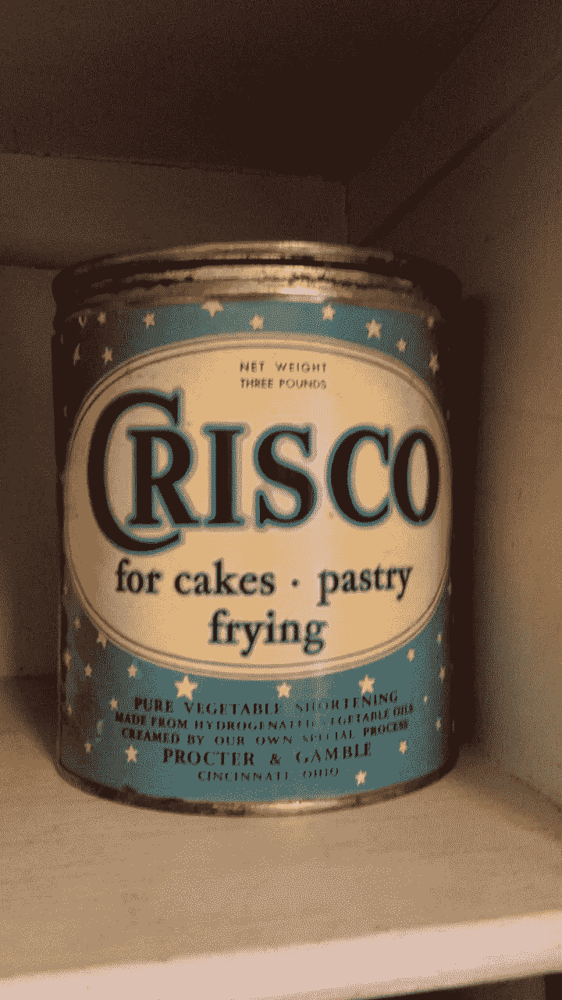

# 克里斯科，技巧&润滑阿片类药物危机

> 原文：<https://medium.com/swlh/crisco-artifice-greasing-the-opioid-crisis-6077e287dbed>

[Wikimedia Commons](https://medium.com/u/c329b6eef5c6?source=post_page-----6077e287dbed--------------------------------) by George D. Buckley

## 利益相关者借用宝洁公司的诡计欺骗美国购买他们的阿片类歇斯底里症

1906 年，猪油(在较小程度上，更贵的黄油)被用于美国各地的各种烹饪，作为饼干、馅饼、蛋糕等的脂肪基料