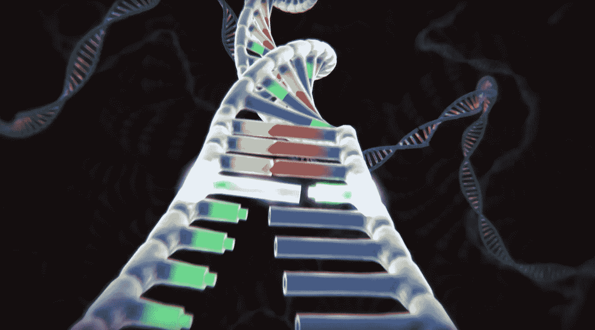

# 多极世界中的 CRISPR

> 原文：<https://medium.com/swlh/crispr-in-a-multipolar-world-9ffa173a682a>

## 基因工程和全球竞争

Photo by McGovern Institute for Brain Research at MIT.

近十年来，被称为 CRISPR 的工具已经席卷了科学界。[缩写代表一个过程](https://www.broadinstitute.org/what-broad/areas-focus/project-spotlight/questions-and-answers-about-crispr)我不想解释，只要说它足够精确地完成工作，最小的基因序列可以被删除、插入或突变成想要的组合就够了。这其中的含义是显而易见的，全球所有顶尖的生物化学家和微生物学家现在都在竞相寻找使用这种方法的最佳技术和解决方案。

CRISPR 大约在 1993 年出现，并开始在一些最大和资金最充足的实验室涉足基因编辑。特别是中国，[第一个在猕猴灵长类动物身上使用这种方法](https://www.sciencedirect.com/science/article/pii/S0092867414000798)，创造了他们所谓的*突变创始人*。没过多久，这个新兴的超级大国就将其兴趣瞄准了人类胚胎。尽管人类受试者不太可能在此期间足月分娩，但仅仅几年后，流氓基因工程师何建奎做出了这样的声明。虽然他的研究被框定为基因外科手术，但他的伦理论点是基于艾滋病疫苗或疗法的缺乏。因此，他针对 CCR5 基因的研究，可以被视为一种合理的干预，cc r5 基因已知有助于免疫抑制病毒。然而，问题在于生物学本身的复杂性。

在所有已知的存在中，有机生命的遗传物质发生了随机突变。只有在选择性压力下，这些突变中的一些才能找到它们的生殖系，在其他条件下传递给其他世代，这些条件可能施加也可能不施加同样的压力。我们对这一过程的粗略理解叫做生物进化。进化有时需要数百万年，经历数百万次突变。其他时候，只有几代人才能带来必要的变化，使一种生命形式完全形成另一种生命形式。CRISPR 可以在瞬间完成所有这些工作。

相对而言，CRISPR 革命令人震惊。生命从来没有能力编辑自己的基因指令。此外，从来没有一种已知的生物拥有如此不可思议的计算能力。[戈登·摩尔](https://www.cs.utexas.edu/~fussell/courses/cs352h/papers/moore.pdf)在 1965 年的一篇论文中预测，每隔几年，计算能力就会翻一番，他是首批商用晶体管公司的创始人之一，后来又领导了微处理制造商英特尔。他是对的。在过去的五十多年里，芯片变得更快、更小、更高效。现在，任何人都可以在手腕上戴上相当于 [Cray-2 超级计算机](https://www.youtube.com/watch?v=yNx3Unb0zsI)的东西，不去模拟核战争，而是在千层面做好的时候提醒他们。数据处理的这一令人难以置信的飞跃现在正在遗传学中找到出路。

对整个人类基因组进行测序的费用大约在 1300 美元左右。根据所使用的方法，一些估计值会更高或更低。要记住的关键事情是每兆字节(MB)的成本[，它正在下降到每兆字节不到 1 美分](https://www.genome.gov/sites/default/files/media/files/2019-06/Sequencing_Cost_Data_Table_Feb2019.xls)。四年前，每兆 4 美分。你可以想象这将走向何方。可以想象，在未来十年，同样的成本动态将会发生，将整个基因组序列的商业价格降低到近 50 美元——相当于一个月的星巴克大杯焦糖玛奇朵。一个人不必是火箭科学家就能理解廉价基因组测试的普遍存在将很可能导致它们被包括在医院怀孕费用中。哪个父母不想至少了解一下他们新生儿的健康风险状况呢？新发现的疾病清单[和已经知道的疾病清单](https://rarediseases.info.nih.gov/diseases/browse-by-first-letter/)；为什么不通过尽早和经常地解决这些问题来避免可能的医疗费用呢？但是，这种数据雪崩的另一个方面将有助于 CRISPR 的准确性，包括遗传相互作用的新发现。

[全基因组关联研究](https://www.genome.gov/about-genomics/fact-sheets/Genome-Wide-Association-Studies-Fact-Sheet) (GWAS)是利用不断增长的数据和处理速度的应用。给定大量测序的基因组图谱，专业人员开始理解特定基因相对于其他基因(包括基因组)之间的关系。[截至本月，已完成近 4000 项研究](https://www.ebi.ac.uk/gwas/)，涉及 13.8 万个关联遗传属性。从精神状况到骨质疏松症、高血压甚至腰臀比，所有的一切都要经过大量的计算。更重要的是，机器学习算法现在正在寻找进入生物信息学的方法。允许特斯拉汽车在镇上自动驾驶的同类效率现在正在识别心脏病和酒精中毒的概率。大多数 GWAS 研究仅受限于完整的和部分的基因样本，这可能是昂贵的。到下一个十年结束时，对小国大小的基因群体的研究将不再有障碍，准确率和概率指标将与虹膜扫描和指纹匹配等生物识别技术相匹配。医学专家[将不再猜测你最有可能自然死亡的年龄](https://www.sciencedaily.com/releases/2019/05/190513081412.htm)，他们会在几个月内知道，如果不是几周的话。

GWAS 数据发现是 CRISPR tooling 作为合法医疗干预措施取得成功的关键。但是乌云正在田野上形成。就在几天前，俄罗斯微生物学家 Denis Rebrikov 透露了他复制何建奎进行的广受谴责的程序的计划。在前苏联国家，有数十万艾滋病毒阳性妇女，其中[几十人对抗逆转录病毒药物](https://www.sciencemag.org/news/2019/06/russian-geneticist-answers-challenges-his-plan-make-gene-edited-babies)没有反应。Rebrikov 打算再次瞄准 CCR5 基因，让这些潜在的母亲放心，知道她们的孩子不会通过怀孕继承病毒。让这个故事更加疯狂的是，Rebrikov 无意将他的疗法局限于 CCR5，而是准备为包括侏儒症、耳聋和失明在内的遗传性疾病提供更清晰的解决方案。在几天前接受[科学杂志的乔恩·科恩](https://www.sciencemag.org/news/2019/06/russian-geneticist-answers-challenges-his-plan-make-gene-edited-babies)采访时，他甚至更进一步说，诸如跑步速度、智商和眼睛颜色等增强功能将不再停留在“神圣的天意”范围内，甚至那些认为这些属性不会改变的人都是“骗子或傻瓜”

中国对研究易变特征并不陌生。正如他们之前用 CRISPR 突变灵长类动物一样，他们从[开始将特定的人类基因转移到猕猴](https://www.cbsnews.com/news/chinese-scientists-insert-human-brain-gene-into-monkeys/)身上，声称已经显著提高了智力评估。即使是建奎的工作也可能让[提高了接受手术的双胞胎](https://www.independent.co.uk/news/science/gene-edited-baby-china-brain-intelligence-hiv-he-jiankui-crispr-a8792386.html)的智力。神经生物学家阿尔西诺·席尔瓦在 [2016 年对 CCR5 的研究中发现](https://www.ncbi.nlm.nih.gov/pubmed/27996938)它的抑制导致小鼠学习能力和记忆功能的提高。传言说剑魁的目的是在防止病毒感染的幌子下提高人类的智力。因为这项研究太新了，而且目前无论是数据还是研究都不能最终确定任何副作用，唯一符合伦理的前进方式是施加国际限制。但是没有什么是容易的。

苏联解体后，随着中国的缓慢崛起，美国自由地将其意志强加于全球社会。从世界银行如何确定贷款资格到世界贸易组织，没有美国的参与，任何事情都不会得到承诺。但在过去几年里，也许是自特朗普当选及其民族主义运动以来，俄罗斯和中国等国家形成了更牢固的关系。十分之七的美国人不喜欢俄罗斯，俄罗斯人也不喜欢俄罗斯。相比之下，绝大多数俄罗斯人和中国人都非常喜欢对方。我们不仅进入了一个机器辅助基因解码正在普及的世界，而且还在削弱美国的影响力。这两个前超级大国和正在崛起的超级大国并不认为基因工程是一个道德难题，而是一个对抗西方统治地位削弱的竞争优势。

随着我们进入计算能力进步的新十年，不断增长的基因组数据和基因工具库将改变对生物学的普遍理解。一个多世纪以来，西方人文主义一直试图应对两次世界大战，这两次大战摧毁了欧洲，迫使西方评估与众不同意味着什么。种族关系、多元文化，包括对各行各业、性别、宗教和种族的接受，已经主导了政治和文化。然而，这本身就是一种独特的文化模式，并不是东方大部分地区共有的普遍主义。当然，他们整合了这种精神气质的一些元素，但普遍不愿意接受被视为对整个慢性西方病理学的无能解决方案的信条。如果需要的话，中国和俄罗斯都不会假装有机会增加人口。他们也不会将基因工程的创新拱手让给西方大学。他们正在标记领域并全面向前推进，给予他们的机构充分的控制权，以便在他们出现的时间和地点找到改进。我们只能祈祷他们将纳入同样的伦理规则，引导科学到这一步，但有些东西告诉我，我们已经进入了一个勇敢的新世界。