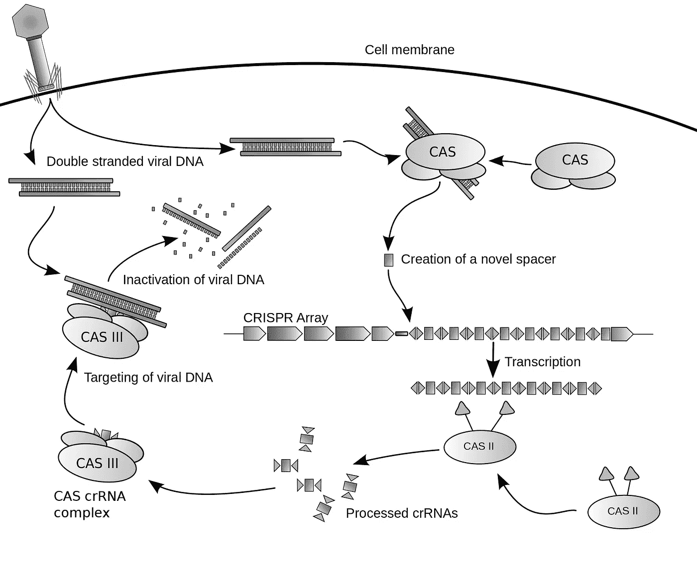
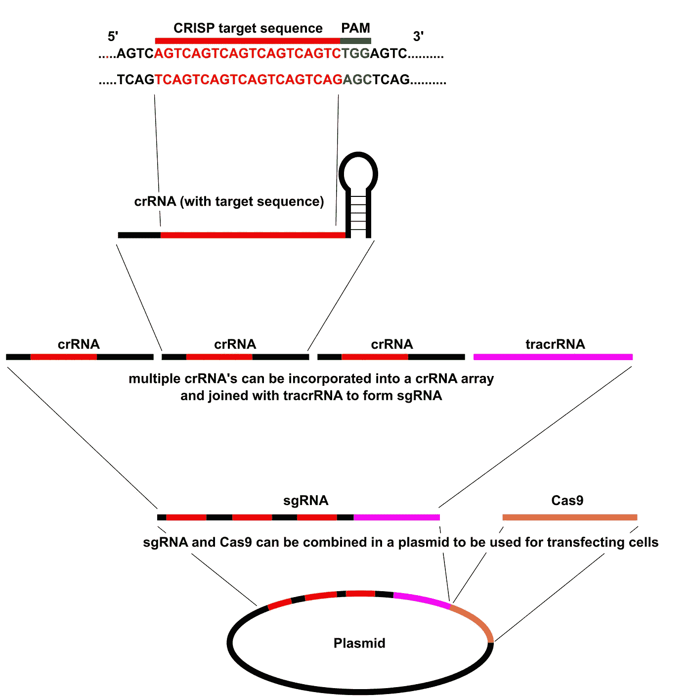

# 克里斯普:你需要知道的是

> 原文：<https://medium.com/swlh/crispr-what-you-need-to-know-8ed1ae4a2a7d>

最近，随着媒体报道的增加和涉及基因编辑的电影的上映，这一过程中涉及的一项技术受到了很多关注，即 CRISPR。尽管这项技术现在因其在基因编辑方面的潜力而广为人知，但普通大众仍不了解它是什么的确切细节，并且它目前的研究范围经常被忽视，因为它对未来创造“设计者”或“超级”人类的可能性以及关于这种应用的伦理问题有更牵强的想法。然而，在这篇文章中，我们先仔细看看这项技术及其意义，然后再仔细看看它的应用范围。

Image from Pixabay

# CRISPR 到底是什么？

CRISPR(成簇的规则间隔的短回文重复序列)是在原核生物如细菌和古细菌的基因组中发现的 DNA 序列家族。这些序列来自以前感染过原核生物的病毒的 DNA 片段，用于在随后的感染中检测和破坏类似病毒的 DNA。因此，这些序列在原核生物的抗病毒防御系统中起着关键作用。

Cas9(或“CRISPR 相关蛋白 9”)是一种使用 CRISPR 序列作为指导来识别和切割与 CRISPR 序列互补的特定 DNA 链的酶。Cas9 酶与 CRISPR 序列一起构成了一种称为 CRISPR-Cas9 的技术的基础，该技术可用于编辑生物体内的基因。这种编辑过程具有广泛的应用，包括基础生物学研究、生物技术产品的开发和疾病的治疗。

Diagram of the CRISPR prokaryotic antiviral defense mechanism

CRISPR-Cas 系统是一种原核免疫系统，它赋予对外来遗传因子的抗性，例如那些存在于质粒和噬菌体中的遗传因子，提供了一种获得性免疫的形式。含有间隔序列的 RNA 有助于 Cas (CRISPR 相关)蛋白识别和切割外来致病 DNA。其他 RNA 引导的 Cas 蛋白切割外来 RNA。CRISPR 存在于大约 50%的测序细菌基因组和将近 90%的测序古菌基因组中。

# 使用 CRISPR-Cas9 进行基因编辑

CRISPR 基因编辑是一种可以编辑生物基因组的方法。它基于细菌 CRISPR/Cas (CRISPR-Cas9)抗病毒防御系统的简化版本。通过将与合成指导 RNA (gRNA)复合的 Cas9 核酸酶递送到细胞中，可以在期望的位置切割细胞的基因组，允许去除现有基因和/或添加新基因。

Overview of CRISPR gene editing

虽然自 20 世纪 80 年代以来，使用各种方法在真核细胞中进行基因组编辑已经成为可能，但是所采用的方法被证明是低效的，并且不适合大规模实施。基因组编辑导致基因不可逆的改变。Cas9 核酸酶像基因剪刀一样工作，打开 DNA 靶序列的两条链，通过两种方法之一引入修饰。通过同源定向修复(HDR)促进的敲入突变是靶向基因组编辑方法的传统途径。这允许引入靶向 DNA 损伤和修复。HDR 利用相似的 DNA 序列，通过掺入外源 DNA 作为修复模板来驱动断裂的修复。这种方法依赖于 DNA 损伤在靶位点的周期性和孤立的发生，以便开始修复。由 Cas9/CRISPR 引起的敲除突变导致通过 NHEJ(非同源末端连接)修复双链断裂。NHEJ 通常会导致修复位点的随机缺失或插入，从而破坏或改变基因功能。因此，CRISPR-Cas9 的基因组工程使研究人员能够产生有针对性的随机基因破坏。

正因为如此，基因组编辑的精度是一个很大的问题。随着 CRISPR 的发现，特别是 Cas9 核酸酶分子的发现，高效和高选择性的编辑现已成为现实。Cas9 提供了一种可靠的方法，在 crRNA 和 tracrRna 指导链指定的特定位置产生靶向断裂。来源于化脓性链球菌的 Cas9 促进了真核细胞中的靶向基因组修饰。研究人员可以很容易地插入 Cas9 和模板 RNA，以沉默或引起特定基因座的点突变，这已被证明对快速有效地绘制基因组模型和与各种真核生物中各种基因相关的生物过程非常重要。一种新设计的 Cas9 核酸酶变体已经开发出来，可以显著减少脱靶操作。称为 spCas9-HF1(化脓性链球菌 Cas9 高保真度 1)，它具有 85%的体内修饰成功率和不可检测的脱靶操作，如通过全基因组断裂捕获和用于测量总基因组变化的靶向测序方法所测量的。

CRISPR-Cas 基因组编辑技术有许多潜在的应用，包括医学和作物种子增强。使用 CRISPR-Cas9-gRNA 复合体进行基因组编辑是美国科学促进会 2015 年年度突破的选择。

# CRISPR-Cas9 的优势

可以说，CRISPR-Cas9 相对于其他基因组编辑技术最重要的优势是简单高效。CRISPR 技术非常简单，易于使用，价格低廉，不像以前的基因编辑技术，如转录激活剂样有效核酸酶(TALENS)。该技术可用于分析基因的相互作用以及遗传差异和表达(表型)之间的关系。它也可以用来敲除基因并用另一个基因代替它来治疗疾病

由于 CRISPR-Cas9 可以直接应用于胚胎，因此与基于使用胚胎干细胞的基因靶向技术相比，它减少了修饰目标基因所需的时间。改进的生物信息学工具可以识别最合适的序列来设计指导 RNA，并且优化实验条件，这使得非常稳健的程序能够保证成功引入所需的突变。

与传统的基因靶向方法相比，在 ES 细胞中使用 CRISPR-Cas9 的主要优势在于，Cas9 诱导的 DNA 损伤将同源重组事件的频率提高了许多数量级。因此，不需要鉴定携带修饰基因的 es 细胞克隆，这简化了产生靶向载体、ES 细胞筛选和验证的程序。通过分离细胞的克隆群体，有可能避免镶嵌现象，并进行深入的质量控制程序，以验证经修饰的基因不携带任何过客突变。

# CRISPR-Cas9 的应用

由于世界范围内人口的增长和对食物的高需求，据报道，由于气候变化和全球变暖，贫困和食物短缺将会大量增加。CRISPR-Cas9 的出现在提高作物产量和预防作物遗传疾病方面显示了更大的前景。这项技术可以用来改造植物基因组。这种趋势技术的应用正在迅速增加，目的是开发非转基因基因组编辑植物，以避免气候变化可能导致的不利变化。科学家们已经使小麦对像白粉病这样的杀手真菌变得免疫，暗示着在一个越来越暖的星球上可以养活 90 亿人口的转基因主粮作物。CRISPR-Cas9 使植物的遗传修饰达到了一个新的水平，例如修饰它们以适应气候变化，提高对恶劣条件的耐受性，减少疾病，提高作物质量和产量。一组研究人员还通过设计定量基因启动子序列对转基因番茄进行了研究，这种方法导致了番茄形状和大小的积极变化。另一项关于水稻的研究表明，种子的大小、数量和重量都有所增加。

使用 CRISPR，研究人员还一直在研究逆转导致失明的突变，阻止癌细胞繁殖，并使细胞不受导致艾滋病的病毒的影响。生物工程师还使用 Crispr 改变酵母的 DNA，使其消耗植物物质并分泌乙醇，有望结束对石化产品的依赖。

这项技术目前的另一个应用是将有害基因引入携带疟疾的蚊子，这是解决疟疾疾病的方法之一。这涉及到随着时间的推移，有生育能力的雌性蚊子的数量增加，希望成功地根除这种疾病。

CRISPR 技术的应用前景是无限的，无法量化，只能预测。根据 Doudna 等人 2017 年的说法，CRISPR 技术旨在帮助治疗癌症，改造人类，使其骨骼强壮，不易患心血管疾病，或者设计具有特定特征的人类，让父母挑选婴儿的性别，眼睛，身高和其他理想特征。科学家们还投入时间研究抗衰老，希望通过这项技术，人类的预期寿命将超过 100 岁。

# 围绕 CRISPR 的误解和道德问题

关于使用 CRISPR-Cas9 进行遗传编辑的一个主要误解是，任何遗传修饰都会反过来影响其后代的基因。然而，这并不完全正确。使用 CRISPR 来修复遗传疾病和其他疾病通常涉及对体细胞的修饰，这些修饰仅限于个体。只有对生殖细胞的改变才会遗传给下一代，而这些改变又会产生深远的影响。

目前，CRISPR 的大多数应用，尤其是涉及人类的应用，是体细胞编辑。然而，即使在被认为对生态系统不是特别重要的动物中进行种系编辑，也必须极其小心地在受控的环境中进行，因为否则的话，后果可能是灾难性的，造成的损害是不可逆转的。这引发了关于基因编辑的主要伦理问题:在被认为过分之前，我们能在多大程度上篡改自然进化。此外，什么是编辑必须考虑的特征和方面也是有争议的，不可能达成共识。

CRISPR 目前的范围使我们能够根据我们是什么样的人来设想未来，要么是一个具有无限可能性的未来，在这个未来中，我们摆脱了目前困扰人类社会的问题，要么是一个反乌托邦的未来，在这个未来中，我们给自己带来了一系列全新的麻烦。毫无疑问，CRISPR 技术是革命性的，像所有的革命一样，它是危险的。CRISPR 最终可以让遗传学研究人员变出任何人曾经担心过的一切——设计婴儿、入侵突变体、特定物种的生物武器，以及其他十几个启示录式的科幻比喻。它带来了生命科学研究实践的全新规则。但是没有人知道规则是什么，或者谁会第一个打破规则。人们只能希望这项技术的使用要经过仔细的考虑，并且在对我们的生态系统的影响进行详细的分析之后，任何种系编辑都要极其小心地进行。