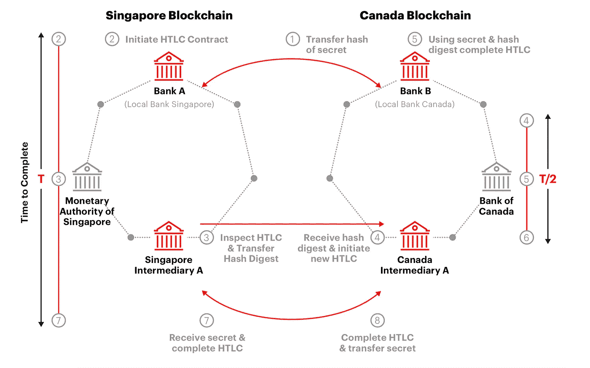

# 使用区块链技术和信任证明进行跨境支付

> 原文：<https://medium.com/swlh/cross-border-payments-using-blockchain-technology-a3e24398953e>

# 现行制度

在一个国家的银行之间结算支付可能是一个复杂而耗时的过程。在结算银行间交易或购买商品时，中央银行和商业银行都扮演着重要的角色。商业银行需要通过在账户和其他银行之间转移余额来结算经济主体(个人或企业)之间的交易。中央银行在这个过程中起着重要的作用。不在同一家商业银行的账户之间的交易将需要通过第三方进行，其中银行或其代表在同一分类账上有资金。不同的商业银行或中央银行有可能充当这种中介，甚至非银行机构也有可能以这种方式运作。结算的频率以及从结算的开始到转账不可撤销的最后一步之间的延迟是实时系统和延期系统之间的区别。

当考虑跨境支付时，可以理解会有额外的复杂性。这反映了代理银行网络的多重要求。首先也是最重要的一点，外国银行必须在他们开展业务的国家的银行有一个账户。因此，金融机构需要在不同的司法管辖区内，在不同的监管约束下运营时，在支付路径、货币兑换、流动性部署和管理等方面达成共识。

# 在区块链的投资

区块链世界的最新头条新闻显示，今年对该技术的投资可能会增加 90%，从 15 亿美元增加到 29 亿美元[1]。这种大幅增长在很大程度上是由于人们对区块链和智能合约如何促进跨境支付产生了浓厚的兴趣，这使得跨境支付更快，需要的中介更少。澳大利亚储备银行的 Michelle Bullock[2]认为，“跨境支付被广泛认为是一个效率显著提高的领域。当前的流程缓慢且成本高昂，涉及大量的法规遵从性负担以及不同辖区的许多不同金融机构。新技术和新商业模式可以用来解决这些摩擦。”她讨论的新技术当然是区块链的技术，特别是智能合约，它能够消除跨境支付中冗长乏味的流程。

在所有领域，区块链的研发都在加快步伐，我们现在正处于实施区块链解决方案的时期。受人尊敬的市场观察家 IDC 写道:“区块链正在迅速成熟，我们已经到达了一个拐点，实施正在快速超越试点和概念验证阶段[3]。”换句话说，现在是银行认真利用这项技术的时候了。

# 中央银行数字货币

为了便利跨境支付，最重要的发展领域之一似乎是中央银行数字货币。数字货币与我们都熟悉的加密货币(比特币、以太币、莱特币等)有许多相似之处，但也有微妙的重要差异。比如，比特币还不是一种普遍接受的支付手段，因此还不能作为交易媒介。此外，加密货币的可用性随着其成为购买力不稳定的投机工具而降低。以既定货币计价的 CBD 可以解决这些问题。CBDC 的稳定至关重要，而有助于实现这一点的一件事是一个可适用于 CBDC 的货币政策框架，允许广义消费价格指数长期保持稳定[4]。全球超过 40 家央行正在试验 CBDCs [5]，最近在 2019 年 5 月 28 日，一位欧洲央行(ECB)官员站出来支持这一想法。欧洲央行的维塔斯·瓦西里奥斯卡斯说“代币是一种无记名资产，这意味着在交易过程中，发送方将价值转移给接收方，无需中介。这从根本上不同于当前的系统，在当前的系统中，中央银行借记和贷记账户，而不转移实际价值[6]。”从这句话中可以推断出，数字货币与区块链技术密切相关，尽管没有明确说明。然而，区块链无疑参与了加拿大银行(BoC)和新加坡金融管理局(MAS)之间的首次此类交易。本月(2019 年 5 月，撰写本报告时)，两家央行使用 CBDCs 进行了首次使用区块链技术的跨境支付[7]。

Figure 1\. Schematic view of the HTLC used to process the transfer between MAS and BoC. [Image source](http://www.mas.gov.sg/~/media/ProjectUbin/Jasper%20Ubin%20Design%20Paper.pdf).

中国银行(Jasper)和 MAS (Ubin)的区块链项目是在两个不同的平台上开发的:Cora(埃森哲)和 Quorum(摩根大通)。由于埃森哲和 Quorum 开发的两个巨大的区块链平台提供了技术支持，这两家央行得以证明无需任何中介即可实现支付对支付(PVP)结算。通过使用哈希时间锁定合同(HTLC)，这是一种智能合同，如果在特定时间范围内不满足条件，将资金返还给发送方，资产将被锁定或限制，直到不完全满足条件，此时资产将全部转移到所需的钱包地址，请参见图 1。以获得这方面的概述。这是区块链技术在金融领域迈出的里程碑式的一步，这一成功的实验证明，结算可以在不同的国家、不同的货币和不同的区块链平台上进行。

根据在 Bitcoin.com 发表的一份报告，事实仍然是 25%的智能合同包含严重的错误。该报告指出，调试部署套件和专业的反编译器在识别错误方面是有用的，但它们绝不是足够全面和可靠的，不能单独依赖。虽然不是绝对正确的，但是避免智能合同中的严重错误的最好方法是通过彻底的审计过程。专业审计公司 Hosho 已经审计了价值 10 亿美元的智能合同。他们声称，60%的合同至少有一个安全问题，1/4 的合同有严重的漏洞。

在高风险的情况下，参与交易的各方必须确保资金将被转移到正确的位置，并且个人记录不会有风险。如果包含错误的智能合同被提交给区块链，它们将被永久且不变地记录，因此，在智能合同被用于国家税务系统之前，智能合同被设计得完美无缺符合所有个人的利益。信任证明(PoT)拥有唯一的专利协议，专门设计用作保证层，防止执行无效或不安全的智能合约。一旦智能合约被设计为正确地促进交易，就可以通过委托层和超级委托层来审计该合约。假设最初的合同有 5%的机会包含一个致命错误，审计过程将把最终合同包含一个错误的概率减少到少于 5 亿分之一。虽然最初的合同被认为风险太大而无法部署，但在经过精心挑选的高技能人员的审核后，无效合同执行的风险可以忽略不计。有了工作，区块链的好处才能真正显现出来。关于 PoT 协议的更多细节，请参考 theproofoftrust.com 的白皮书。

# 结论

总之，银行需要一种简单、廉价和高效的方式来完成跨境交易。斯科特·亨德利(Scott Hendry)的话呼应了米歇尔·布洛克(Michelle Bullock)的观点，他说，“跨境支付的世界是复杂而昂贵的:我们探索使用 DLT(分布式账本技术)来降低一些成本并提高这些支付的可追溯性的旅程产生了许多教训[5]。”然而，需要更多的银行采取中国银行和新加坡金融管理局的步骤，以确保这些项目成为国际交流的主要手段。随着区块链和智能合约发挥更大的核心作用，安全程序将需要得到加强，这就是锅的突出特点。

# 参考

1.块数据。“分解福布斯区块链 50 强。” *Medium* ，Blockdata，2019 年 4 月 24 日，Medium . com/block data/breaking-down-the-Forbes-区块链-50–2f44e 9902537。

2.IMB 和 OFIF (2018) *央行数字货币*，访问[https://www . om fif . org/analysis/reports/reports/Central-Bank-Digital-currences/](https://www.omfif.org/analysis/reports/reports/central-bank-digital-currencies/):。

3.洪水，加里。“IDC: 2019 年全球区块链投资可能会增长 90%。”*THINK Digital Partners*2019 年 3 月 5 日[www . THINK Digital Partners . com/news/2019/03/05/IDC-2019-see-90-jump-global-区块链-investment/](http://www.thinkdigitalpartners.com/news/2019/03/05/idc-2019-see-90-jump-global-blockchain-investment/) 。

4.博尔多、迈克尔和安德鲁·莱文。“央行数字货币的好处。”*中央银行数字货币的好处| VOX，voxeu.org/article/benefits-central-bank-digital-currency. CEPR 政策门户*，2017 年 9 月

5.力量，本杰明。“央行对区块链的兴趣比你想象的要大。”breaker mag*2019 年 4 月 8 日，breaker mag . com/central-banks-is-more-interest-in-Japan-than-you may-think/。*

6.卡特里，尤吉塔。"欧洲央行官员表示，批发央行数字货币是一个“可行的选择”. " *CoinDesk* ，CoinDesk，2019 年 5 月 28 日，[www . coin desk . com/ECB-official-says-wholesale-central-bank-digital-currency-a-vivable-option](http://www.coindesk.com/ecb-official-says-wholesale-central-bank-digital-currency-a-viable-option)。

7.加拿大银行和新加坡金融管理局(2019) *利用分布式账本技术实现跨境高价值转账*，可从[http://www . MAS . gov . SG/~/media/project ubin/Jasper % 20 ubin % 20 design % 20 paper . pdf](http://www.mas.gov.sg/~/media/ProjectUbin/Jasper%20Ubin%20Design%20Paper.pdf)获取:

8.塞奇威克，凯。"所有智能合同中有 25%包含严重错误."*比特币新闻*，2018 年 8 月 29 日，News . Bitcoin . com/25-of-all-smart-contracts-contain-critical-bugs/。