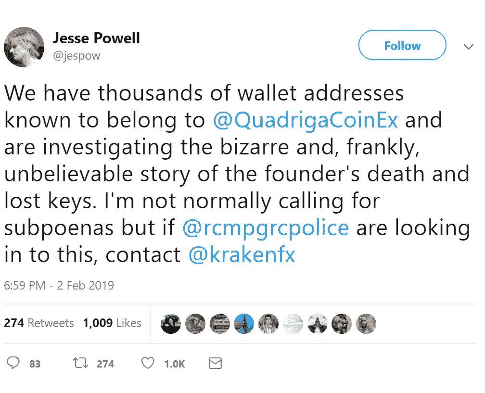
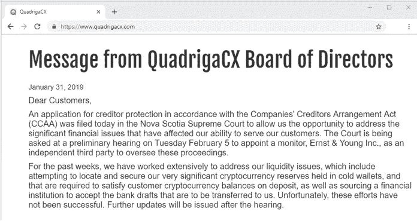

# Crypto Exchange 已故首席执行官持有唯一一把钥匙，可以解锁 1.45 亿美元的客户硬币

> 原文：<https://medium.com/swlh/crypto-exchange-ceo-deceased-holding-only-key-that-can-unlock-145-million-in-customer-coins-c4dec286db19>

数字资产交易所 Quadriga CX 有一个价值约 1.5 亿美元的问题，几乎已经解决。根据 1 月 31 日在哈利法克斯新斯科舍提交的法庭文件，这家加密初创公司无法检索为其客户持有的约 1.45 亿美元(1.9 亿加元)的比特币、以太币、莱特币和其他数字令牌。总部设在温哥华的 Quadriga CX 公司也无法支付他们所欠的 7000 万加元现金。

Quadriga CX 公司的数字钱包似乎在 Quadriga 首席执行官杰拉尔德·科顿去世后失去了，他于 12 月 9 日因克罗恩病并发症在印度去世，年仅 30 岁。

根据证词，该交易所的线下钱包大约有:

*   26500 比特币(9230 万美元)
*   11000 比特币现金(130 万美元)
*   11，000 比特币现金 SV(707，000 美元)
*   35000 比特币黄金(352000 美元)
*   20 万莱特币(650 万美元)
*   43 万乙醚(4600 万美元)

首席执行官 Gerald Cotten 一直很注意自己的安全，他用来运营和管理这家 5 年前的企业的笔记本电脑、信息系统和电子邮件地址都被加密了。据他的妻子珍妮弗·罗伯逊(Jennifer Robertson)说，他是负责资金、硬币、会计和银行业务的人，为了不被黑客攻击，他将大多数数字货币转移到了冷库中。

鉴于加密货币交易平台经历了黑客的许多麻烦，他的安全措施实际上似乎非常聪明。此外，仅去年一年，虚拟货币平台就遭受了至少五次重大攻击。日本恰好是世界上一些最活跃的数字资产交易所的东道国，也经历了两次已知的最大的加密黑客攻击:2014 年的 Mt. Gox 灾难和去年冬天 Coincheck Inc .近 5 亿美元的数字代币被盗。

问题是他们找不到他的密码或任何业务记录。他的遗孀住在哈利法克斯郊区，在法庭文件中宣布，专家和专业人员被请来侵入科滕的其他电脑，手机只取得了“有限的成功”，试图绕过加密的 USB 密钥也受到了阻碍。

*“在 Gerry 去世后，Quadriga 的加密货币库存变得不可用，其中一些可能会丢失，”* Robertson 表示，并继续说该公司对加密货币的访问已经*“严重受损”*，该公司已经无法协商不同支付处理器提供的银行汇票。

*“在过去的几周里，我们一直在努力解决我们的流动性问题，包括试图找到并保护我们存放在冷钱包中的非常重要的加密货币储备，这些储备是满足客户加密货币存款余额所必需的，以及寻找一家金融机构接受将转移给我们的银行汇票，”*该公司表示*。"不幸的是，这些努力没有成功。"*

像往常一样，人们开始在 Reddit 的在线论坛上讨论这个问题，人们开始怀疑这整个业务是否是一个骗局，呼吁集体诉讼，甚至提出阴谋论，谈论首席执行官是否甚至没有去世。

***引文:***

*(未注明)。检索自 https://www . Bloomberg . com/news/articles/2019-02-04/crypto-exchange-founder-dies-leaves-behind-2 亿-problem*

*smoocheviewallace。(未注明)。公司损失了 1 . 45 亿美元，因为唯一知道密码的人死了。检索自 https://www . ebaumsworld . com/articles/company-loss-1.45 亿美元-因为唯一知道密码的人死了/85877919/*

*如果您想了解更多，请访问 BIDITEX 页面并提出您的问题，关注我们的*[*Twitter*](https://twitter.com/biditex_com)*，* [*脸书*](https://www.facebook.com/biditex/) *，*[*Medium*](/@biditex)*，*[*Telegram*](https://t.me/biditex%20%28edited%29)*等。投标变更同***。**

**

## *这篇文章发表在 [The Startup](https://medium.com/swlh) 上，这是 Medium 最大的创业刊物，拥有+421，678 名读者。*

## *在这里订阅接收[我们的头条新闻](https://growthsupply.com/the-startup-newsletter/)。*

**