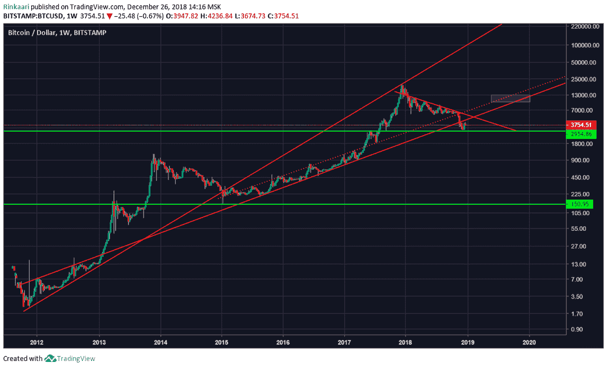
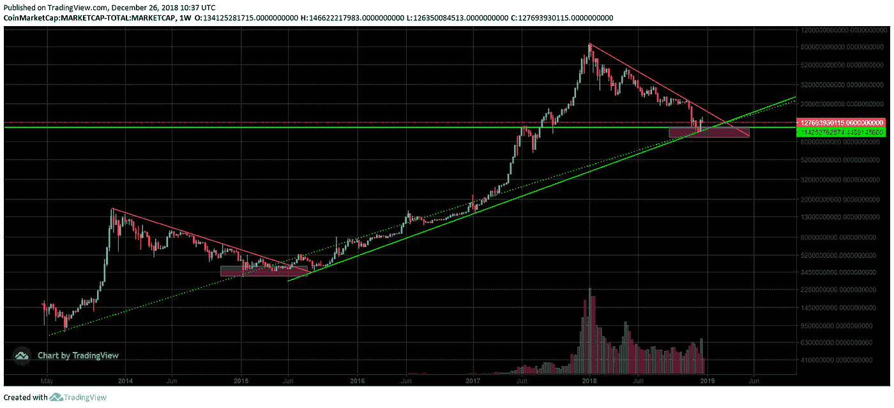

# 2019 年密码市场有什么值得期待的？奔牛节还是另一场大屠杀？

> 原文：<https://medium.com/swlh/crypto-market-forecast-2019-33ce2d1a24f3>

加密货币在 2018 年没有他们最好的(咳咳)一年。与其流泪埋葬整个市场，不如让我们试着去理解到底发生了什么，我们将走向何方。

Crypterium Research 曾[预测](https://hackernoon.com/crypto-bloodbath-why-has-the-market-fallen-3-times-and-what-comes-next-6d466015901a)价格将跌至 3000-5000 美元，并在 7 月份出现 ICO 市场危机，现在我们准备提供对 2019 年市场的深度和全面预测，包括主要趋势、主要参与者的发展、价格动态、法规更新等。向下滚动以了解密码市场在新的一年将会发生怎样的变化。

## **马棚领路**

2018 年是许多加密项目艰难测试的一年。在达到 8000 亿美元的峰值后，加密市场的资本已经缩水 88%，现在正在寻找一个标志着新周期开始的点。

最著名的加密基金之一潘迪拉资本损失了超过 70%的资产净值。大型矿业公司比特大陆在 2018 年第三季度亏损 7.5 亿美元，而第四季度可能更糟。专注于数字资产和区块链的资产管理公司 Galaxy Digital 也损失了数亿美元。

这种修正催生了一种新趋势，即大规模推出稳定货币——加密货币，旨在将价格波动的影响降至最低，其价值与传统货币挂钩，如美元或欧元。包括双子星座和比特币基地在内的许多主要玩家都争先恐后地创造他们的项目，以征服垄断者——系绳公司的市场。最有可能的是，这一趋势将在 2019 年继续，并将对整个市场产生积极影响。

## **机构入侵**

市场的下跌并没有排除业内大玩家的兴趣。相反，市场的调整和重估为他们指明了一个很好的切入点。2019 年需要等待的关键事件是机构投资者正式进入市场的基础设施的启动。

纽约证券交易所的运营商将于 2019 年推出比特币期货平台，纳斯达克将于明年效仿，而富达决定为 BTC 和瑞士联邦理工学院推出机构平台。所有这些工具将允许机构自由获取、存储和使用任何加密货币(主要是 BTC)。这些决定代表了密码市场向更容易获得、更有用和更受监管的工具发展的关键转变。

## **交易所在寻找增长点**

加密市场的主要参与者——交易所——也经受了市场的彻底考验。日交易量从峰值的 700 亿美元下降到平均 150 亿美元。所以 2018 年是业务扩张和寻找增长点的时候也就不足为奇了。

例如，最大的交易所币安已经开始积极地[发展](https://www.binance.com/en/blog/284296426230820864)像币安实验室、研究院和研究这样的计划，并扩展到新的地区，在马尔他、乌干达和泽西开设子公司，以获得许可证并进入菲亚特市场。Okex 推出了数字资产交易所开放合作伙伴计划，这是一个由 OKEx 赞助的交易所联盟，为交易所的建立提供帮助，并为它们提供解决方案。火币已经创建了自己的衍生平台，并计划发布自己的 stablecoin。

我们已经[告诉过](https://crypterium.com/news/open/40dcde17-cd85-455c-823d-38b29d251753)你的另一个趋势是——密码交易所正在研究分散化的解决方案。是的，你没听错。自加密市场开始以来，就有这样一个悖论:数字资产背后的主要思想是去中心化，但主要参与者是集中的。这种情况可能会在 2019 年发生变化。

能够改变加密交易所概念的事件是币安 DEX 的推出。其他顶级玩家通常会跟随这些趋势。
Bithumb 和 Bitfinex 已经在以太坊的区块链上启动了他们的 DEX，并计划在 EOS 区块链上进行实施 DEX 的实验。

2019 年，由于引入了高性能分布式账本技术(DLT)的技术实验，并将其活动纳入受监管的全球贸易，交易所也可能发生变化。

## **价格动态**

2018 年，比特币出现了-84%的修正，重复了之前市场周期的修正水平。例如，2015 年的价格修正幅度为-86%(从 1172 美元到 163%)，而 2011 年的价格修正幅度更大，为-93%(从 32 美元到 2 美元)。

Crypterium 之前进行的研究[将今年比特币的价格区间定义为 3000 至 5000 美元之间。目前比特币在这个区间交投活跃，突破了 6000 的支撑区。然而，最近的调整使 BTC 价格在 3000 到 4000 美元之间。](https://hackernoon.com/crypto-bloodbath-why-has-the-market-fallen-3-times-and-what-comes-next-6d466015901a)

基于 BAKKT 和纳斯达克期货推出等重大基本面因素，预计 2019 年价格动态将是积极的。使用对数标度的技术分析显示，比特币可以增加到 12，000 美元，标志着 2020 年的进一步增长。那一年非常接近另一个基本面因素——BTC 减半日期(比特币网络的整体奖励减少 50%)。历史模式显示，每次价格减半后，比特币价格都会在一年后飙升。

让我们也来看看加密市场的总资本。根据我们的分析，加密市场资本达到了类似的底部，如 2014-2015 年周期，而资本水平的关键支持水平现在是 1000 亿美元。我们预计，2019 年，市场将能够突破阻力(红线)，企稳并开始增长。

基于回顾性数据和有利的基本面事件，我们可以预计到 2019 年底总资本回报率至少为 3000-4000 亿美元。总的来说，这一事实与我们对 BTC 价格的预测保持一致，价格将上涨 3 倍。

## **替代硬币证明用例**

2019 年，最强的项目将是那些证明自己用例的项目。目前，替代硬币市场尚未走出操纵价格的阶段。具有严重用例的替代硬币可以在市场上修改，并在不久的将来展示积极的动态。最佳解决方案将由市场决定。

在很大程度上，2017-2018 年的趋势将会重复。目前，最受欢迎和使用最多的数字资产是 BTC。比特币将继续设定市场的方向，但其影响力将逐渐下降，因为许多具有稳定硬币和法币的替代硬币的直接交易 peerings 的出现。2019 年将是大多数项目的用例搜索年。只有找到它的人才能生存，其他人将失去他们的价值。因此，altcoin 的使用情况越严重、越庞大，它对 BTC 的依赖就越小。

明年有可能会确定市场领导者。用例的主要方向是支付和资金转移、供应链和数据管理。在这些领域，可能会出现来自 altcoin 市场的最佳解决方案，它们将以新的方式引领行业。

还有另一个有趣的趋势——出现了一种可以与分布式账本技术竞争的新技术解决方案——有向无环图(DAG)。对于分布式数据记录，这种解决方案速度更快，可扩展性更强。像 Hedera Hashgraph 这样在 ICO 期间筹集了 1 亿美元的项目的全面启动定于 2019 年，如果它们成功，密码世界可能会永远改变。

## **STO vs ICO:未来如何？**

整个 2018 年，ICO 市场呈现负面趋势，投资金额逐月减少。投资的高峰是在 2018 年 1 月，金额为 15 亿美元，11 月，这一金额下降到 1.8 亿美元，这意味着[下降](https://www.icodata.io/stats/2018)近 90%。以太坊(ICOs 期间使用的主要货币)的衰落本身就导致许多公司削减成本和员工，以适应当前的形势。

当市场出现下跌和修正时，许多投资者开始意识到他们投资的有效性是有问题的。ICO 业态逐渐脱离众筹方案，来到封闭私售。推出 ICOs 的最新项目在质量上已经远远优于 2017 年开展的项目。然而，筹资的负面动态并没有停止。在这种情况下，一种新的筹资方式——STO(证券代币发行)的出现就不足为奇了。

[STO](/@tatianakoffman/your-official-guide-to-the-security-token-ecosystem-61a805673db7) 意味着对合格私人投资者的吸引力增加，因为它赋予了从公司活动中获得收入的权利，以及由于公司必须满足监管机构的所有要求而保护他们的利益。STO 面临的主要挑战是遵守令牌持有者原籍国监管机构的要求。

2018 年 6 月，区块链 STO 证券化平台宣布在 STO 筹集了 5 亿美元(Lottery.com 凯罗斯，22x)，安全令牌平台 Tzero 筹集了 1.34 亿美元。

尽管 STO 越来越受欢迎，但现在取消 ICO 还为时过早。因为 ICO 本质上是一个普通的、未被认可的、拥有适度资本的投资者参与投资活动的唯一途径。同时，随着新的普通投资者的涌入和稳定的市场增长，ICO 上的趋势可以取得回报。

尽管 2018 年有所下降，但许多优质项目的收入超过了 1 亿美元(Telegram—17 亿美元，filecoin—2.57 亿美元，dfinity—1.95 亿美元)。然而，一个严重的升值是[预计](https://www.ccn.com/bitmex-ceo-arthur-hayes-2019-to-be-year-of-reckoning-for-major-ico-funds/)后，他们将进入二级市场。

## **规定**

在美国，市场由主角证交会主导，它仍然认为 BTC 和 ETH 不是证券。与此同时，监管机构引发了几起丑闻。例如，Paragon Coin 和 Airfox 被罚款 25 万美元，并必须退还在美国的所有众筹投资。这次 SEC 的活动让市场非常害怕。因此，大多数 ico 冻结了他们的公关活动。

另一方面，另一个美国监管机构——CFTC——[承认](https://ambcrypto.com/bitcoin-btc-futures-on-nasdaq-confirmed-by-company-executive-to-be-launched-in-first-half-of-2019/)比特币期货是一种商品。这是最大的市场事件之一，因为它导致了 ICE BAKKT 和 Nasdaq 将 BTC 纳入其交易所上市的举措。

反过来，欧洲在密码监管方面仍未做出决定。对于监管的必要性有一些一般性的建议，但没有取得重大进展，尤其是在欧盟层面。有些国家有地方性法规，但它们只规范市场的某些部分。主要要求是完全符合反洗钱标准。

在一些国家，立法越来越严格——[爱沙尼亚](https://cryptovest.com/news/estonia-prepares-to-tighten-cryptocurrency-regulation/)就是一个很好的例子。在其他国家，比如马耳他，情况正好相反，政府希望在银行系统中采用加密货币。《虚拟金融资产法》( VFA)在马耳他的推出使马耳他成为世界上最具吸引力的加密货币管辖区之一。最大的交易所正在积极向那里转移。

另一个积极的迹象是建立了一个单一的全球反洗钱监管机构。总部设在巴黎的金融行动特别工作组——FATF，将在明年六月前建立第一个监管数字资产的规则。这是为监管者创造国际标准的重要一步。世界各地的司法管辖区将被要求许可或监管交易所、ico 和提供加密钱包的公司，以帮助消除加密货币在洗钱、恐怖融资或其他犯罪中的使用。

与此同时，自 2017 年以来，亚洲市场一直保持负面议程。去年在监管方面有很多限制。现在情况看起来稍微好一点了。有很多有趣的解决方案，比如[将](https://www.coindesk.com/chinese-arbitration-court-says-bitcoin-should-be-legally-protected-as-property))比特币作为财产保护，允许购买。韩国仍然是最大的加密市场之一，该国正在积极尝试监管它。监管方面最引人注目的一步是[禁止匿名交易和禁止未成年人和政府官员交易，以及比特币作为汇款方式的合法化。](https://cointelegraph.com/news/south-korea-s-regulatory-evolution-important-steps-for-crypto-exchanges-icos-and-blockchain)

## **结论**

明年市场会稳定下来并开始增长，因为周期总是在变化。监管服务、交易所和价格动态预测方面有很多积极的消息。冷水淋浴是社区需要的东西，有了经验教训，这个行业可以继续发展，带来变化，受到热心人的赞赏。

## 关于隐密处

根据毕马威和 H2Ventures 的说法，Crypterium 是最有前途的金融科技公司之一。我们正在打造一款移动应用，以满足数字资产时代的银行需求。

我们的目标很明确:有了 Crypterium，无论你用传统货币做什么，你都可以用数字资产来做。这个想法得到了 TechCrunch 联合创始人 Keith Teare 和超过 40 万注册用户的支持，而且这个数字还在与日俱增。

该团队由 Visa 中欧和东欧前总经理 Steven Parker 以及来自全球金融机构(如复兴保险、伦敦衍生品交易所、美国运通等)的高管领导。

加入我们的 [**电报新闻频道**](https://t.me/crypterium_en) 或其他社交媒体，保持更新！

[**网站**](http://crypterium.com)**๏**[**电报**](https://t.me/crypterium)**๏**[**脸书**](https://www.facebook.com/pg/crypterium.org)**๏**[**推特**](https://twitter.com/crypterium)**๏**[**bitcointalk**](https://bitcointalk.org/index.php?topic=2214098.0)****************

************

## ******这篇文章发表在 [The Startup](https://medium.com/swlh) 上，这是 Medium 最大的创业刊物，拥有+415，678 名读者。******

## ******订阅接收[我们的头条新闻在这里](http://growthsupply.com/the-startup-newsletter/)。******

************