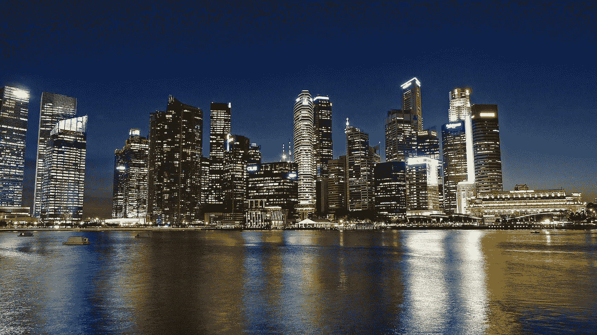

# 加密货币&做生意的成本

> 原文：<https://medium.com/swlh/cryptocurrency-the-cost-of-doing-business-9119d5c6fec6>

## 全球最大的加密货币交易所币安遭到黑客攻击，却没有引起加密货币交易商的注意，这是怎么回事？

You’ll come for the satay, you’ll stay for the banking secrecy. ( Image by [Jason Goh](https://pixabay.com/users/cegoh-94852/?utm_source=link-attribution&utm_medium=referral&utm_campaign=image&utm_content=255116) from [Pixabay](https://pixabay.com/?utm_source=link-attribution&utm_medium=referral&utm_campaign=image&utm_content=255116))

2007 年 2 月，新加坡一个特别温暖的周六晚上，张维锡(化名)是一家大型跨国银行的合规官，该银行在新加坡设有区域…