# 思维花园中的密码种子

> 原文：<https://medium.com/swlh/cryptographic-seeds-in-the-garden-of-ideation-a960b6e85daa>

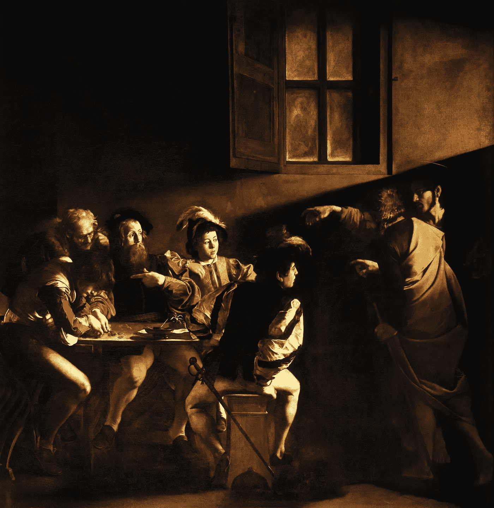

一件艺术品多久会随着时间增值一次？我们有*的《蒙娜丽莎》*，我们有*的《格尔尼卡》*，如今每一幅画的美元价值都比以往任何时候都高。事实上，仅丽萨号上的保险就有大约 6 亿美元。如果今天有人要买《蒙娜丽莎》,价格将是天文数字。但是下一个买家会付更多的钱。因此，不幸的是，在这幅画被创作了大约 500 年后的今天，除了达芬奇之外的所有人都获利了。可以理解，但很不幸。有没有其他方法？

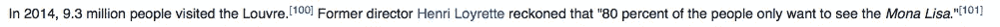

音乐、书籍、电影呢？其中有多少会随着时间的推移而增值，有多少会迅速贬值？非常非常少的音乐作品能够随着时间的推移而不变得新奇。在前现代，音乐本来就稀缺。每场演出都有价值，不一定是美元，而是一种无形的公共方式。热天水的价值。写于至少 1800 年前的《Natyashastra》展示了戏剧、舞蹈、音乐和表演的独特剧目。每种功能都有一种形式，致力于传承传统。个人作品可能会被作曲并被遗忘，但即使在今天，孟加拉女孩仍会跳舞，年轻人会学习 ragas。

传统导致脆弱。不知何故，持续时间长的东西继续存在，并且大胆地存在*。*

**

*Does Gloria Ann Taylor know how much people are willing to pay for her music?*

*在录音音乐时代，曾经无形的东西现在是一种产品——有机会成本。随着时间的推移，一段录音对其创作者来说有可能增值吗？我们每年都有一个排行榜前 100 名，里面充满了半衰期为 1-2 个月的歌曲。即使这是一个保守的估计。*

*为了从这些产品中获取最大价值，我们开发了一种算法结构，可以从任意“流”和广告中产生收入。不幸的是，这导致了膨胀的不对称:在艺术家得到一分钱之前，需要支付 100 名高管。这种结构鼓励音乐通过商业手段生存——广告、授权广告、公司播放列表、迷因视频、蹩脚的俱乐部 DJ、广告歌。简而言之，垃圾，以及时间跨度非常短的垃圾。*

*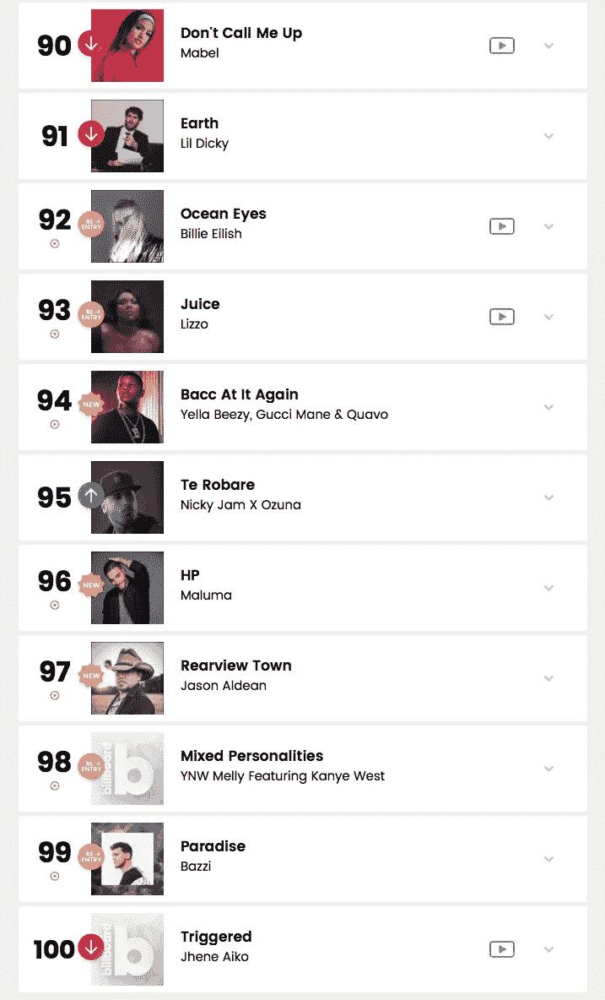*

*Take a guess how many of these songs will be listened to ten years from now. Hell, even next year.*

*随着时间的推移，唱片的价值是否会增长，这是一个值得追求的目标吗？毕竟，我们生活在这样一个时代，无名小卒一夜之间就像病毒一样传播开来，赚的钱足够永远舒适地生活，这有什么错？音乐产业造就或毁灭明星，这有什么新鲜的，对吗？*

*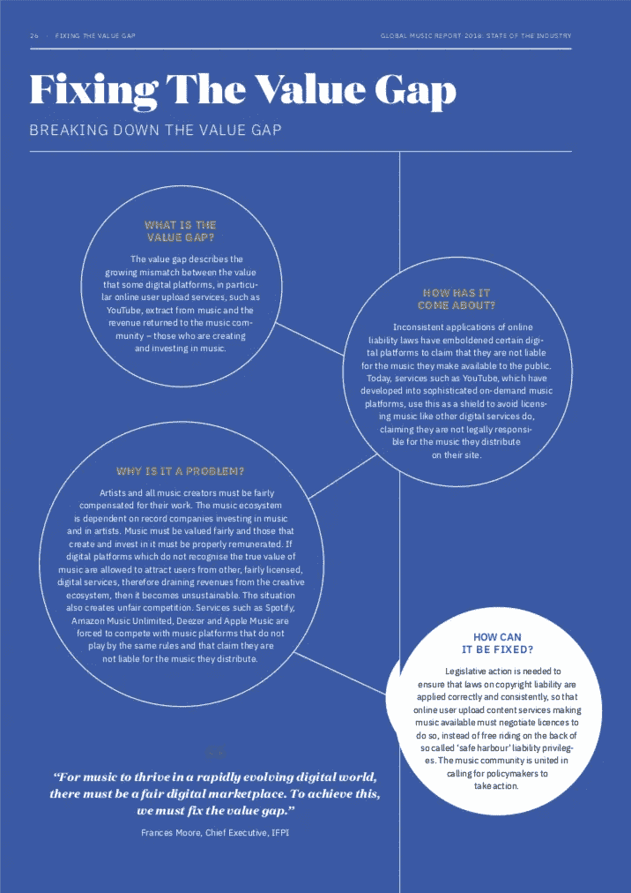*

*They know there’s an issue, they just have no idea why.*

*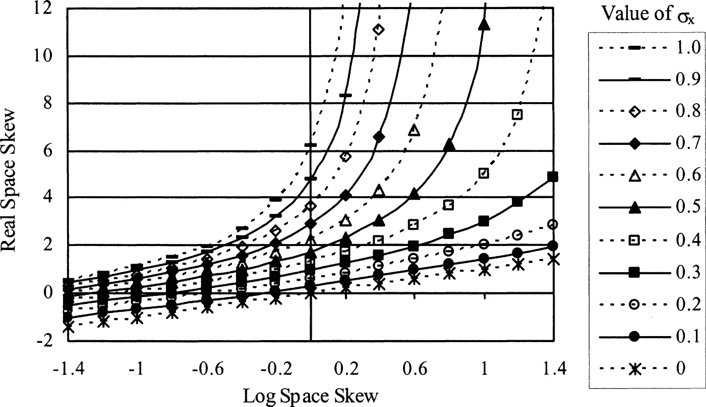*

*Outliers determine the mean.*

*好吧，如果系统激励时间性，那么即时满足就是游戏的名字。我们将继续获得病毒式的点击率，随着时间的推移，它们会来得更快、更猛，贬值得更快。想想波涛汹涌的天气中的波浪——每个波长都会叠加到下一个波长上。“艺术”已经变得满足。容易消化，非常符合时代精神，并且容易抛弃。系统运行的时间越长，上升的速度就越快，在跌入使用内容的深渊之前，上升的速度就越高。具有讽刺意味的是，音乐已经变得像一个市场泡沫。*

*A pleasant, wholesome circus where the clowns are very friendly.*

**的蒙娜丽莎*和比如说*的老城路*有什么区别？最普遍的区别是, ***老城路的病毒式成功随着时间的推移阻碍了它的成功*** 。还有一个有趣的想法是，有一个原始的，独立发布的记录，现在已经被工作室制作的，文化基因友好的比利·雷·塞勒斯功能所掩盖。一波加一波。*

**老城区道路*需要假以时日才能成功吗？可能不会，但我仍然认为这是一个很好的例子，因为它突出了像 Lil Nas X 这样的艺术家的独特情况。众所周知，这种情况越来越不独特。这是创造持久音乐事业的正确方向吗？如果我们继续沿着这条路走下去，五十年后这个行业会是什么样子？对于每一个一夜之间的成功，我们有 10000 倍的失败，都是因为他们看到了谁和什么登上了顶峰，即*影响力追逐者*。问问你自己:明年，谁会做更多的表演，Lil Nas X 还是齐柏林飞船，一个已经死了 30 年的乐队？*

*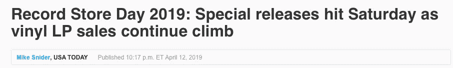*

*And every single one came out before I was born.*

*不要误解我，我不是说齐柏林飞船“更好”或者他们做得对，也不是说 Lil Nas X“不好”。谁知道有多少高管从 50 年前的商品目录和婴儿潮怀旧中赚了数百万？我指出，在当今世界，持久的潜力是一个傻瓜的游戏**，直到它不是。***

*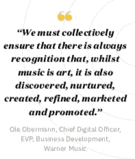**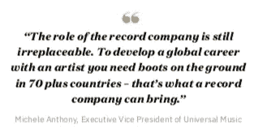*

*Is this really what’s needed?*

*//*

*我想在这里提出一个简单的想法:有形艺术(绘画、雕塑、建筑)在通货紧缩中的成功是它们作为以下功能的产物:a)有形和**；b)赞助的产物；c)稀缺，也许最重要的是，d)容易归因于其唯一的创造者。最终，世界各地的 t 恤、海报和咖啡杯上千百万的蒙娜丽莎复制品只会增加它的价值，因为人们一致认为只有原作才是真正有效的。达芬奇仍然是知识产权的持有者。实际上，更准确的说法是，法国作为一个国家实体拥有知识产权，使其不可分割。然而，某个地方的某些人(事实上，很多人)正从利用该图像为自己谋利中获益。这样看来，《蒙娜丽莎》比《老城路》更接近 Natyashastra，它代表了一种传统。***

***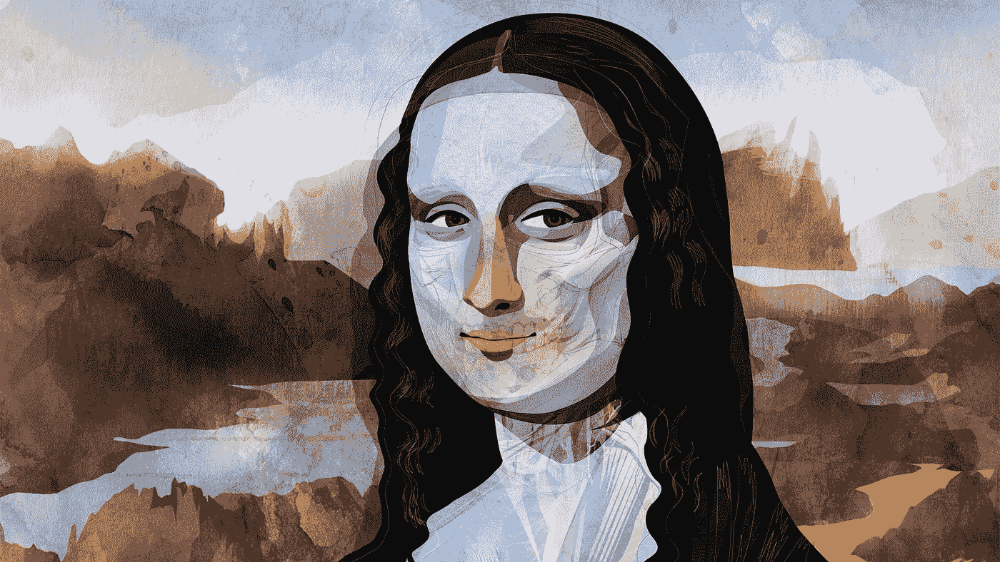***

***为了让《蒙娜丽莎》像今天一样成为令人难忘的作品，大多数其他艺术品都不得不被遗忘。如果有一种方法可以通过自由市场使艺术品随着时间的推移变得不易碎，而不需要广告或不断的挪用，会怎么样？一个没有算法的市场，一个算法变得多余和不必要的市场，那会是什么样子？***

***这可能需要一些富有想象力的思考。这可能需要某种永久的保证，一个从 A 地向 B 地传递信息的系统，中间没有中介。一个永久的分类账，不能被更改，可以被任何人使用，并在人与人的范围内连接。一个点对点的市场，一个数字集市，在这里你的消费完全在你的掌控之中。***

***//***

***今天的音乐市场比以往任何时候都更加民主和多样化。但制作成功音乐的成本高得离谱，产品揭示了观众、创作者和行业之间的不对称，只有顶尖的 0.1%才能维持这种做法。这是无法挽回的。一波未平一波又起，我们陷入了困境。***

***输入比特币。或许正好可以解决这个问题。***

***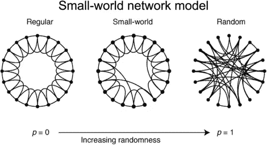***

***Bitcoin (BSV) is a small-world network on potentially massive scale.***

***不，不是那个比特币(BTC 或 XBT)，是赛格维特币(T21)。***

***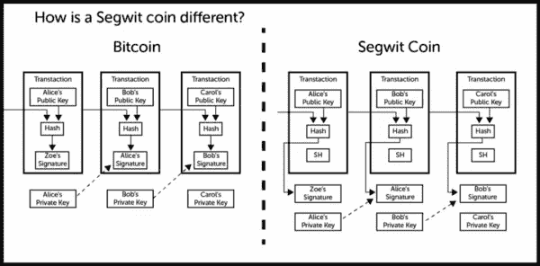***

***我说的是 BSV，最初的比特币。要讨论 BSV 的政治、经济和历史还需要另外十篇文章，所以我只想在这里链接几个关键概念，希望能引起个人的研究:***

*   ***[比特币白皮书原文](https://bitcoin.org/bitcoin.pdf)***
*   ***[SV 网站](https://bitcoinsv.io/vision/)***
*   ***[区块链的安全和隐私](https://arxiv.org/abs/1903.07602)***
*   ***[比特币的激励机制](https://arxiv.org/abs/1111.2626)***
*   ***[中本聪著述图书馆](https://nakamotostudies.org/satoshi/)***
*   ***[BSV 路线图](https://bitcoinsv.io/roadmap/)***

***BSV 能为创作者做些什么来平衡不对称，发展抗脆弱性，并创造持久的潜力？***

***嗯，需要理解的重要一点是，比特币是一个小世界网络，每个“用户”(投资者)都被激励去支持其他“用户”(投资者)，因为所有人都将受益于生产率的提高。换句话说，每个投资比特币的人都可以用 BSV 来奖励其他投资比特币的人，要么用他们的钱，要么通过增加网络的价值。本质上，一个超纯的资本主义。***

***有一个区块链，一个不变的、不可更改的分类账，可以保存各种数据。这个区块链是化名的，但是公开的，很容易被审计。当基础设施被构建时，[并且正在被构建](https://bitdb.network)，从链中读取和返回查询将会非常容易。这对创作者有什么帮助？这意味着你可以上传一些东西，并立即拥有可证明的所有权。这意味着你可以上传一些永远不会被改变的东西。你这样做将会得到回报，以比特币的形式。***

***为什么用比特币打赏很好？因为和任何货币一样，比特币是一种[透明互利的幻觉](https://nakamotostudies.org/literature/its-not-about-the-technology-its-about-the-money/)。但与任何其他货币不同，我们都可以通过使用比特币来增加其价值。这是完全控制你的产品的一种方式，是世界市场上的创造性投资者。***

***想想市中心的主街，每个商家都被激励去互相帮助和支持，因为这增加了主街上所有商家的价值。***

***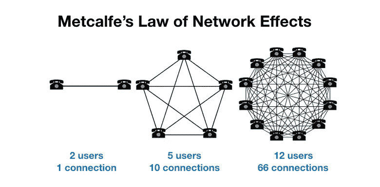***

***The Peer-to-Peer marketplace.***

***那么，如何“投资”比特币呢？当然，你可以用美元购买比特币，这将增加一些金融价值。但在不久的将来，将会有近乎无限的方式为 P2P 市场做出贡献，并反过来得到回报。无形资产将再次拥有真正的价值。***

***//***

***除了亲身经历，我想不出更好的方式来简单说明这一点。几天前，一个简单的网站 [audioB.app](http://audiob.app) 发布了，其明确的目的是展示在链上可以做什么——音频托管在云服务器上(暂时),但被永久散列到链上。***

***我决定上传一些音乐。过程是这样的:使用[的按钮](https://www.moneybutton.com/money)，我在 BSV 支付了大约 0.03 美元来上传一个 5MB 的文件，包括带宽使用和交易费用。然后，我设定了 0.05 美元的 BSV 价格——任何想听的人都必须在 BSV 支付这个价格(立即存入我的钱包)，以获得无限的访问权和下载权。然后，网站告诉我，我的付款将去哪里，以及相关的交易费用，这意味着我每次付款将获得大约 0.03 美元 BSV。***

***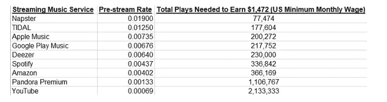***

***The status quo***

***第二天醒来，我在 BSV 收到了大约 0.5 美元，相当于 Spotify 上的 120 个流。相当酷！从上传到花费，再到收到我的付款，我在这个过程中的控制水平令人耳目一新。我既尴尬又好笑地说，这 0.5 美元是我多年来上传音乐到社交媒体的 24 小时内赚得最多的。我很兴奋地想到，如果这个网站被大众使用，会有什么样的可能性。***

***然而，真正的刺激是在那天晚些时候。我在下午 12 点收到了 0.50 美元的 BSV，但是到晚上 8 点，BSV 的美元价值已经上涨了 40-50%。这意味着我的 0.50 美元现在大约值 0.62 美元。***

***当这一切发生时，我感到了一股巨大的能量。我觉得好像突然看到了未来的景象。因为现实是我第一次用比特币而不是美元获利。我向网络输入了我的价值，网络以同样的方式回应，然后奖励我的输入。纯粹的资本主义。我在主街的小店。***

***//***

***你能想象没有算法广告的未来吗？一个不再有经济动机去追随潮流的世界？一个创造者可以控制自己的知识产权，可以随心所欲的世界？一个每个人都可以发送小额付款的世界，甚至是被剥夺权利的人？一个没有第三方需要验证和接受你的交易的世界？一个人类向网络输入价值，让所有人都能受益的世界？一个自下而上生长的有机网络？***

***我正在努力。我试图想象在思维花园里种下的加密种子——当我们可以自由决定时，会长出什么？***

***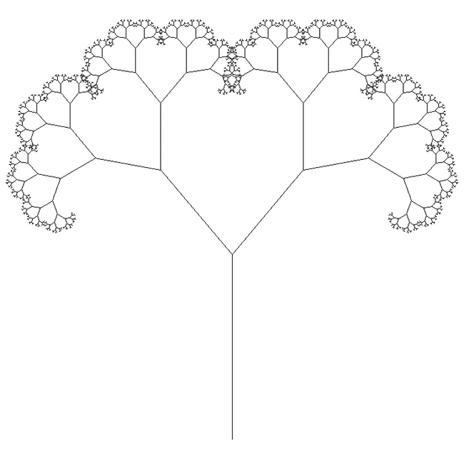******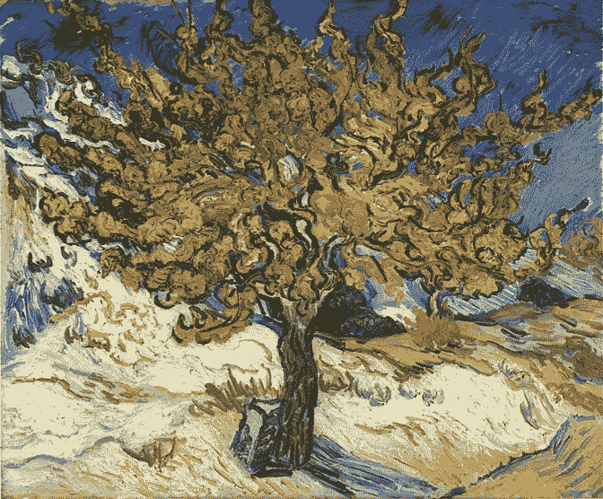***