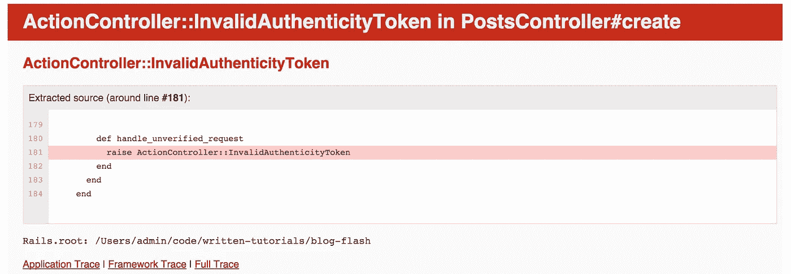

# CSRF(跨站点请求伪造攻击)及其在 Rails 中的应对方法

> 原文：<https://medium.com/swlh/csrf-cross-site-request-forgery-attack-and-ways-to-combat-it-in-rails-7d0ae7de57d2>

当我使用 rails 框架制作一个包含接受用户响应的表单的网站，并测试请求和响应以及路由和控制器操作是否正常工作时，在我的测试会话中发生了一个意外的错误。这个奇怪的东西被称为“无效的真实性令牌”

