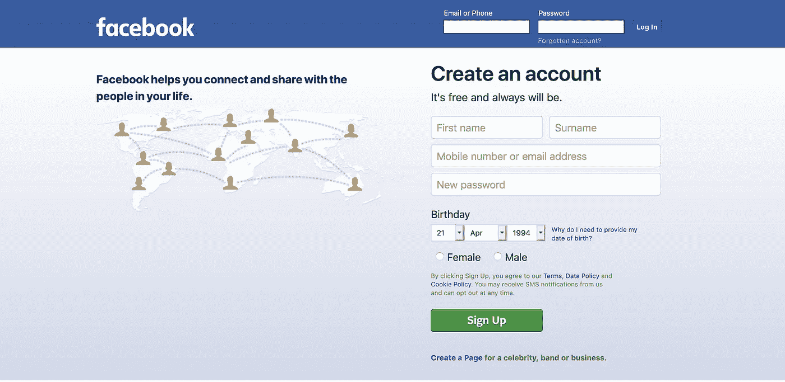
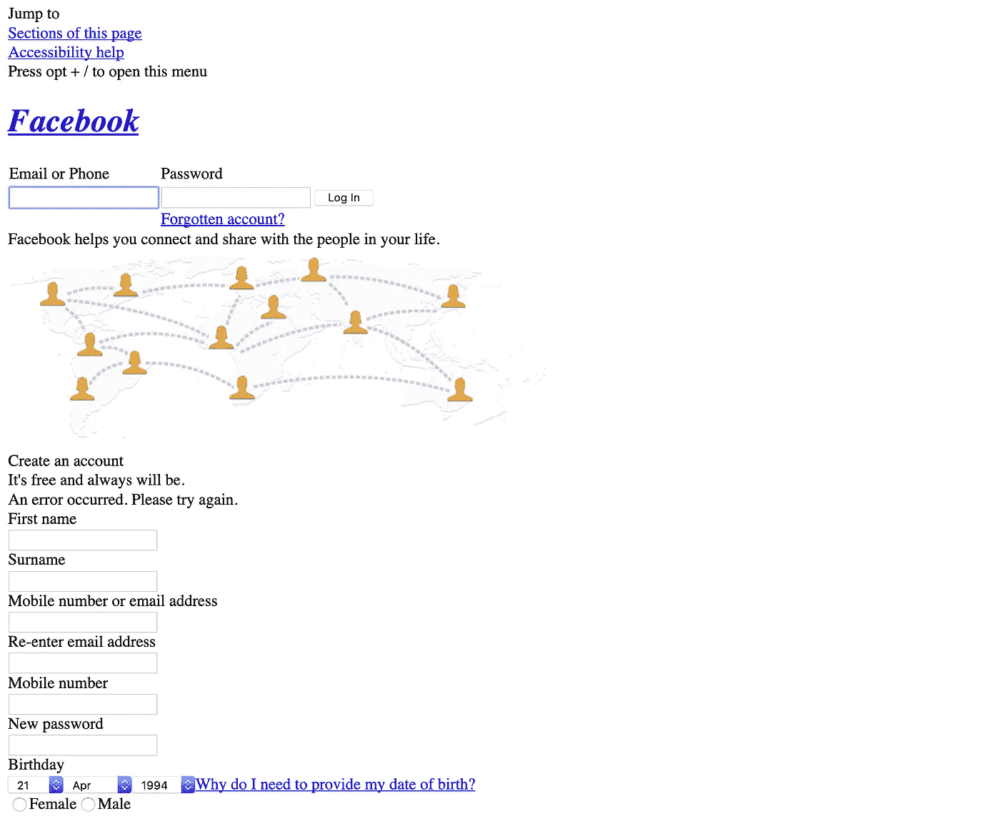
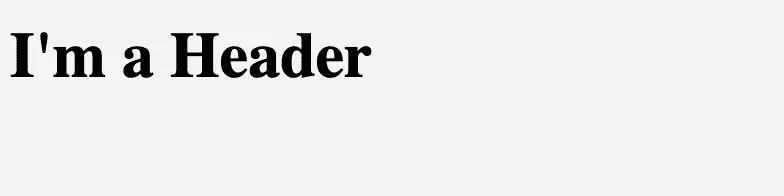
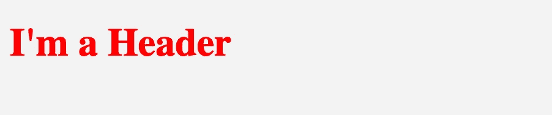

# 初学 CSS:CSS 是什么，如何在 Web 开发中使用？

> 原文：<https://medium.com/swlh/css-for-beginners-what-is-css-and-how-to-use-it-in-web-development-5985afe53096>


Photo by [Fabian Grohs](https://unsplash.com/@grohsfabian?utm_source=medium&utm_medium=referral) on [Unsplash](https://unsplash.com?utm_source=medium&utm_medium=referral)

**HTML、CSS** 和**JavaScript**…**Web 前端开发的 3 种主要语言**。在这篇文章中，我将介绍 CSS 的基础知识。所以如果你对 CSS 没有任何概念，或者不知道如何使用它，这篇文章就是为你准备的:)

我们将看看什么是 CSS，如何编写 CSS 规则，以及如何将它们添加到 HTML 中。作为先决条件，如果你对 Web 开发一无所知，我建议你先了解 HTML。

# 什么是 CSS？

**CSS(层叠样式表)**是一种用于**对网页**进行样式化的语言。我们可以使用 CSS 来改变网页的外观和布局。我们还可以定义一个网站的视图如何在不同的屏幕上变化，如桌面、平板电脑和移动设备。

CSS 不像 C++或 JavaScript 那样是一种编程语言。然而，CSS 并不像看起来那么容易。如果你试图在不理解的情况下使用它，你将在 web 开发中遇到困难。所以，学习 CSS 和学习编程语言一样重要。

让我们继续用一个例子来揭示 CSS 在一个网站上的效果。下面你可以看到**脸书网页**看起来和平常一样(用 CSS):



[https://www.facebook.com/](https://www.facebook.com/)

## **这里你可以看到脸书没有 CSS 的样子:**



**Facebook without CSS**

正如我们所看到的，CSS 使网站的视觉表现更好。

# CSS 语法:

让我们编写我们的第一个 CSS 代码。例如，我想改变 **< h1 >** 标签的**颜色**。

```
<h1>I'm a Header</h1>
```



首先，我们需要告诉 CSS 如何找到 HTML 元素。我们可以通过一个名为**“选择器”的功能来实现。CSS 中的选择器用于根据标签名、类名、id 等等来查找 HTML 元素。**

所以下面我为 HTML 元素**定义了一个选择器，基于它的标签名< h1 > :**

```
h1 { }  // An example of a selector 
```

之后，我们可以在选择器的括号之间声明 CSS 规则，每个规则都以分号结束:

```
h1 {   // CSS rules between brackets
  **color:** red;
} 
```

因此，基于已定义的选择器( **h1** )，CSS 现在可以理解在哪里应用新规则:



有许多不同的方法来定义 CSS 选择器，下面你可以看到一些选择器类型的例子:

*   **类选择器:**根据类属性查找 HTML 元素
*   **Id 选择器:**根据元素的特定 Id 查找元素
*   **元素选择器:**根据标签名查找元素

**这里** **可以查看** [**了解更多关于 CSS 选择器的信息。**](https://www.w3schools.com/cssref/css_selectors.asp)

# 如何在 HTML 中添加 CSS？

现在，您已经了解了为什么以及如何定义选择器并编写一些 CSS 代码。但这还不够。我们还需要在 HTML 中添加 CSS，否则它无法识别这些变化。

我们可以用三种不同的方式在 HTML 文件中添加 CSS:

## 1.外部 CSS 文件:

将 CSS 代码保存在单独的文件中是最佳实践。在真实的编程世界中，我们需要将 HTML、CSS 和 JavaScript 代码保存在单独的文件中，然后在需要的时候导入它们。

我们可以创建一个扩展名为`.css`的单独的 CSS 文件，并将其包含到 HTML 中。例如，我们可以创建这样一个 CSS 文件:`index.css`

在`index.css`里面，我们可以写我们的 CSS 代码:

```
**p** {  
  color: red;
}
```

然后我们可以将`index.css` 导入到带有 **<链接>** 标签的 HTML 中，如下图:

```
<head>
  ** <link rel="stylesheet" href="index.css">**
 </head><body>

 <p> I'm a Text </p>

</body> 
```

所以现在 HTML 文件有了 CSS 代码，更改将应用于元素。

## 2.带有

另一种编写 CSS 代码的方法是在 HTML 的 **<样式>** 标签中。这将把 CSS 代码直接保存在 HTML 文件中，而不是保存在一个单独的文件中。

```
**<style>** **p** {  
    color: red;
  }**</style>**<body> <p> I'm a Text </p></body>
```

## 3.内嵌样式:

第三种方法是直接在 HTML 元素中编写 CSS 规则，使用**样式**属性。在这个方法中，我们直接在标签中定义 CSS 规则，不需要为它创建一个类。

```
<p **style="color: blue; font-size: 22px;"**> I'm a Text </p>
```

> **这种方法不是干净代码的例子，不推荐使用。**

# 结论

CSS 是 Web 开发的重要组成部分。在这篇文章中，我试图解释 CSS 的基本用法和语法。如果你有任何问题，不要犹豫，在下面的评论区提出来。

在 CSS 的世界中还有许多其他的规则和特性可以探索。我将在接下来的文章中介绍它们。

> **如果你想了解更多关于 Web 开发的知识，** **欢迎在 Youtube 上关注我** **！**

非常感谢&下次再见！

[](https://medium.com/swlh)

## 这篇文章发表在 [The Startup](https://medium.com/swlh) 上，这是 Medium 最大的创业刊物，拥有+446，678 名读者。

## 在这里订阅接收[我们的头条新闻](https://growthsupply.com/the-startup-newsletter/)。

[](https://medium.com/swlh)