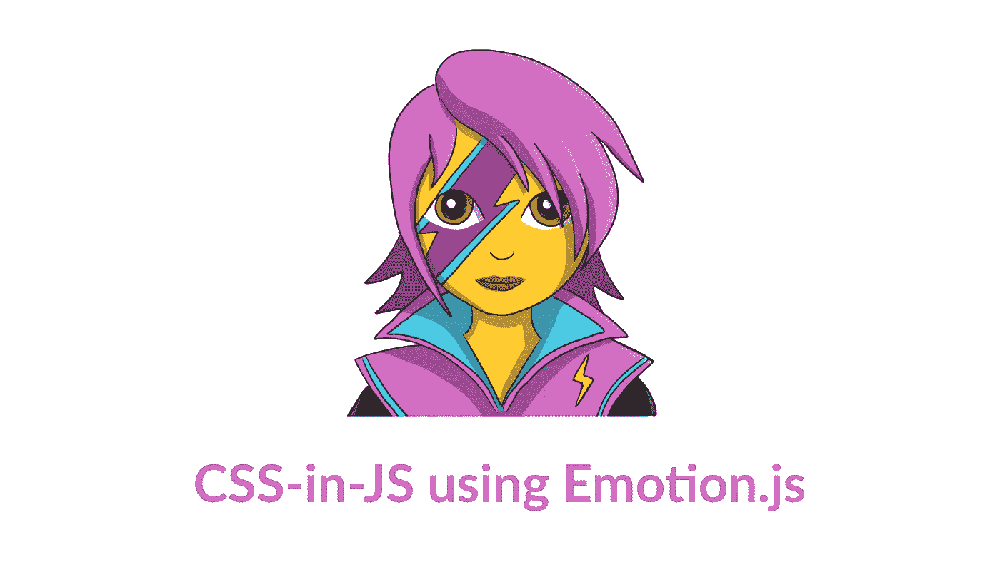

# 使用 Emotion.js 的 CSS-in-JS

> 原文：<https://medium.com/swlh/css-in-js-using-emotion-js-7fd9836d2ff>

大家好！今天我们要用 CSS-in-JS 写一个 React web app(剧透一下:是一个供领养的猫的列表)！

我们将了解什么是 CSS-in-JS，它有什么好处，之后，我们将直接跳到代码！

# 什么是 CSS-in-JS？

随着近年来 JavaScript 前端库和框架的兴起，社区…