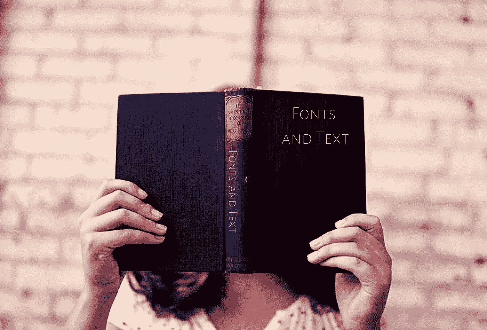

# CSS 入门:字体和文本

> 原文：<https://medium.com/swlh/css-primer-fonts-and-text-b6b5bb3e0370>

## 半铸钢ˌ钢性铸铁(Cast Semi-Steel)

## 默认字体。通用字体系列。字体系列。系统用户界面字体。

我在网络程序中使用的第一个字体可能是 Times。这不是我最喜欢的。它是我的浏览器中的默认字体，我正在使用 Chrome 浏览器输出文本“Hello World”。

# 默认字体