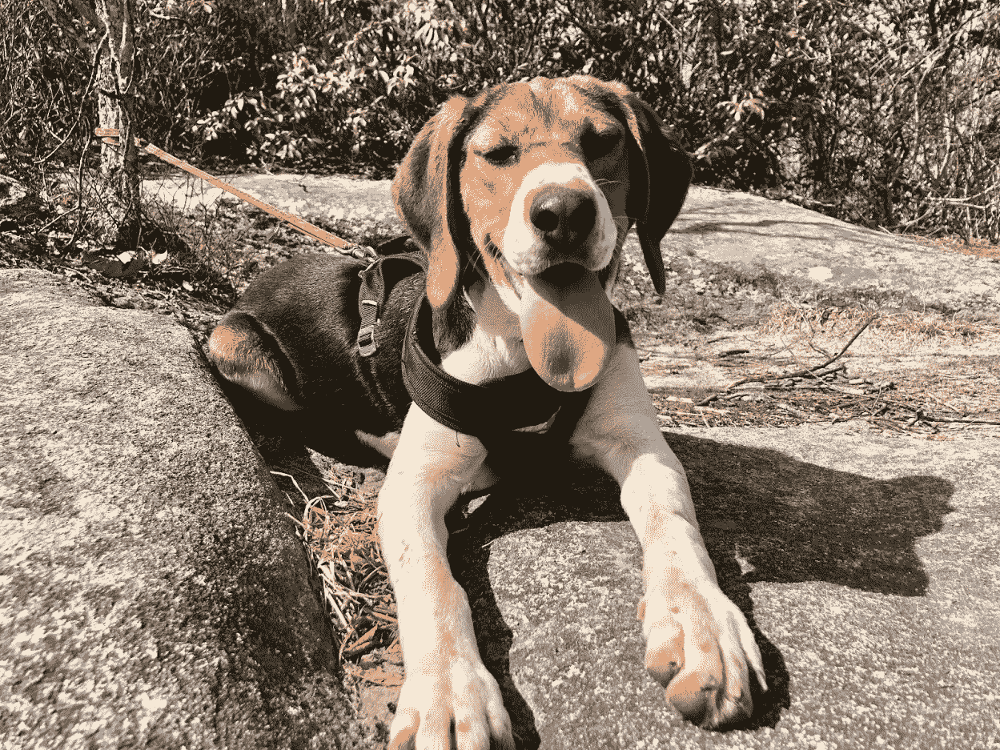

# 培养勇气:在不文明话语时代写回忆录

> 原文：<https://medium.com/swlh/cultivating-courage-writing-memoir-in-the-age-of-uncivil-discourse-561d995e66a8>

r

当我的回忆录《平身败名裂与两只山羊》于去年出版时，我预料会有一些负面反应。这本书详细描述了我家的经济困难，我知道钱是一个敏感的话题，有些人无法看透我在书中承认的糟糕决定。然而，我希望，虽然不是每个人都取得了财务…