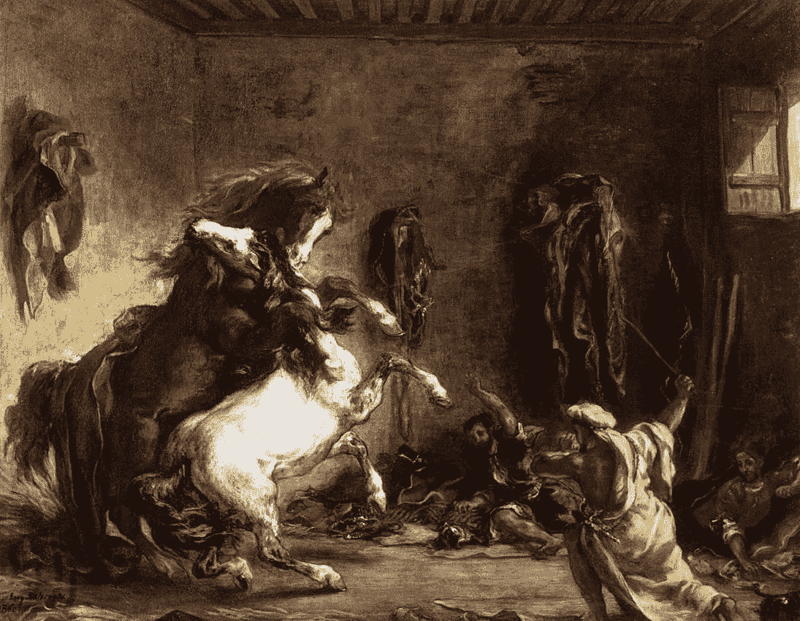
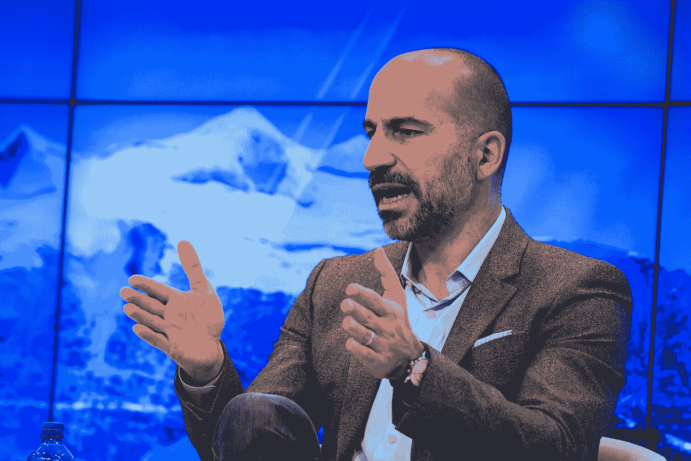
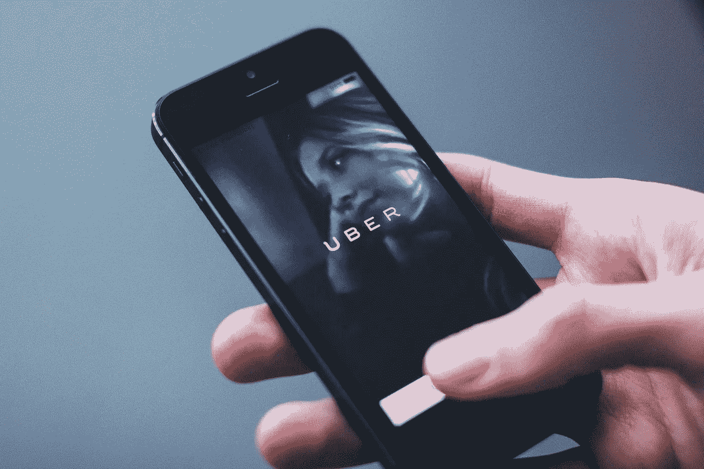
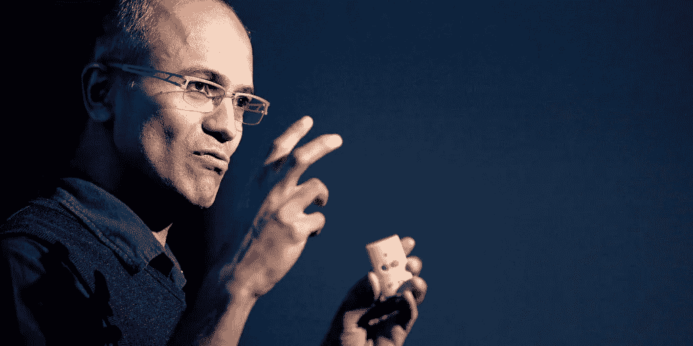

# 文化冲突可以成就/破坏优步-卡里姆交易

> 原文：<https://medium.com/swlh/culture-clash-can-make-break-the-uber-careem-deal-526952a34a4>

Via Eugène Delacroix (1860)

## 以及优步可以从其他公司学到什么。

随着最近收购中东自己的独角兽 Careem，优步将接管该地区的按需出租车服务。这笔 10 亿美元的交易被誉为迪拜和中东其他地区创业生态系统的一个重要里程碑，是外国投资者更认真对待这里的创业场景的一个强烈信号。

但这些公司有着截然不同的起源故事，预示着两种结果:

1.  文化转型。
2.  或者死亡。

## 为什么文化很重要——公司如何表现？

当谈到 M&A 交易时，文化可能是最后想到的。

与战略和合并资产负债表相比，它被放在优先地位。但当麦肯锡(McKinsey)和贝恩公司(Bain & Co .)等公司表示，文化是 M&A 交易成功的关键因素时，你应该有不同的想法。

但是，在谈到最近的卡里姆-优步交易时，这似乎是一个缺失的组成部分。这令人不快，因为:

文化代表一个公司的行为和价值观。它解释了公司的决策过程。从首席执行官到接待员，文化束缚着组织。

贝恩公司概述了并购后整合文化的步骤。简而言之:

1.  意识—

*   到目前为止，你是如何取得成功的？
*   你做决定的指导原则是什么？
*   这些原则有什么好/不好的地方？

2.编辑—

*   在推进这项交易的过程中，应该保留什么？
*   什么应该被搁置一旁？

3.转变—

*   你能从另一家公司借到什么？
*   创造文化契合应该接受什么？
*   你公司的行为有哪些文化差距？

## 当文化出错时——X.com 和自信

Paypal 是世界上最受欢迎的支付服务公司。但它的早期经历了一个重要的里程碑——彼得·泰尔的 Confinity 和埃隆·马斯克的 X.com 的合并。

随后发生的是明显的文化冲突。马斯克的威权领导风格惹恼了 Confinity 的老员工。马斯克还希望将 Ebay 的系统从 Unix 转移到微软，这一举动促使联合创始人麦克斯·拉夫琴发动了一场政变。

Levchin 和其他高管向董事会发出了最后通牒——除掉马斯克，否则他们将退出 Paypal。因此，马斯克失去了他在 Paypal 的首席执行官职位。

*又见:* [*易贝 vs PayPal——分手难做|第五集*](https://player.fm/series/business-wars/ebay-vs-paypal-breaking-up-is-hard-to-do-5)

## 优步和卡里姆的起源故事可能预示着文化冲突

> “无论我们做什么，随着时间的推移，都必须有巨大的影响力，而且必须有意义。不是为了赚钱。钱会来的。这只是副产品。这实际上是为了改善人们的生活，产生影响，并最终为我们在世界上留下遗产。”
> 
> Mudassir Sheikha，阿拉伯创业公司

尽管 Careem 是一家极其相似的服务公司，但它是一家不同类型的公司。首先，他们是价值驱动的。阿拉伯语“慷慨”的意思，Careem 是一家照顾客户、司机和同事的公司。他们旨在向司机传授专业知识，称他们为“船长”。他们向员工提供股票期权，这是一笔丰厚的奖励，尤其是最近的优步交易，价值近 31 亿美元。

*参见:* [*在马格尼特*](https://magnitt.com/research/startup-arabia-untold-stories-top-arab-entrepreneurs-free-book) 上免费获得阿米尔·赫加济的《创业阿拉伯》

他们成功的一个关键特征是能够掌握该地区的脉搏——Careem 通过提供现金支付选项和保护您的联系信息，优先考虑该地区的需求。

这种对本地的高度关注帮助该公司避开了优步，后者需要重新调整自己以应对该地区的独特挑战。与优步等竞争对手相比，它给了 Careem 三到六个月的领先优势和利用更少资金的能力。

*另见:* [*Careem -骑中东第一独角兽*](https://www.youtube.com/watch?v=oGgv0lXZRZ4)

## 优步的文化有助于它“获胜”吗？

Credits: World Economic Forum

另一方面，优步充其量是具有破坏性和争议性的。在争议方面，有一个[流水账](https://www.businessinsider.com/uber-company-scandals-and-controversies-2017-11)关于侵略性的商业策略，性骚扰指控，缺乏对司机的背景调查和在国家的非法设立。

对于像 Lyft 这样的竞争对手，优步利用一次性手机进行虚假预订，以浪费竞争对手的驾驶时间。司机自己，被称为“独立承包人”，在疯狂工作的时间里获得最低工资。有时一周 80 个小时。

凭借一种“先道歉”的文化，该公司在德国等国家立足，而没有通过“有原则的对抗”与立法者或其他监管者核实——未经许可就开店。

所有这些，甚至没有谈到苏珊·福勒和公司里的各种性指控。显然，优步的文化被打破了。

也有更少的公开斗争，如部门之间缺乏透明度，而是缺乏协调的孤岛式混乱。

优步公司的现任首席执行官达拉·科斯罗萨西(Dara Khosrowshahi)认为，正是这种文化造就了优步的今天。在斯坦福 GSB 的[演讲中，Khosrowshahi 认为如果没有这种文化，公司就不会成功。但是这种成功导致了对这种文化所带来的问题的忽视。这就是他想在优步改变的。](https://www.youtube.com/watch?v=M8aCKi3dsVg)

## 优步 2.0——他们在前进吗？

Where is Uber heading? (Credits: freestocks.org)

> “作为一个组织，我们去年确实经历了相当多的创伤，我总是试图提醒人们，优步由 18，000 人组成，优步有成千上万的人现在是变革的推动者，他们希望看到我们成为一个更好的组织，实现我们想要成为的真正愿景。我们是优步 1.0，我们不想再这样了。我们希望成为优步 2.0。”
> 
> — Bo Young Lee，首席多元化和包容性官

随着[达拉·科斯罗萨西](https://medium.com/u/8e77815ae44c?source=post_page-----526952a34a4--------------------------------)的掌舵，优步正在采取行动改变他们的文化。当性别歧视被解决的时候，他们兄弟文化的侵略性正在发展。

Inc .的一篇文章认为，一切都不会因为首席执行官被替换而改变。相反，应该把更多的注意力放在工程部门，因为在那里可以发现很多问题。鼓励更多女性在科技公司担任领导职务，有助于对抗这种有害文化。

这正是优步在 2018 年一直在做的事情，将女性在全球劳动力中的比例提高到 38%。这也是 Khosrowshahi 在加入优步之前在 Expedia 做的事情。作为 Expedia 的首席执行官，截至 2016 年，他将美国女性劳动力的比例提高到了 51%。

要了解更多关于优步新任首席执行官如何在加入后把优步的家打理得井井有条，请查看《财富》杂志的这篇文章。

## 微软刷新——纳德拉如何让文化变得更好

Credits to [Johannes Marliem](https://www.flickr.com/photos/100626730@N07/13250541685)

[塞特亚·纳德拉](https://medium.com/u/d989edf5a0ea?source=post_page-----526952a34a4--------------------------------)的故事与微软有着相似的相似之处。一家高管内讧、等级森严的大型科技公司。糟糕的沟通损害了它未来的潜力。史蒂夫·巴尔默(Stever Balmer)担任首席执行官 14 年后，纳德拉的第一天从一本书开始。

纳德拉采取了低调的方式，给每位高管发了一本马歇尔·罗森博格(Marshall Rosenberg)写的名为《非暴力沟通》(非暴力沟通)的书。他通过研究各部门之间的沟通方式，为自己希望如何改变公司文化定下了基调。

他还大量借鉴了卡罗尔·德韦克的《心态:希望的新心理学》一书的观点。他想从这本书里激发驾驭成长心态的能力——一种从错误中学习的承诺。

当然，高管们不仅仅是在读书，还在积极改变公司的运营和价值观。例如，微软 Office 产品是为苹果 Macbooks 等产品推出的，这在巴尔莫时代是一种罪恶的行为。

## 会有影响吗？

毫无疑问，优步 2.0 还有很长的路要走。由于优步的百万美元损失和低迷的首次公开募股，该公司有许多问题需要解决。解决他们的文化问题可能是解决这些问题的最佳步骤。

对 Careem 的收购可能对优步的文化转型有价值，因为他们可以借用品牌的最佳部分来调整他们在世界上的运营方式

但是，让我们假设优步 2.0 是成功的，这将使交易成功吗？也许吧。但如果文化转型进展不顺利，这不仅对两家公司，而且对中东的创业生态系统都可能是一笔有害的交易。

*你可以在 Instagram 上给我发 DM(@ not just writing)或者留言。*

*注:*

我不是并购和企业文化本身的专家。我只是觉得奇怪，没有人在谈论中东这一里程碑式交易的文化转型。