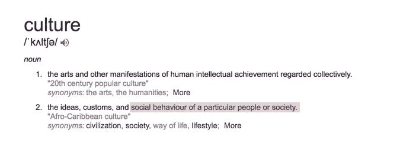

# 文化是你是谁，而不是你想成为谁

> 原文：<https://medium.com/swlh/culture-is-who-you-are-not-who-you-want-to-become-1dc4ce586c12>

## 免费酒和乒乓球桌的误解

Photo by [Clark Tibbs](https://unsplash.com/@clarktibbs) on Unsplash

我偶然遇到了我曾经工作过的一家初创企业的创始人，于是我们决定一起喝几杯。看到他的公司开发了一个伟大的产品和一个了不起的团队，我很受鼓舞；相比之下，我放弃了几个月前刚刚加入的一个项目。

他问我为什么决定离开。

我告诉他，其中一个主要原因是缺乏文化契合。我觉得我和其他员工相处得不是很好，跟随他们的工作方式干扰了我的工作。我希望他们改变的愿望没有实现，因此，我决定放弃。

我责怪自己妥协得不够好。

“这就是你不对的地方，”他停顿了一下。“因为人不会变，会成长。所以你基本上不是他们翅膀上的羽毛。”

我眨了眨眼。

“在过去的两年里，我们的招聘有失误也有成功，创造我们的文化并不容易。意识到没有什么可创造的。文化是有定义的。这已经体现在我们雇佣的人的性格和态度中了。”

突然间，一切都变得有意义了。

Photo by [rawpixel](https://unsplash.com/photos/PG3NsaGpY3s?utm_source=unsplash&utm_medium=referral&utm_content=creditCopyText) on Unsplash

文化超越了啤酒之夜和棋盘游戏。手里有太多时间或金钱的不只是公司。这不是金钱奖励或福利可以补偿的。

# 你的文化的定义

我有一种强烈的信念/偏见，认为只有特定的个性才能在团队中很好地合作。当我还是个孩子的时候，我研究过迈尔斯-布里格斯人格类型和一点九型人格图。我想成为一名工业组织心理学家。

像谷歌和脸书这样的大公司以雇佣来自不同种族和教育背景的人而自豪。这些公司庆祝多样性，同时保留自己的文化和身份。

然而，不是每个人都能品尝到多种口味的馅饼。

## 为什么多样性对初创企业来说是致命的

初创企业从团队成员人数开始。一个成功的团队在技能和个性方面是平衡的。

*多样性* *发生在某个品质有丰富或缺乏的时候。例如，如果一家初创企业雇佣了 10 名技术人员，其他专业各雇佣 1 名，那么这家初创企业的技术团队是多元化的。

根据初创公司的目标和需求，多样性可能不是一件坏事。然而，现实是，许多初创企业的创始人都很年轻，缺乏经验，因此，当企业试图取得一些进展时，管理这些多样性可能是一项艰巨的任务。

另一个例子是，如果一家初创公司雇佣了 10 名专业人员，但只雇佣了 1 名设计人员。公司缺乏设计投入会造成产品产出的不平衡，小的设计团队会不断感受到无法执行的痛苦。

**得到一些反馈后，正确的说法其实是‘不相称’。*

Photo by [rawpixel](https://unsplash.com/photos/PG3NsaGpY3s?utm_source=unsplash&utm_medium=referral&utm_content=creditCopyText) on Unsplash

## 关于“平衡”的大辩论

许多创始人认为，创建你的第一个团队没有正确或错误的答案。然而，统计数据表明，没有创建合适的团队是初创企业失败的主要原因之一。

理想的团队由实用主义者和远见者组成。你需要有远大梦想的人，也需要把事情做好的人。

你还需要特定角色的人来使你的团队正确。

**产品所有者/项目经理**:定义产品及其交付战略路线图的人。他们会理解这个问题，并将其转化为一个可观的解决方案。

**商业/营销分析师**:洞察提供者，他们是你的商业和数据专家。他们将测量和跟踪定性和定量数据，以确定企业的下一步行动。

**前端/后端开发人员**:建立产品架构早期阶段的创建者。他们将通过代码和逻辑思维将解决方案带入生活。

**设计师**:解决方案的定义者。他们将承担问题和解决方案，并为团队和关键利益相关者可视化。

Photo by [Annie Spratt](https://unsplash.com/@anniespratt) on Unsplash

# 如何修复现有裂缝

如果你现在的团队不理想，也不是世界末日。有很多文章和资源都是关于建立一个合适的团队的，但是当你谈论如何组建一个团队时，就没有那么多了。

如果你想解雇所有人，重新开始，[点击这里](https://blog.bolt.io/the-complete-guide-to-building-hardware-startup-teams-part-1-founders-culture-773b62cced65)。如果你希望解决问题并保持你的才能，请继续阅读。

## 定义你的多数

你目前的团队是由谁和什么组成的？你需要了解你的初创企业的内容，然后才能找出其中的问题。

**大揭秘的 3 个步骤**🌟

1.  列出每个员工、他们的指定角色以及他们在该角色中的工作年限。
2.  根据他们所在的行业/专业对他们进行分组。
3.  计算一组的总年数

瞧啊。你应该能够看到你的团队是由什么组成的最基本的轮廓。

Photo by [Startaê Team](https://unsplash.com/photos/36Aai16fubc?utm_source=unsplash&utm_medium=referral&utm_content=creditCopyText) on Unsplash

## 最低纲领

玛丽·近藤一直在激励着这个世界，让我们摆脱生活中那些不快乐的东西。她所提倡的只是极简主义的一小部分。

极简主义不仅仅是去除多余的东西，它还确保你拥有必需品。

看看董事会，问问自己，你的初创公司真正需要什么样的团队。越瘦越好。

## 细节设计

在这一点上，听起来你必须在开始招聘更多人之前解雇一些人。幸运的是，这不仅仅是你的决定。

和你想放手的人约个时间，诚实地说出原因。如果这个人希望留下来，讨论他能为团队此时的需求做出什么贡献。如果这个人想离开，那么放手不是问题。

> 如果你在招聘员工时很彻底，那么你在解雇员工时也应该同样彻底。

一个人为什么离开团队的细节是你下一次开始建立另一个团队的学习课程。

在放下一些人的同时，留意你下一个重要的队友。这将加速团队重组过程，并确保你尽快拥有一个功能性的组织。

不要只寻找你需要的技能，也要寻找你想在公司里拥有的个性。

Photo by [Priscilla Du Preez](https://unsplash.com/photos/XkKCui44iM0?utm_source=unsplash&utm_medium=referral&utm_content=creditCopyText) on Unsplash

# 最佳实践

建立文化的第一步是建立正确的团队。假设你现在已经得到了正确的团队，你已经准备好开始培养你自己的文化(希望不是有毒或细菌)。

## 价值介词

找出在公司工作时每个人都重视的关键品质。你可以通过召开小组会议或与每个人私下交谈来做到这一点。

这里人们犯的错误是只识别特征而不识别“触发条件”。触发条件基本上是特质的动机。

比如我最看重的特质就是‘开放’。因此，人们认为我会自然而然地变得开放，并在公司内部创造一种开放的文化。然而，我的开放有一个条件:我希望别人也能开放。

这种现象被称为“[心理投射](https://en.wikipedia.org/wiki/Psychological_projection)”。

人类是彼此的镜像。当我们没有遇到一个有利的环境来表现个性时，我们个性的一部分可能不会被反映出来。

> 仅仅了解一个人重视什么是不够的，还要了解如何确保他们坚持这些价值观。

## 组织你的积极因素

即使有独特的价值观和个性，你的初创企业也应该能够从内部形成和谐。我们的行为和信仰不是独立的群体，而是有组织的大体系的一部分。

想象每一个积极的特征都是一个不同颜色的橡皮泥。当用橡皮泥创作东西时，你不只是将所有的颜色混合在一起，然后对一团糊状物感到高兴。取而代之的是，你想象那种颜色会变成什么样的可能性，以及它如何与另一种颜色搭配。

***整理好你目前的团队后，你现在可以着手招募新人了。***

Photo by [rawpixel](https://unsplash.com/photos/PG3NsaGpY3s?utm_source=unsplash&utm_medium=referral&utm_content=creditCopyText) on Unsplash

## 雇佣名人

我有无数这样的故事:公司雇佣了一个拥有高超技能和专业知识的人，却不得不让他们离开，因为他们的态度与公司长期格格不入。

Sam Gerace 强调，除了在纸面上看起来不错，理想的候选人还需要 3 个 a 才能被认为是一个好的候选人:*态度、能力和适应性*。

⭐ **态度**:对某事的固定思维方式或感觉。你要确保理想的态度是在未来 5 年中可取的。

⭐ ⭐:获得的做某事的能力。基本上，候选人能够完成多少工作，随着时间的推移，他们还能完成多少工作。

⭐ ⭐ ⭐ **适应性**:能够适应新环境的品质和为新目的修改某物的能力。你要确保候选人无论如何都是创新的。

> "雇佣态度，而不仅仅是经验和资格."格雷格·萨维奇

# 下一步是什么？

Brain Chesky 写给他在 Airbnb 的整个团队的公开信总结了这一点。一旦你建立了稳固的基础，不要让它再变得模糊不清。

我认为，一家初创企业的创始人，甚至是一家公司的首席执行官，关注的重点之一是保持良好的文化。哪里有好的文化，哪里就不太需要实施过程来管理文化的缺乏。

如果你愿意为公司的成功做任何事，那么接受我的建议:首先关注你的文化。

## 这篇文章发表在 [The Startup](https://medium.com/swlh) 上，这是 Medium 最大的创业刊物，拥有+417，678 名读者。

## 在这里订阅接收[我们的头条新闻](http://growthsupply.com/the-startup-newsletter/)。

如果你喜欢我的故事，请给它多点掌声(👏).