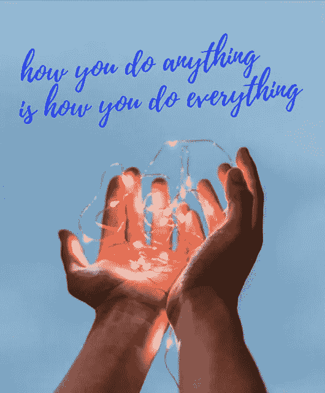

# 大众市场文化&理解个人品牌……(在 human2human 部分)

> 原文：<https://medium.com/swlh/culture-of-mass-market-vs-understanding-personal-brand-6c931582d822>

> 你拥有一切你需要的东西去建造比你自己更伟大的东西。
> 
> 赛斯·戈丁

“帮助人们醒来”的领域已经变成了膨胀的市场。而且在未来几年只会继续增长。

无论你是心理咨询师、生活教练、化身促进者、精神导师还是治疗师，你都属于人类。

如果你自我推销，创建登陆页面，定期向个人收件箱发送电子邮件，并在社交媒体渠道上发布带有流行标签的帖子，那么你这么做的原因只有两个。

1.  你想卖东西。
2.  你想改变什么。

在第一种情况下，你是一个企业。第二，你是一个品牌。

企业与客户打交道。品牌与人类打交道。

既然你是在与人一对一地工作，你必须成为一个品牌，而不是一个企业。

把它作为一个暂时的框架，来看看为什么它是你在你的专业领域中如何看待自己的一个足智多谋的转变。

….

首先，我们都是别人脑袋里的“隐喻”。

有时候这些隐喻变得如此强大，以至于成为了“品牌”。

成为一个品牌意味着当人们想到你时，他们会强烈地将某些品质归因于“你做事的方式”。

如果你问他们“你最喜欢的是什么？”大多数人会说出完全无法衡量的品质。很多人会说“就是她！”

这并不是说他们爱你。这也不意味着他们喜欢你应该教的一些技巧。他们当然很欣赏，但这不是他们喜欢的。

他们喜欢的是他们的边缘系统认为“这是给我的”的东西。这是我们深深扎根于重要选择的层次。这是信念的层次，而不是行为的层次。这也是人们喜欢你的无意识能力的水平，而不是你的专业知识。

无意识的能力是驱动天才的力量。正是这种能力，你自己不能分解成一个过程，它让你进入心流状态。

正是这种能力，让人们看着你，心想:“我就是喜欢你做事的方式”。但是在他们的内心深处，他们会想:“天哪..你是怎么做到的！”

这意味着，如果明天你开始教如何钩针编织，而不是如何“成为你自己”，这些人会说:“这将是不可思议的！给我报名！”

**当这种情况发生时，从专业角度来说，你已经成为一个品牌，人们知道你的签名。**

这并不意味着明天你必须尝试新事物，看看是否会发生这种情况。100%相反——品牌诞生于狭窄的利基市场。

品牌需要时间，因为他们需要信任。你不能完全把它变成一个策略——你只是在做你正在做的事情。但是如果你突然消失了，人们会开始想念你…

当这种情况发生时——你已经成为“一个品牌”。

尽管揭示你的一些无意识天赋可以强化它们，让它们更有成就感，但你永远无法衡量人们到底喜欢什么。

你潜意识能力的主要部分将永远是一个谜——这是有原因的…

但是，你能“衡量”的，是爱它的人。

为什么从他们开始？

让我们反过来看……当你不作为一个“品牌”，而作为一个“企业”时，会发生什么。而你是“卖”，不是“关心”。你对你的观众没有感觉。你是为了所有人…

# 你的“自我推销”很普通…

向下滚动您的登录页面需要 5 分钟。你有 15 个客户的推荐，他们用最普通的语言来表达你如何永远改变了他们的生活。

当我最终被你提供的价格绊倒时，我看到了以下内容:

在这里，我的本能大脑应该向我发出信号，冲向我的信用卡，直到为时已晚，以折扣价认识你。

我继续向下滚动…

它告诉我关于你的教育，你的“突破”故事，以及你多么想让我自由和富足…还有价格！现在，大写字母锁定尖叫到我的眼睛，我是多么幸运，今天打开了这封邮件。

如果我不“满意”，保证退款…

然后，作为这次购买的结果，我应该发展的复杂认知技能和“人类状态”的清单…

还有(手稿之后):只有受邀者才能留下几个位置…

你知道我的感受吗？

退订！

有两个原因:

1.它占用了我太多的时间。

2.它没有提到我。(不是直接的方式，不支持我的真实交互的观点。而且感觉自己被卖了)。

这样做，你就是在充当一个“企业”。你把自己替换为“价值主张”，把我替换为“客户”，而这应该是一个邀请——一个“广告”。

广告的主旨是毫无选择性地不断打断某人的私人生活。

广告是针对人们的行为的。广告是为顾客准备的，也就是说，人们根据价格进行选择，一旦你的折扣不再有效，他们就会忘记你。

这种“广告”传递的信息是，你不知道你接触到了谁，你接触到的人也不知道他们为什么需要它。因为他们不知道，你不得不淹没他们的收件箱，对着他们的眼睛尖叫，这样他们才会注意到你。

一旦他们注意到这一点，他们会直接进入:

还有这个:

希望能买下来。

….

但最有可能的是——不是。

# 回到品牌…

像其他地方一样，在 human 2 中，人类领域的品牌随着时间而诞生，最强大的环境是你真实的存在。这是当你在施魔法的时候，你没有“做任何事情”。人们在本能的层面上审视它。当他们“购买”时，他们“购买”你给他们的感觉。

**他们也买“他们认为和他们在一起的人”。**

他们“购买”潜在的亲和力。

这就是人们购买品牌而不是大众市场产品的方式。

信息成本正以疯狂的速度下降。一切都在网络上。与此同时，**时间成本也在上升**，因为我们有越来越多的分心事物。有人打开了你的电子邮件、登录页面或视频，这本身就是一种贡献。你抓住了他们的注意力，这是最有价值的资产。

注意力是无价的。分心的代价很高。研究表明，人类大脑大约需要 23 分钟才能重新聚焦到这个过程。

以最明智的方式简洁、有创意、与你的观众亲密接触。

亲密是你了解我，而不是想勾引我。你说我的语言，我的形象，我的信仰。感谢我的关注。

这就是我选择你的原因。

而且这个选择我不要打折。

# 摘要

大量的转型工作和“觉醒”选项已经建立了一个行业。它会变成一个巨大的市场还是保持其独特性几乎是毫无疑问的。

感觉这种趋势基本上是在“个人成长”或者“觉醒”的标签下制造另一层困惑。

但是希望还在…

无论你的内容是实用的，抒情的，神秘的，诗意的，还是其他什么——你试图接触的人会因为他们自己的原因而喜欢它。你知道为什么吗？

甚至像 H&M 这样的“大众市场”品牌也在使用人工智能来研究人们在社交媒体上的行为，然后在知情的情况下决定在新系列中加入哪些颜色。

因为认识这些人不是“营销伎俩”。这是一种关心的表示。

1.**说真正的语言。发明你的语言。这是找到你的听众的最好方法。如果我们的语言相似，我会听你的。如果你的语言让我开心，我不会忘记你。不要照搬别人说的话。复制别人的“固定表达”是没有用的。**

2.人是过程。但是隐喻不是。我们的神经学在隐喻中“编辑”其他人。一旦你成为某人头脑中的一个隐喻，就很难去建构它。这个比喻将是我对你所有深刻印象的结合。在所有的互动媒介中做你自己。否则你的比喻将得不到信任。品牌是很强的隐喻。*(如果你在私人会议上说的是真实的语言，为什么我看到你在脸书打折推销自己？)*

3.**欣赏人的时间。你只需要几秒钟就能让别人想了解你更多。在这几秒钟里发挥创造力。**

4.如果你认为是关于营销的，以上都不成立。市场营销本身并不存在。**营销意味着了解你的人。你会惊讶于它会如何改变你的叙述。**

5.在 human2human 领域，你比在其他任何地方都更希望拥有忠实的观众。**忠实观众是小众**。缩小范围。了解你的定位并照顾好它。

6.再一次——缩小范围。**侍奉你的小生。**

如果你在服务于改变人们，但你的自我推销没有真实互动的法典，那么你几乎要对**在最有价值的点是排他性的领域创造大众市场文化负责。**

正如营销教父塞思·戈丁所说:“多少人对你来说就够了？”

研究显示，多达 80%的大众受众根本不在乎明天是否看不到你在脸书上的帖子。

当你与人一对一地工作时，“成为一个品牌”的本质是 100%相关的。

作为一个品牌，你是相关的。没有你的人民就没有你…即使地球上只有十个人。

去了解他们。

> “越少的选择越有成就感”
> 
> —马特·卡恩

也发表于[https://cmajor.co/blog/](https://cmajor.co/blog/)

## 这篇文章发表在 [The Startup](https://medium.com/swlh) 上，这是 Medium 最大的创业刊物，拥有+442，678 读者。

## 在这里订阅接收[我们的头条新闻](https://growthsupply.com/the-startup-newsletter/)。

