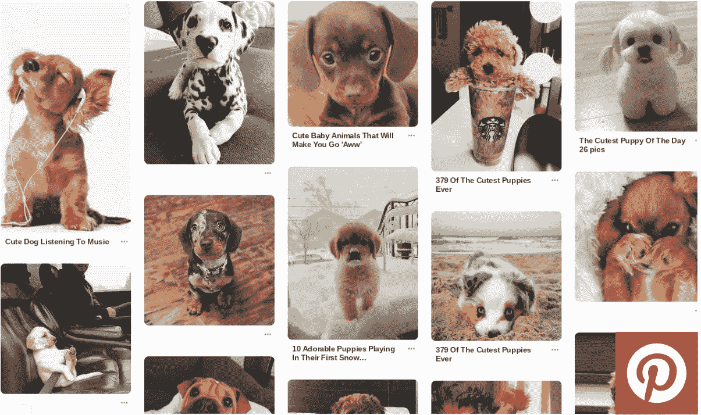

# 策划探索:Pinterest 的竞争优势

> 原文：<https://medium.com/swlh/curated-exploration-pinterests-competitive-advantage-f8e8251a48ea>

## 在结构和流动之间，我们发现了新的想法

## 作为一名正在恢复的搜索营销人员，我发现 Pinterest 特别吸引人。

视觉搜索引擎(或社交网络，如果你喜欢的话)拥有超过 2.5 亿每月用户的参与基础，并使…