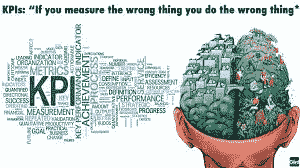

# 客户成功不是一个部门...

> 原文：<https://medium.com/swlh/customer-success-isnt-a-department-de7896ba0168>

## 技术领导者的实用策略

## 要想成功，它必须是你公司中每个人和他们所做的每件事的核心

您的客户从您这里购买产品，因为您正在帮助他们解决难题、开启机会，或者只是完成一项工作。你希望你的客户成功使用你的产品和服务。然后他们会呆得更久，推荐更多的人给你，你会得到帮助别人做更多事情的快乐。

因此，您可能已经组建了客户成功团队，现在一切都会变得很好！但让这些客户成功并不是一个部门的工作，而是整个公司的口号，是每个团队和每个人工作的核心。

> 帮助你的顾客是你工作的基础，但你是否把它放在每个人工作的中心将决定你是否成功。你不能让一个团队独自应付这一切！

客户成功部门不是答案。这是一个关键的部分。但是如果每个人都关注客户的成功会怎么样呢？

# 让我们看一下每个团队的情况…

## 产品和开发

确定路线图并构建贵公司所需的解决方案，该部门无疑专注于客户成功…或者他们是否被相互竞争和冲突的需求所淹没，评估每个功能的 ROI，并且过于频繁地拒绝它们，因为这太费力了？

顾客的想法和要求经常被孤立地看待。因此，好处看起来很小，可能想要它的客户数量有限，而努力看起来很大。所以，当然，他们拒绝了。但是这个团队必须问自己…

> 这位顾客为什么要问这个？他们试图解决什么更大的问题，有多少人会从中受益？或者，客户还能如何解决这一需求？

细分来看，每次该部门拒绝请求时，他们都需要回答以下问题:

1.  这个请求源于什么更大的需求？如果解决这个问题与您所做的一致，那么评估优先级并添加到路线图中！
2.  客户还能如何满足他们更大的需求？通常它是可以解决的，只不过是以不同于他们的客户所要求的方式，它可以在你的产品内部或外部解决！

确保团队关心客户的成功是他们关注客户成功的基础。

## 销售和营销

这些团队了解你的客户。他们真的了解他们。他们发现并追逐他们，然后宴请他们，无论是在网上，通过大量的电话，还是后续的电子邮件，让他们付钱给你来解决他们的需求。但事实是，这些团队的唯一动机是通过尽快签约新客户来获得新收入，然后转向下一个潜在客户。

如果他们负责将潜在客户从非用户转化为非常成功的客户，会怎么样？如果他们对客户与你在一起的时间负责会怎么样？

营销需要负责在公司内部阐明什么是理想的客户群，为什么他们想要做出改变并与你的公司合作，以及你如何才能帮助他们。然后重复并分享，因为公司的每个人都可以根据他们的经验提供反馈，以提炼信息并了解谁真正重视你提供的东西。

> 营销需要与所有团队建立一个反馈循环，以便他们能够根据哪些客户实际上从您的工作中受益最大来完善所需的客户档案

关于这个问题的更多想法，Hubspot 有一个客户成功和营销的总结。虽然这更侧重于对客户的营销，但在与客户和营销合作的团队之间建立一个反馈回路是至关重要的。

销售处在第一线，最有能力理解潜在客户为什么会掏钱，因为他们相信你会给他们最好的帮助。

> 销售人员需要与入职团队和客户服务团队分享客户的战略目标，以便这些团队能够确保实现这些目标

如果做不到这一点，就意味着其他团队和客户都不会成功。

[Hubspot 有一篇关于协调销售和客户成功的文章](https://blog.hubspot.com/service/sales-and-customer-success-alignment)，尽管它很好地解释了如何使用营销工具向客户销售，但它忽略了一个事实，即战略销售人员是最有效的，但需要与公司的所有团队分享这些客户战略。

## 客户服务和客户成功

好的，现在我们在为帮助您的客户而付费的团队中…但是他们的报酬是基于客户的成功，还是基于他们与客户沟通的速度以及他们关闭故障单的速度？

客户服务或支持团队经常被重新命名为“客户成功”,但他们的使命或愿景没有改变，即他们如何为客户带来成功。最糟糕的是，不知道如何衡量 Custer 的成功，因此使用旧的成本节约指标，并根据这些指标奖励团队，而不是根据 Custer 的成功进行奖励。

> 您的客户成功团队需要有基于客户成功的明确指标，而不是他们成为您客户的时间长短

在接下来的一周，我会写更多关于这个的内容，敬请关注…

## 最后…您的客户

我们都知道有一个很棒的客户，他很有战略眼光，而且“一语中的”。他们提出最好的想法，并对公司产生重大影响。但更多的时候，这只是因为他们可以用一种对你有意义的方式来解释。他们在解释更大的问题，并且经常使用你公司内部使用的相同术语，这样每个人都容易理解。但所有其他客户都有一些东西要分享，但你没有领导他们。

但是，如果你真的倾听所有客户的意见，并以你的团队能够理解的方式帮助他们交流想法，那会怎么样呢？我敢打赌，你的客户的更多想法会更有意义，并帮助你帮助你的客户。

了解你的客户有很多技巧，但在与我的邻居交谈时，问一个棘手的问题是最好的方式，我的邻居是一家非常成功的公司的退休首席执行官。稍后会详细介绍。

# 包裹

客户成功不仅仅是一个团队的责任。相反，它需要成为每个部门的中心，这些部门的人员需要共同努力，提供一个全面和协调的消费者成功方法。

## 轮到你了

填写这份关于谁管理您的客户的简短调查，看看其他人如何做的结果