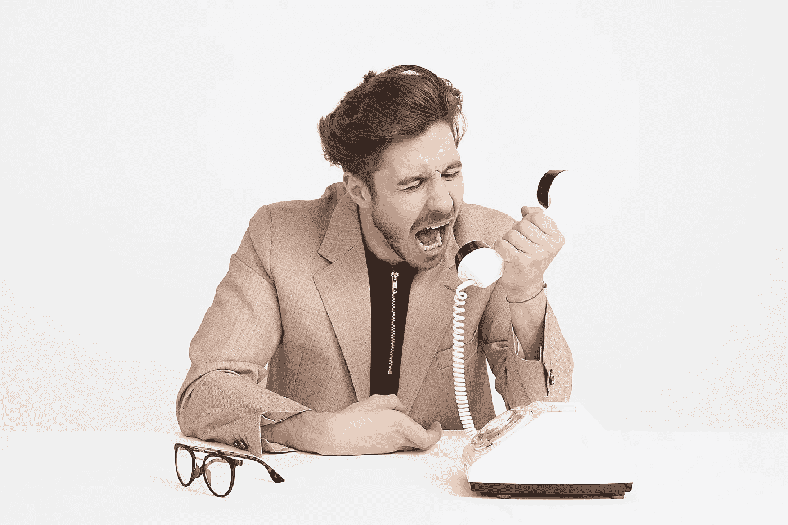

# 自助垃圾循环

> 原文：<https://medium.com/swlh/cycle-of-self-help-garbage-8a6e06883c0e>

似乎无论我走到哪里，都会有人向我推荐一些自助书籍、文章或播客。从蒂姆·费里斯，到亚当·格兰特，再到一些像戴尔·卡耐基这样的老作家，显然，总有另一本书可以读来“改善我似乎沮丧的生活”。这个世界似乎在向我们灌输一本又一本的自助书籍，发誓下一个诡计将会颠覆我们的世界。

这可能是真的。也许有那一本书，但是我有我的怀疑。你可能会在这些书中找到灵感的火花或有用的金块，但最终你会陷入自助垃圾的循环中。你只会不停地消耗，从不执行任何事情。你会一直希望其中一本书会突然成为释放你真正潜力的关键。

秘密是:永远不会有。

如果你一直消费而不能执行，什么都不会发生。

你可以阅读每一本《纽约时报》最畅销的“自助”书籍，也可以阅读媒体上关于如何“将你的生产力提高 10 倍”或如何“成为有史以来最成功的足不出户的人”的每一篇文章，但除非你离开床去尝试，否则你永远不会真正做到。

> "一个人的价值并不比他的野心更大。"-马库斯·奥勒留

最终，所有的自助知识都会变得一样，不管来源是什么。就在几天前，我在 Medium 上搜索了“热门爱好”,发现有 15 篇文章声称完全相同的事情。如果你想找到自助的真正根源，读读旧哲学:马可·奥勒留，尼采，希腊人，等等。你会得到同样的内容，蒂姆·费里斯也不会告诉你去海外买一个虚拟助手。

我不得不做的最难的事情，也是我现在仍在努力做的事情，就是把自我帮助的噪音拒之门外。我真的会被媒体上的一篇又一篇文章所吸引。我必须不断提醒自己，如果我真的想鞭策自己，学习新的东西，我需要阅读小说、传记和非小说类的题材，推动我的思维。

自助可以是激发灵感的绝佳跳板，但也可能是一个恶性循环，让你陷入过度消费。找到平衡，并采取行动获得回报。