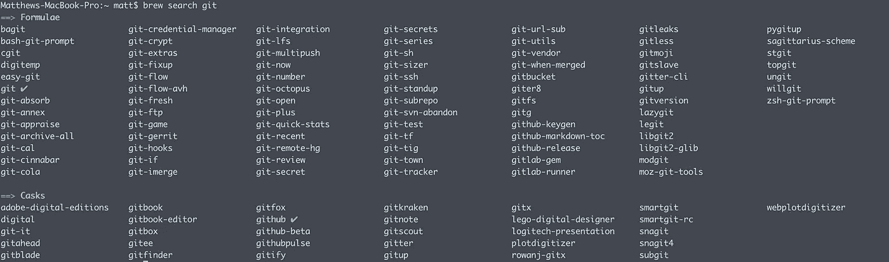

# Déjà brew 或我如何学会不再担心并爱上自制啤酒

> 原文：<https://medium.com/swlh/d%C3%A9j%C3%A0-brew-or-how-i-learned-to-stop-worrying-and-love-homebrew-503055b656be>


Photo by [BENCE BOROS](https://unsplash.com/@benceboros?utm_source=medium&utm_medium=referral) on [Unsplash](https://unsplash.com?utm_source=medium&utm_medium=referral)

在谷歌上摸索，搜索并手动下载一个应用程序文件，肯定有更好的方法来完成这件事。


和你们大多数人一样，在发现家酿之前，我习惯用通常的方式在我的 mac 上安装应用程序。搜索谷歌，找到 app 文件，最后移入应用文件夹。

Ubuntu 和所有其他 linux 发行版都有 sudo apt-get 来通过命令行安装大多数应用程序。因为 OSX 的核心是基于 Unix 的(Darwin ),所以必须有一个解决方案。

# 还有一个办法！！！！

家酿是一个软件包管理器，从命令行运行。它提供了一种简单易行的方法，可以直接通过在 shell 中运行命令来安装您能想到的几乎任何应用程序。

你可能会想，为什么要从我的生活中抽出时间来配置和安装这个呢？

这个 xkcd 很好地总结了答案。


# 装置

要安装 Homebrew，请运行以下命令

```
/usr/bin/ruby -e "$(curl -fsSL https://raw.githubusercontent.com/Homebrew/install/master/install)"
```

通过运行以下命令检查它是否正确安装

```
brew doctor
```

现在你已经安装了自制软件，你可以安装任何东西了。

# 啤酒

command brew 将是您最好的朋友。它可以让你用一个简单的命令安装任何命令行程序。

Homebrew 有所谓的公式，你可以运行它来安装一个应用程序。要为您想要的应用程序搜索公式，只需使用

```
brew search <appname>
```

假设您想要安装 Git。您可以下载并安装 dmg，或者在您的终端上运行这一行。首先运行一个搜索，你会得到一堆不同的 git 相关公式



太多了！我们只需要基本的命令行 git，所以让我们安装它。

```
brew install git
```

现在，您可以通过运行以下命令来确认软件包的安装

```
which git
```

这就是在你的设备上安装任何应用程序所需要的一切


如果你正从任何一个 Linux 发行版过渡到 OSX，对于你所习惯的 GNU 命令行工具来说，有一个很好的公式。

```
brew install coreutils
```

# 扩展到 GUI 应用程序

Homebrew 上面的樱桃是木桶，它允许你安装任何你通常会在网上或应用商店找到的 GUI 应用程序。

不像命令行应用程序，图形用户界面存储在桶里，而不是公式。

首先你需要安装木桶

```
brew install cask
```

安装完成后，您可以键入“brew cask”前缀而不是简单的“brew”来安装您最喜欢的应用程序

举个例子，让我们安装我最喜欢的 ide

```
brew cask install visual-studio-code
```

就是这样！一块蛋糕或馅饼


# 卸载

另一个令人惊叹的功能是，只需一个命令就可以卸载和清除您的计算机上使用 brew 安装的任何应用程序。

检查你用自制软件安装了什么程序

```
brew list
```

或者

```
brew cask list
```

记住你的 GUI 应用程序和命令行应用程序是分开的

现在卸载列表中的任何应用程序

```
brew uninstall <Formulae>
```

或者

```
brew cask uninstall <cask>
```

# 更新中！

OSX 不会让你的应用保持最新。当然，家酿啤酒提供了一个解决方案。

你猜对了，所有你用家酿软件安装的东西都可以用一个命令更新。

您可以使用此命令找出什么是过时的

```
brew outdated
```

您现在可以使用更新所有应用程序(不考虑公式)或单个应用程序

```
brew upgrade <formulae>
```

GUI 程序也可以更新

```
brew cask upgrade <cask>
```

简而言之，这就是家酿的基本功能。希望你现在可以使用和安装任何你想要的东西。我会留下一些你可以通过自制软件安装的必备软件的链接。祝你好运！

[](https://picocoder.io/best-homebrew-packages-for-mac/) [## 适用于 Mac 的最佳自制软件包

### 如果你是 Mac 超级用户，并且可能是软件工程师，你会在你的机器上安装自制软件。万一…

picocoder.io](https://picocoder.io/best-homebrew-packages-for-mac/) [](https://www.quora.com/What-are-the-first-or-must-have-homebrew-packages-that-you-install-on-your-Mac) [## 你在 Mac 上安装的第一个或必备的自制软件包是什么？

### 回答(第 1 题，共 12 题):我不得不推荐 irssi，因为它是我个人最喜欢的 IRC 客户端。它在终端运行，所以，如果…

www.quora.com](https://www.quora.com/What-are-the-first-or-must-have-homebrew-packages-that-you-install-on-your-Mac)