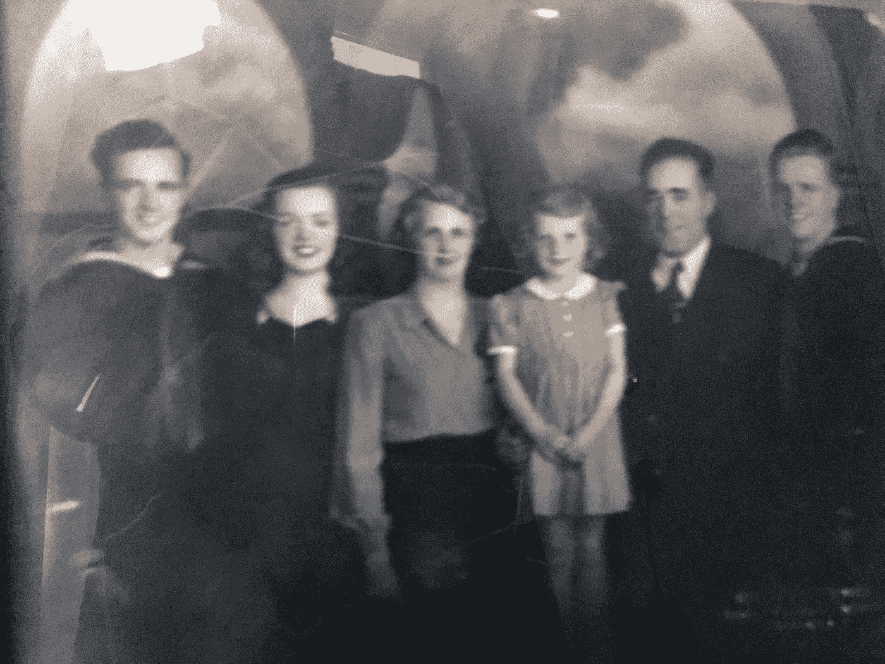

# 登陆日:我们只是想让这该死的事情结束。

> 原文：<https://medium.com/swlh/d-day-we-just-wanted-the-god-damn-thing-to-be-over-5d9104b3a147>

My family, Jack, Left, Frank, Right, home on leave March 1945.

## 我当时五岁。我对战争了解多少？

他们都这么说。越过后面的栅栏。做完礼拜。在理发店，在肉店排队。父亲和母亲，虽然女人省略了诅咒语。孩子们用低沉、严肃、成熟的声音模仿我们的父母。

# “把这该死的东西弄过来……