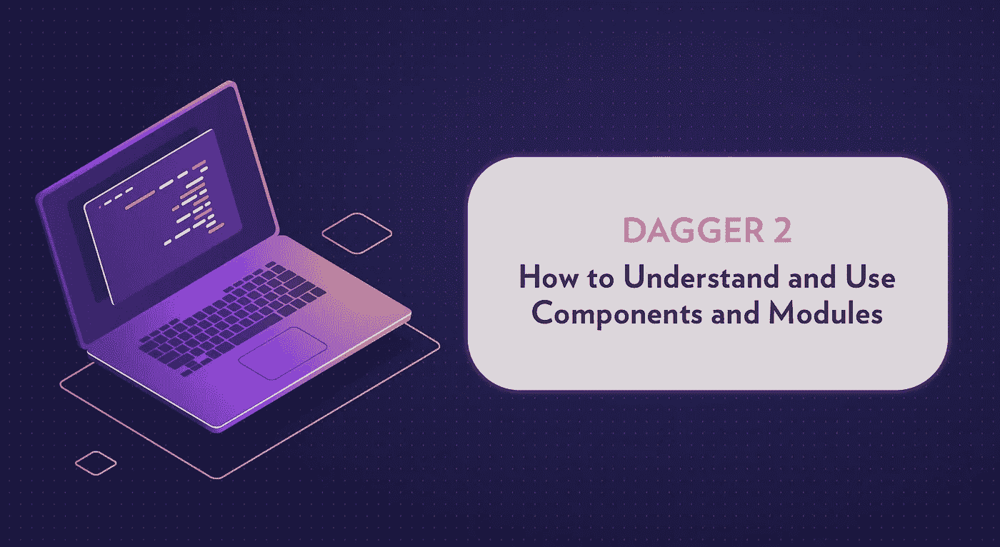

# Dagger 2:理解组件和模块

> 原文：<https://medium.com/swlh/dagger-2-understanding-components-and-modules-distillery-1f568df41ca2>

Dagger 是一款优秀的依赖注入(DI)工具。它在编译时完成大部分工作，使应用程序更小更快，依赖性解析更安全。

没什么了不起的是[文档](https://google.github.io/dagger/users-guide)。*匕首*绝不是简单的工具。正确有效地使用它需要一定程度的理解。