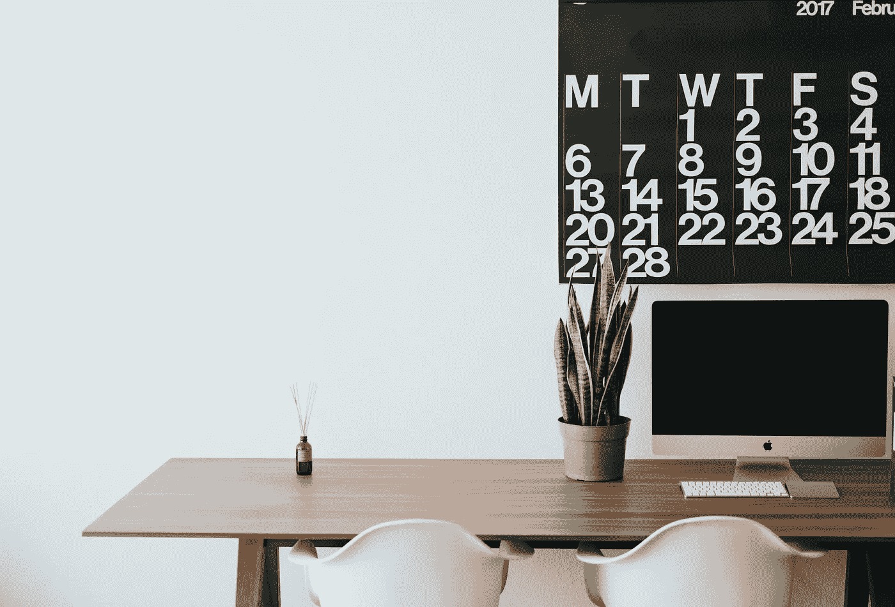

# 日常事务:你应该实施的 5 个理由

> 原文：<https://medium.com/swlh/daily-routine-5-reasons-why-you-should-create-one-for-yourself-25e637b6ec41>

## 日常生活对生产力和心理健康的好处

Photo by [Roman Bozhko](https://unsplash.com/@romanbozhko?utm_source=unsplash&utm_medium=referral&utm_content=creditCopyText) on [Unsplash](https://unsplash.com/search/photos/working?utm_source=unsplash&utm_medium=referral&utm_content=creditCopyText)

对大多数人来说，外出通常表现为无聊。但是常规是让你有条理并专注于你的目标和项目的东西。我曾经听过这句让我产生共鸣的话:

> 你度过一生的方式就是你…