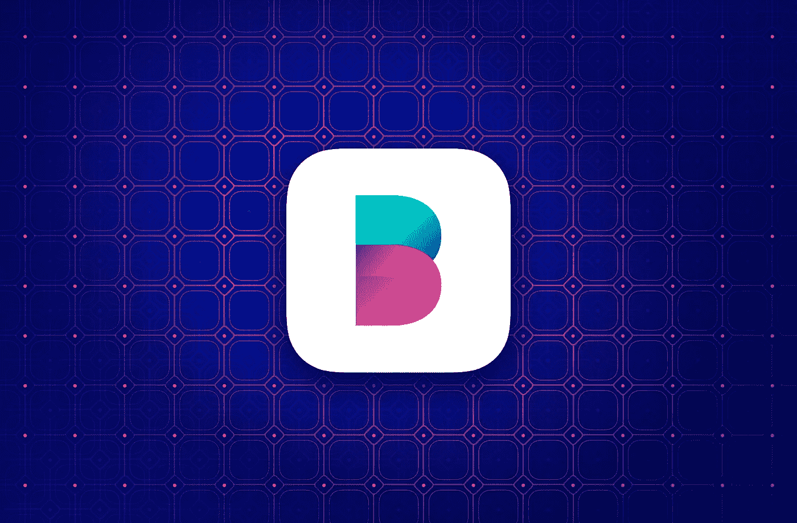
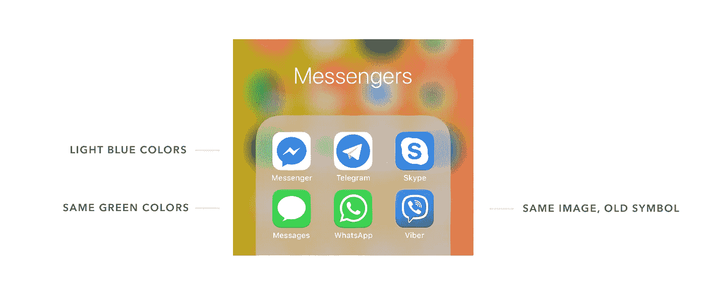

# 敢于做一个亮眼的品牌

> 原文：<https://medium.com/swlh/dare-to-be-a-bright-brand-dbf924b503be>

## "成功来自脱颖而出，而不是随大流。"——唐·德雷珀《广告狂人》

[Balance app icon](https://dribbble.com/shots/5271865-Balance-App-Icon)

在**广告**、*的世界里，无论是获奖的电视节目还是真人秀，*我们在它存在的整个时期都观察到独特而大胆的解决方案。每个品牌都希望有一个引人注目的、有吸引力的活动，有容易记住的口号，这样才能脱颖而出，让人们谈论它。

当谈到**产品和品牌设计**时，这个创意世界的画面就不一样了。也许是因为它存在的时间更长，视野更广，许多公司还没有准备好接受这种大胆的风格。风险更高，因此存在许多问题——该解决方案是否提高了转化率，用户是否会注意到 CTA 按钮并进行订购，应用系统 iOS 设计是否更好，以便我们的应用程序使用起来更简单、更自然？

嗯，在某些情况下会有用。比如，如果你是这个行业的先驱，比如 Whatsapp。因此，拥有数十亿用户使得发布应用外观和行为的重大变化变得更加困难。但是你不应该忘记的是

> 产品应该驱动情感——快乐、可靠和自信的感觉。

# 应用程序设计中的情感

该应用程序基本上由不同的功能组成，收集并保存在小地方，你的口袋里。它应该易于使用，但是我们是否只想保持高水平的功能，或者我们也关心感觉？

这里有一个例子——比较脸书和 Eventbrite 应用程序中的事件搜索。是的，他们在一个核心上有所不同，因为脸书活动只是众多功能中的一个，而 Eventbrite 的主要功能就是这个。但是让我们从用户的角度来看，分析一下使用和感知上的区别。

**脸书活动**屏幕显示了一些活动、特定搜索和创建您自己的活动的选项。正如你所看到的，图像可能会有所不同，事实上，你的活动封面变暗，以放置细节，使它们看起来灰色和不具吸引力。

在 **Eventbrite 应用**中，我们可以看到一个清晰结构的好例子*，最重要的是*有一种**快乐的情绪**。这是通过插图实现的——它占据了屏幕的一半，由于填充的背景，整个页面的颜色对比达到了平衡。它揭示了另一个方面，问题是，

## 插画在 app 中扮演什么角色？

[插图](https://medium.muz.li/why-ux-ui-designer-should-know-how-to-draw-illustrations-and-what-are-the-first-steps-to-begin-9c7785df70bd)反映了情绪——它可以让你预期进一步的步骤(在 Medium 应用程序中加载屏幕)并推动行动(探索 Airbnb 功能)。也可以是防止数据单调的元素(GoogleCalendar)。

插图有无穷无尽的风格，正因为如此，该应用程序获得了独特的设计。这也是一个工具，照亮了整个应用程序的设计，反过来是一致和直接的。

应用程序可能不是你的服务所需要的唯一数字元素，而你的老大哥——网站来了。

# 网页设计，一个不同的感知系统

每个网站的首要任务是吸引用户继续浏览它，在大多数情况下，向下滚动并看到文件夹下的**。“你永远不会有第二次机会给人留下第一印象”——威尔·罗杰斯这样预测每个网站的主页。**

**网站的桌面版本就像一个大画布，整体和连贯的风格可以立刻被注意到。**

****

**The concept of [the landing page](https://dribbble.com/shots/2719343-magic-co-landing-page-concept)**

**在下面的例子中，magic.co 网站的**，用户的兴趣和好奇心是通过明亮的动画渐变实现的，这些渐变背后有一个秘密。后面的章节保持了风格，同时为内容本身带来了更多的空间。****

**这一概念没有现场发布，但设计社区的积极反应是新客户赞赏并选择它作为他们首选风格的范例，这证明了字面上的**明亮解决方案的力量。****

****

**[Balance app landing page](https://dribbble.com/shots/5186797-Balance-App-Landing-Page)**

**再比如，**天平 app 登陆页面**说明了[黑暗模式](https://uxdesign.cc/blueberry-ui-how-to-benefit-from-the-dark-background-8f2678216df5)的好处。作为一个金融应用程序，设计有明亮的颜色和独一无二的外观，这可能听起来像是这个特定应用程序类型的不同寻常的组合，但实际上，这是它脱颖而出和吸引注意力的方式。**

**首先，用户关注闪亮的 CTA 按钮，然后是应用程序的屏幕和图形等视觉元素。所有这些元素彼此靠近放置，我们可以说**焦点**是图像、文本和按钮的组合。**

****

**[Avocode website](https://avocode.com/hand-off-and-inspect)**

**许多品牌努力通过 UI 设计和图形的连接找到自己的语言，例如 Avocode。在插图中，他们不仅使用了主要的绿色，还使用了与按钮和标签相关的深灰色。图案和纹理补充了构图。总之，它带来了一个独特而难忘的画面。**

# ****在一开始是一个符号。标志设计****

**你能想象今天的世界没有任何标识吗？如果我们有和班德纳斯奇电影中一样的机会回到过去，选择不同的进化选项，那么用这个简洁的图像作为一个符号向你介绍这个故事会有什么阻碍呢？这里有几个问题和时间点:**

**原始人应该在洞穴里画动物和符号吗？—没有。**

***中世纪时期没有纹章？*—完全没有。**

**我甚至没有提到制造业和工业革命。你看，这种保存信息或发送信息或调整到正确情绪的方式是在人类时代开始时建立的，随后的时期只是增加了它的使用。我们很难想象一种不同的进化方式。在我们的世界里，人们非常习惯于图形即时消息，就好像它被添加在我们的 DNA 里一样。**

****

**The result of the test where people draw logo from memory without any visual aids. [Source](https://www.boredpanda.com/famous-brand-logos-drawn-from-memory/?utm_source=google&utm_medium=organic&utm_campaign=organic).**

**尽管对我们来说，理解图形的含义是很自然的，但仍然不能保证这个标志会以它看起来的样子被记住。以下测试的结果可能会令人惊讶甚至震惊，因为大多数人的变体与原始徽标完全不同。但它表明，许多人记得标志的**颜色，它是**主题**或**情感**。****

****

**Screenshot from my phone. Aren’t there much in common in pairs of these apps?**

**考虑到应用程序的标志和图标，以下是你应该记住的事情，不要被其中一个相同的图标所困。**

**选择**颜色**你可以参考应用程序的特定类别中常用的颜色，但不要简单地应用，因为这样应用程序就不会突出整体画面。例如，许多信使应用程序只使用浅蓝色，因此，它们看起来都一样。**

**另一件要记住的事情是图标本身。同样的符号，就像截图中的聊天气泡，几乎没有添加个人的触感。相反，可以引用应用程序的名称，或者像 Telegram 应用程序一样，引用不同的字符——纸飞机。**

# **还有一个隐藏的组件——SMM**

**如今，社交媒体营销对每个品牌都很重要，这已经不是什么秘密了。但是你将如何使它工作呢？你会屈服于诱惑，购买虚假的追随者和喜欢，以便它看起来成立吗？**

**事实是，在这种情况下是行不通的。再一次，你需要给它注入活力。故事要**真实**，**个性**，**跟随品牌风格**。防止使用看起来像照片库中的照片，与回答问题的观众保持联系。**

**因为我有过在我工作的设计工作室领导 Instagram 页面的经历，我将描述我发现的好的品牌页面的例子。**

****

**The examples of high-quality content.**

****Herschel Supply Co.** 和 **Sezane** 品牌创造了象征它们的氛围。在第一种情况下，它用隐藏的信息*呼唤你，“拿起背包或行李箱，让我们去冒险吧”，*第二种情况代表了非常复杂的法国风格，整体的调色板和购买我们的衣服和配饰的想法，女孩会开花，同时会自信和快乐。**

****愚蠢工作室**在其关于设计机构生活的作品和日常故事中，用团队成员的高质量和非常积极的现场照片创作了该部分。在每张照片后面，都有一段关于这个人的文字，不仅提到了他或她拥有的职位，还提到了他或她的爱好。通过这种方式，你可以见到团队，看到他们是真实的人。**

****Osnovy publishing** 是一家乌克兰出版商，在这一部分，他们的照片简约而连贯，所有的注意力都集中在产品本身上，同时由于调色板的存在，页面看起来很清新。**

****杰克逊的艺术**照片简直牛逼。他们不只是拍摄包装的普通照片，而是创造气氛，有时是有趣的构图，或者展示它们的使用。**

**个人故事是关键。别忘了添加优质照片和页面管理背后的真人。请不要用机器人。**

***我想我应该再写一篇文章来单独描述管理 Instagram 页面的主要功能，因为还有很多事情要谈。***

**你读过这篇文章吗？然后，**恭喜**，那就是终点线！**

**我想在文字和例子背后传达的信息是，你的品牌不应该害怕脱颖而出。相反，**

> ****接受新的、新鲜的、不同寻常的观点**。**

**这是成为一个独特品牌、**赢家**的关键。**

**你可能会注意到，在许多例子中有很多颜色的用法，尤其是明亮的颜色。这是我个人的态度，我相信颜色是一个非常有力的工具。与此同时，我欣赏不同的风格和技术，但应该保持不变的是清晰的信息，积极的情绪，以及人们使用你的产品时的信任感。**

**谢谢大家！**

****

## **这篇文章发表在 [The Startup](https://medium.com/swlh) 上，这是 Medium 最大的创业刊物，拥有+412，714 名读者。**

## **在这里订阅接收[我们的头条新闻](http://growthsupply.com/the-startup-newsletter/)。**

****