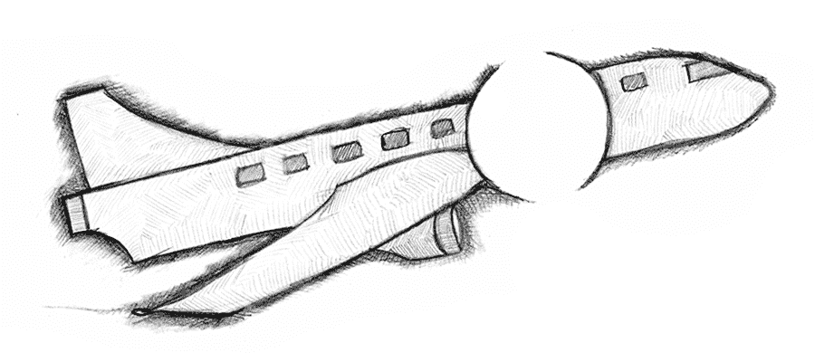

# 自主、黑暗模式和死亡

> 原文：<https://medium.com/swlh/dark-patterns-autonomy-and-death-3019de5107bd>

*What are the dangers of having an incomplete picture of your plane?*

**冗余，冗余，冗余**

今年早些时候，我采访了一位化学工程师，作为我们的用户如何看待他们的设备的研究工作的一部分。我问了他关于他追踪的数据的种类，这导致了对系统内置传感器的讨论。他描述了一个大的化学槽，它处于过程的开始阶段，主要的数据点是…