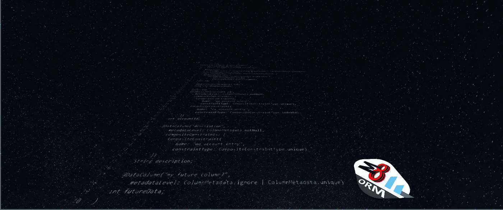

# Dart 框架 ORM M8

> 原文：<https://medium.com/swlh/dart-framework-orm-m8-329de7c2dcca>

# 另一个 ORM？为什么？

沉浸在 **Flutter** 的世界中是一次真实而迷人的冒险。作为一个相当新的框架，有很多机会来开发新的库。结果我觉得这是一个很好的机会，可以设置一个 ORM 来回答更多的问题。我们的目标是有一个框架，除了关系映射之外，还提供为基本用例生成支架的可能性:用户…