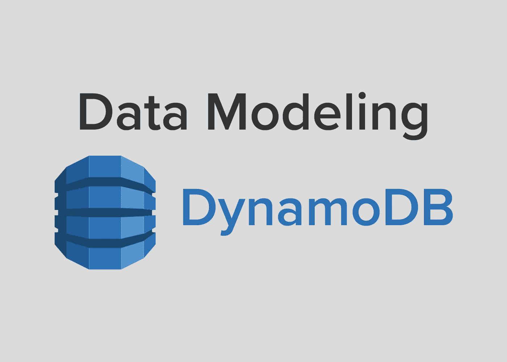

# AWS DynamoDB 中的数据建模

> 原文：<https://medium.com/swlh/data-modeling-in-aws-dynamodb-dcec6798e955>

## 如何建模你的数据与亚马逊网络服务的基于 NoSQL 的 DynamoDB 一起工作。

# 为什么是 NoSQL？

现在存储便宜，计算能力贵。NoSQL 利用了这一事实，牺牲了一些存储空间来允许计算上更容易的查询。本质上，这意味着当设计您的 NoSQL 数据时…