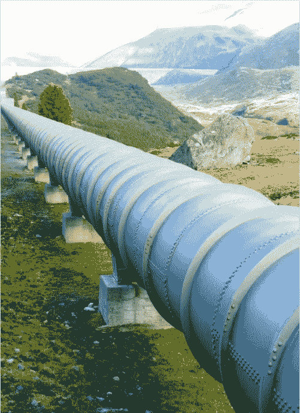

# 使用 TensorFlow 数据集 API 和 Keras fit_generator()的数据管道

> 原文：<https://medium.com/swlh/data-pipeline-using-tensorflow-dataset-api-with-keras-fit-generator-8c7a3e01c4fd>

Water Pipeline!

Google 的 TensorFlow 提供了一个数据集 API，对于导入机器学习数据集非常有用。它提供了一种使用可迭代元素的集合来表示、转换和构建复杂的机器学习数据管道的机制。

我在研究一个序列→序列问题时，偶然发现了数据集 API。我的数据集包含…