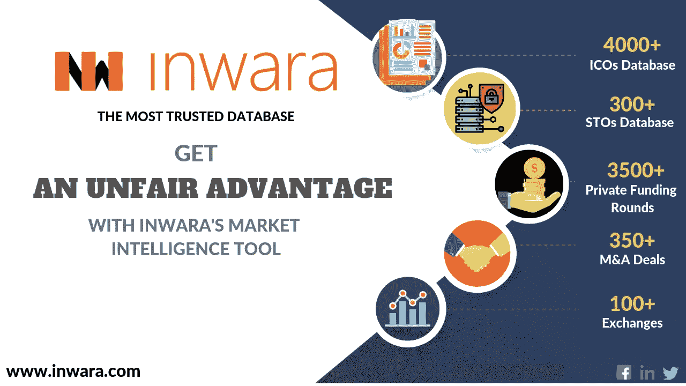

# 数据透明是重振加密货币生态系统的氧气

> 原文：<https://medium.com/swlh/data-transparency-is-oxygen-to-rejuvenate-the-cryptocurrency-ecosystem-d1c62ddf56f4>

## 基于数据透明度的 ICO 和 STO 评级

## **为什么数据透明度分级在 ICO 评级中至关重要？**

随着大数据的出现，企业正慢慢从“需要知道”的心态转向完全透明。难怪成熟行业中的许多企业现在都在寻找提高数据透明度的简单方法。然而，加密空间就不一样了。让你看一下这些数字:

*(*[*Source: InWara’s ICO & STO Database*](http://www.inwara.com/?utm_source=dtgstartup&utm_medium=dtgstartup&utm_campaign=dtgstartup)*; Analysis of 4,150+ ICOs)*

由于该公司披露的任何公开来源都缺少 ICO 细节的核心要素，难怪 ICO 市场处于低迷状态。

## **密码空间需要重新信任 ICOs&sto 吗？**

与穆迪提供的信用风险评级 [S & P](https://www.standardandpoors.com/) & [类似，加密领域迫切需要一家独立研究机构为 ico 提供数据透明度等级，以确保独立投资者——散户或机构投资者——对自己的投资一清二楚。](https://www.moodysanalytics.com/)

# **这种独立等级的好处是多方面的**

## **投资者易于理解**

散户投资者将努力筛选海量信息，无论是 150 页的白皮书，还是 ICO 提供信息的众多博客或社交论坛。数据透明度等级将允许投资者只关注项目、其可交付成果和可行性，并消除数据处理的大量工作。它将允许类似项目的简单基准，并支持正确的企业。

## **机构群体的透明度**

具有讽刺意味的是，当今的密码社区缺少的是信任。完整披露 ICO 细节是 ICO 团队最起码的期望。为了培养这种精神，对数据的清晰性和详尽性进行评级将使创始人对 ICO 的流程负责。

## **为 ICO 建立信誉**

例如，清楚地了解资金将如何被使用，增加了创始人的深谋远虑。这大大增加了 ICO 流程的可信度和 ICO 团队的彻底性。

在这个生态系统中，评级机构通常由 ico 赞助，以提高特定的评级。这个充满利益冲突的社会需要一个独立的研究机构来提供这种评级，InWara 已经做好了准备。InWara 不隶属于 ICOs，拥有超过 4150 个 ICOs 和 sto 的详尽数据库，具备满足加密社区迫切需要的规模和团队。InWara 不接受任何将 ico 列入其数据库的金钱补偿，因此有一个强大的生态系统为这个空间注入活力。

# **基于数据透明度的 ICO 评级方法**

ICO 提供的整个数据集分为以下几个部分:

*   公司详细信息:这将包括地址、控股公司(如果有的话)等简单元素
*   代币详细信息:这将包括代币销售的所有要素，从销售日期到筹集的资金以及其他要素。
*   链上数据:这将包括区块链上代币销售、创建和售后分销活动的书面记录
*   文件:这将包括 ICOs 所有索赔的明确来源
*   杂项:这将包括围绕一个明确的奖金结构，github 活动等部署的杂项细节

基于所公开的每个数据点的填充率，为每个部分指定单独的分数，然后对单独的部分进行加权，以给出最终的字母等级。这五个部分的预期数据点数约为 120。

## 数据透明度分级

[*Source: InWara’s ICO & STO Database*](http://www.inwara.com/?utm_source=dtgstartup&utm_medium=dtgstartup&utm_campaign=dtgstartup)

所有 ico 都遵循相同的等级，无一例外。

## **ico 在行业中的现状如何？**

完成了 4150 多个 ICOs 的这一练习后，InWara 很高兴将其作为摘要发布:

[*Source: InWara’s ICO & STO Database*](http://www.inwara.com/?utm_source=dtgstartup&utm_medium=dtgstartup&utm_campaign=dtgstartup)

*ICO 数量与评级——如预期，底部较重，顶部较轻(来源:InWara 的 ICO 数据库)*

AA 透明度的 ico 数量少得可怜，只有 0.7%。排名后两位的 ico 数量高达 33%。超过 60%的 ICO 在其 ICO 活动期间或之后仅向公众披露了 65%的潜在数据。

## **数据透明等级的值是多少？**

对 InWara 数据透明度等级的分析立即显示了价值。在评估 ICO 并为每个 ICO 分配等级后，注意到以下几点:

[*Source: InWara’s ICO & STO Database*](http://www.inwara.com/?utm_source=dtgstartup&utm_medium=dtgstartup&utm_campaign=dtgstartup)

*评级越好——开发越积极(来源:InWara)*

具有良好信息披露习惯的公司，往往工作更诚实，表现更好。

要全面了解评级，请订阅 InWara 数据库。

*声明:内容来源于* [*InWara*](http://www.inwara.com/?utm_source=dtgstartup&utm_medium=dtgstartup&utm_campaign=dtgstartup) *。这不是财务建议。InWara 不提升/降级任何公司/ICO。本信息或其他媒体中的观点、陈述、估计和预测仅属于作者个人。它们不一定反映 Inwara 或其任何附属公司(“Inwara”)的意见。Inwara 没有义务更新、修改或修正此消息或其他媒体，或以其他方式通知其接收者，如果此处陈述的任何事项或此处陈述的任何意见、预测、预测或估计发生变化或随后变得不准确。本邮件或其他媒体中提供的任何内容、信息和材料均按“原样”提供。Inwara 对其准确性、完整性或及时性，或收件人获得的结果不做任何明示或暗示的保证，并且不对任何收件人在此的任何不准确、错误或遗漏承担任何责任。在不限制上述规定的情况下，Inwara 对任何消息或媒体的接收方不承担任何责任，无论是在合同、侵权行为(包括疏忽)、担保、法规或其他方面，对于此类接收方因其或任何第三方决定的任何行动、意见、建议、预测、判决或任何其他结论或任何行动过程而遭受的任何损失或损害，无论是否基于此处包含的内容、信息或材料。有关更多详情，请访问* [*条款和条件。*](https://www.inwara.com/disclaimer)

## 这篇文章发表在 [The Startup](https://medium.com/swlh) 上，这是 Medium 最大的创业刊物，拥有+418，678 名读者。

## 在此订阅接收[我们的头条新闻](http://growthsupply.com/the-startup-newsletter/)。

