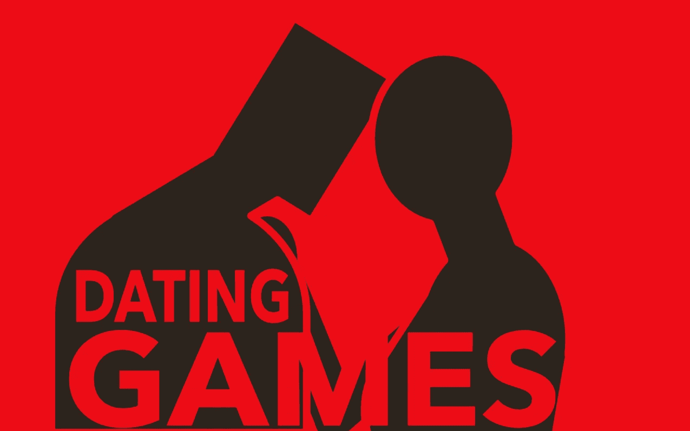
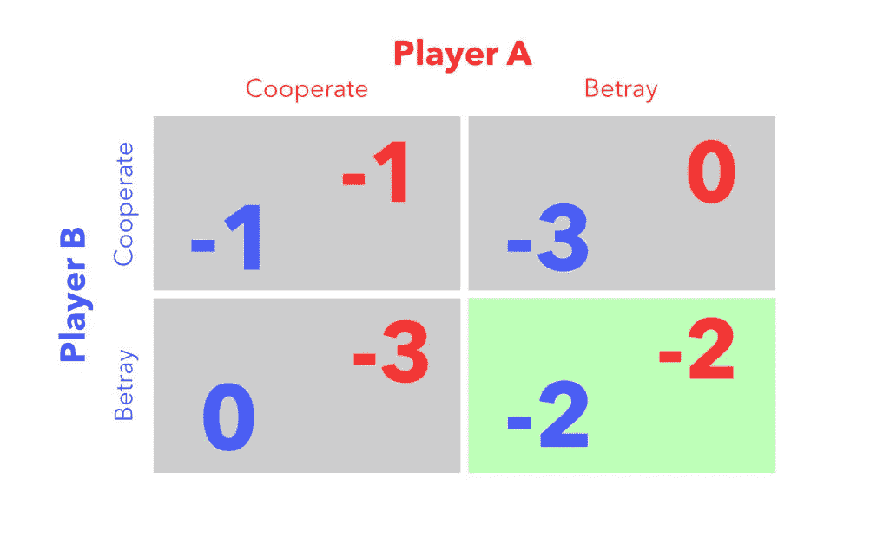
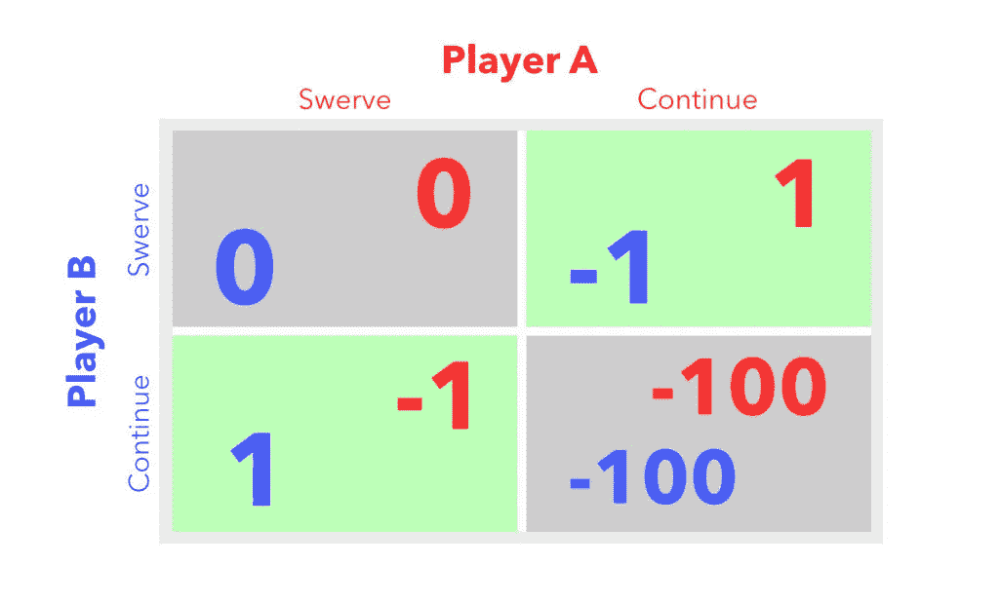
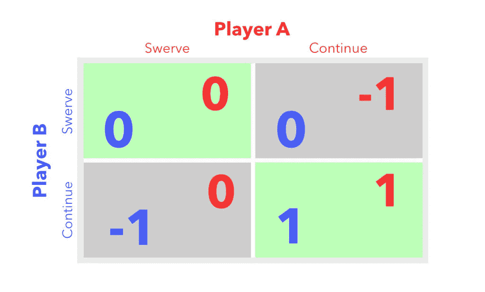
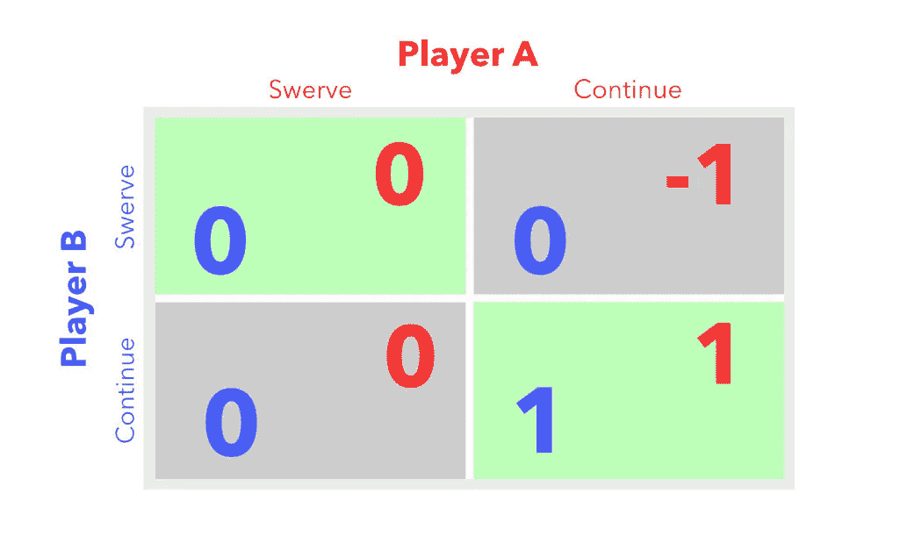

# 约会游戏

> 原文：<https://medium.com/swlh/dating-games-699e56dbb152>

我曾听人形容约会是一场胆小鬼的游戏。从表面上看，这种描述似乎很合适——你有两个正在接近对方的人，其中一个可能会在最后一刻决定退出，留给另一个的可能比他们预期的要少一点。

但是在博弈论中(以及实际的小鸡游戏，如 1984 年由 *Footloose* 所描绘的)，游戏涉及两辆车，如果它们转弯不够快，将会以可怕的撞车结束游戏。

**这看起来*不太像*对我的约会**，所以我决定再深入挖掘一下，试着找到正确的描述。也许我们会学到一些有趣的东西。

先说**博弈论**。到底是什么？维基百科将博弈论描述为“理性决策者之间战略互动的数学模型研究”。这里提到它是一个模型——所以目的是**说明一个概念**,也许**简化一个真实世界的交互**,以便更容易理解。战略互动对我来说意味着有两个**实体对他们的行为产生后果** **。**

最后，我们希望所有的参与者都是理性的决策者……这听起来越来越不像我听说过的任何现代约会情形了(*在这里插入 sit-com 笑轨*)。这仅仅意味着这些实体按照他们自己的最佳利益行事。

行动的后果和理性决策——这些都是我们可以用来简化约会场景中人们之间复杂互动的**假设。**

如果我们挖掘得更深一点，我们还会发现博弈论对这些模型有很好的可视化表示，称为*支付矩阵*。每个矩阵说明一个特定的游戏，通常包括两个玩家和有限的选择。

博弈的一个例子是囚徒困境。在这个游戏中，两个玩家都是单独牢房中的囚犯，没有交流的手段，他们可以选择相互合作(保持安静)，或者背叛对方(告发对方以获得豁免权)。

收益矩阵看起来有点像这样:在行和列的标题上是每个囚犯可能做出的选择。每个单元格内的数字代表在其他玩家选择的情况下，每个玩家获得的*效用*(或收益)。

这张图展示了一组通常保持不变的收益，而玩家会随着时间的推移重复玩这个游戏。像任何游戏一样，人们从以前的决定中学习，并不断地这样做，直到他们为自己的选择制定出一个策略。在这个特定的游戏中，你可能会让玩家 A 决定*先合作*，而玩家 B *也合作*。然后，在游戏的第二次迭代中，玩家 A 可能期望玩家 B*与*合作，随后选择*背叛*以提高他们的收益。在第三次迭代中，我们预计参与人 B 也会选择*背叛*，以避免更差的收益。

最终，你会期望两个玩家总是*背叛*。随着时间的推移，这种期望创造了一种情况，双方都不期望对方会合作，于是一个均衡就形成了，双方的选择不再改变。这被称为*纳什均衡*(我们用绿色突出显示)。

你会注意到这里的一些事情。首先——**在一些游戏中，如果不知道其他玩家的选择，会有一个最优策略**。其次——**最优选择并不总是导致双方的最佳收益**。让我们希望这不是约会的情况。

如果我们回到吃鸡的游戏——两个对立的玩家朝着对方开车，看谁先转弯——我们预计这个模型会有两种不同的选择:*继续*(代表有人继续开车)，或者*突然转向*(当有人转弯时)。

经典博弈中的收益矩阵应该是这样的:

Payoff matrix for the game of chicken

如果我们用这个比喻约会，我们会认为*转向*代表一个玩家决定停止与另一个玩家约会，而*继续*代表继续约会的选择。让我们来看看现有的矩阵的游戏鸡，并作出一些改变:

根据上面的收益矩阵:如果两个人*都转向*，那么两个人的收益都是 0。这听起来似乎是对的——当两个人决定不交往时，什么都不会发生。

如果一个人决定*继续*而另一个*转向*，一个玩家得到负收益，而另一个得到正收益。**假设一般人不喜欢带人去找乐子**(为了简单起见)，我们应该只期望这里没有积极的回报——因为玩家仍然不会互动(尽管一个玩家的感情仍然可能受到伤害)。

最后，**如果两个人都决定继续，我们应该期待整个矩阵中唯一的正收益，而不是典型的吃鸡游戏中的“崩溃”**。这种情况下，人们喜欢彼此约会，并继续这样做。

综上所述，我们最终应该得到这样一个矩阵:

Payoff matrix for the dating game

你会注意到有两个纳什均衡。这是怎么发生的？这意味着什么？

让我们从第一个问题开始，弄清楚*如何*。让我们想象一下，玩家 A 和 B 都从*转向*开始。两个玩家都没有改变策略的动机，因为他们最终会得到负收益。在现实生活中，这种情况的一个例子是两个人互相鬼混。在这种情况下，大多数人会认为，如果他们给对方发短信，他们更有可能被忽视，因为对方也决定不给他们发短信。

如果游戏开始时，一个玩家*转向*，而另一个*继续*，那么继续*的玩家会被激励*转向*，这样他们就不会有负收益。如果你邀请某人出去喝一杯，而他们不理你，你会再次邀请他们吗？*

在最后一种情况下，如果两个玩家都开始选择*继续*，他们将坚持他们的道路，因为这是两个玩家收益最高的结果。这说明了你喜欢有人陪伴，你知道他们也喜欢你。

你现在可能在想，在 75%的情况下，我们最终会错过连接。在四种情况中的三种——*两个玩家都转弯，一个转弯一个继续，或者一个继续一个转弯——*模型预测两个玩家都将选择不与对方互动。如果我们假设你事先已经经历了整个短信和审查过程，75%似乎有点高。这是约会最简单的形式吗？我们被困在这里了吗？这一切意味着什么？

2018 年，尼尔·德格拉斯·泰森[出现在乔·罗根体验](https://www.youtube.com/watch?v=vGc4mg5pul4)节目中，这是一档播客/脱口秀节目，罗根在其中采访了各种嘉宾。在他的出现中，泰森被问到为什么他没有一个手机壳来保护他的 iPhone。泰森拿出了他价值近 1000 美元的手机，并展示了他如何拿着它，同时讲述了他自己保护手机的方法。

有手机壳的人往往不太小心使用他们的手机，因为他们希望手机壳完全完成工作。但大多数情况下只能保护这么多，他们的手机最终损坏。泰森说，他选择**调节他的风险，而不是**，注意他如何持有风险，并注意风险的脆弱性。

我们经常忘记我们在选择中的媒介，以及它对我们周围环境的影响。让我们看看，当我们调整我们的收益矩阵，去掉参与人 B *转向*时参与人 A 的负收益，会发生什么。在现实生活中，**这种变化代表着一个决定，不要把别人的决定看得太个人化。**

Payoff Matrix for the dating game, with modulated payoffs for player B

你会注意到均衡保持不变，但如果你重放游戏中的可能步骤，你也会注意到**现在有 50%的机会让双方玩家都获得正收益**。

在你*突然转向*，或者你们两个*突然转向*的情况下，我们期望平衡是右上角的单元格**，但是如果他们*突然转向*而你*继续*，在游戏的第二轮，另一个玩家被激励*继续*以及**。

当然，**这一切都假设对方有正收益**——如果他们对你毫无兴趣，甚至不喜欢你，他们会继续转向。但是如果不知道这一点，看来你最好的策略是给人们第二次机会。

在整个分析中有很多假设，即收益值和假设复杂的情况可以简化为四个正方形，数字分散在其中。还有一种可能的批评是，这种对情感状况的深入分析会让它们失去浪漫。

没有一个单一的数字可以概括一个人的所有欲望和恐惧，但也许——在安静的时刻——当有时间反思时，或者当你觉得自己想得太多时，这种你在正确道路上的保证可能会平静你不稳定的心。你会给人们第二次机会。

(特别感谢我的朋友们在编辑过程中分享了他们的时间、耐心和专业知识。)