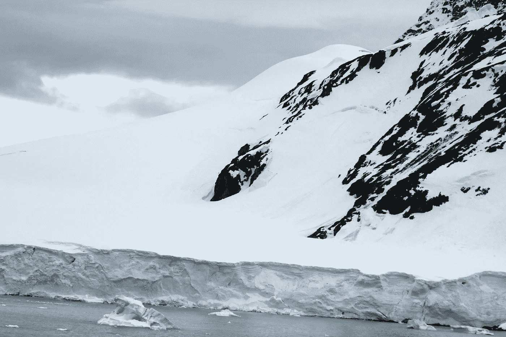

# 南极洲的大卫和歌利亚

> 原文：<https://medium.com/swlh/david-and-goliath-in-antarctica-4936981f6b0a>

Antarctica showing shoreline with 30-foot snow cliffs. Photo by author in 2010

## 大小并不重要。

我第一次见到道格是在大学，我认为他是一个大嗓门，强调大。几年后，当他开始举重时，重点转移到了“大第一”,这个大嘴巴变得非常有趣，非常聪明。然而，当他遇到你的时候，恐吓是一个关键词。当有人说一些愚蠢的话时，他会皱眉头——他有一个惊人的…