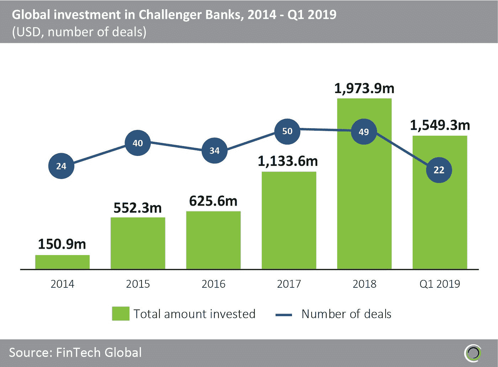
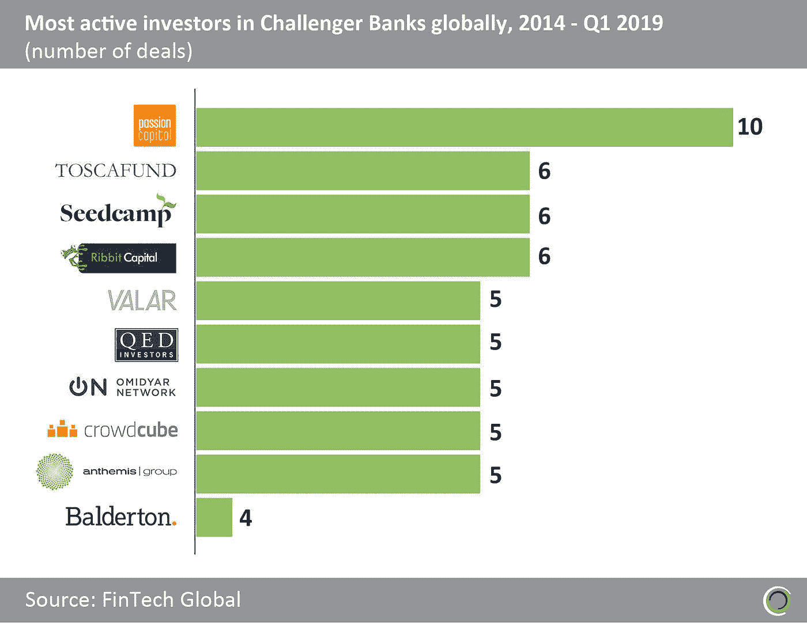
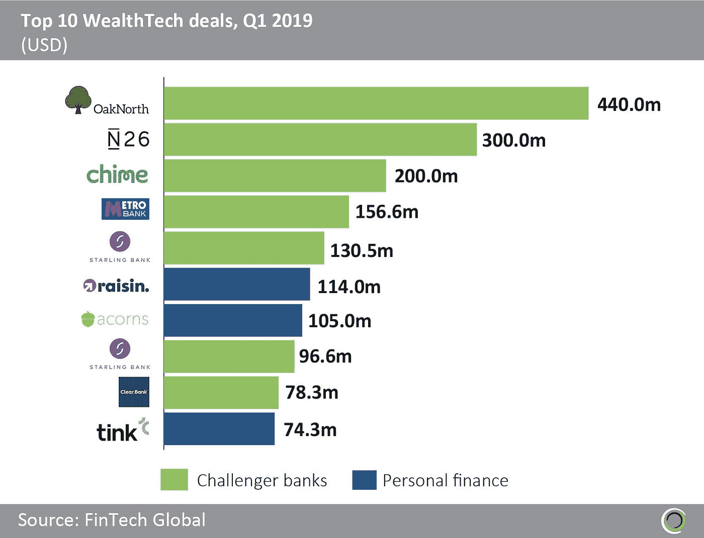

# 大卫五世歌利亚:挑战者银行提高创纪录的投资水平

> 原文：<https://medium.com/swlh/david-v-goliath-challenger-banks-raise-record-levels-of-investment-f34b43341fc2>

# 金融科技全球(FinTech Global)的研究显示，自 2014 年初以来，投资者已承诺向挑战者银行投资 60 亿美元

帮助客户管理他们的财富已经成为金融科技颠覆者的一个主要目标领域。几十年来，自满和忽视一直是许多银行提供者*工作方式*的主要元素。这一点，加上许多财富和资产管理公司过时的方法，促使创新者创造出更好的财富/资产管理、私人银行和数字银行产品和服务。

因此，毫不奇怪，富裕科技领域的最新投资数据继续显示出持续增长。特别是，有趣的是看到挑战者银行类别的投资大幅增长，FinTech Global 将其作为 WealthTech 的一个子行业，因为所有挑战者银行最终都希望向客户出售储蓄和投资产品(否则获得账户有什么意义？).

# 自 2014 年以来，Challenger banks 筹集了 60 亿美元，其中四分之一是今年在 Q1 筹集的。

自 2014 年初以来，财富科技公司在超过 1300 笔交易中筹集了 169 亿美元。如图 1 所示，其中 60 亿美元投资于挑战者银行的 219 笔交易。

挑战者银行的投资增长惊人。今年第一季度的总投资超过 15 亿美元，相当于 2018 年全年的 78%左右，是 2014 年全年的 10 倍。由于 Q1 2019 年的交易数量与 Q4 2014 年第四季度几乎相同，平均交易规模也明显增长了十倍。

据报道，challenger banks 的第一阶段重点是获得千禧一代的账户，要么是因为相信这些客户未来可能会被交叉销售，要么是打算将这些账户出售给为这一群体提供服务不足的落后的主要银行。从那时起，更复杂的策略已经进化。

例如，OakNorth 专注于服务中小型企业，在推出后不到三年就实现了盈利。2019 年 2 月，该银行在软银愿景基金(SoftBank Vision Fund)牵头的一轮投资中筹集了 4.4 亿美元，估值为 24 亿美元。它迅速崛起为独角兽是基于其创新的业务战略和先进的技术能力，而在这个市场上，大多数其他银行都提供大量的官僚主义和蔑视(问问任何小企业主，他们对从银行获得的商业银行服务有多满意！).

对每个玩家来说，前景并不那么乐观。苏格兰皇家银行目前正着手第三次尝试零售数字银行业务:它放弃了使用旧的 Williams & Glyn 名称(最初创建于 1970 年)作为新的 challenger bank 的品牌；然后它投资了 Loot，这是一个专注于学生和年轻人的银行应用程序，今年早些时候进入管理阶段；现在，他们将以 Bo 为品牌再次尝试。

# 自 2014 年以来，超过 300 名不同的投资者支持挑战者银行

挑战者银行的吸引力吸引了众多投资者的注意。自 2014 年 Q1 青奥会开始以来，超过 300 名不同的投资者参与了 219 笔交易。如图 2 所示，10 个最活跃的投资者已经完成了 57 笔交易。

总部位于伦敦的风险投资公司 Passion Capital 在过去五年中是 challenger banks 最活跃的投资者，已经完成了 10 笔交易。其最大的承诺是在 2018 年第四季度由 Monzo 进行的 1.08 亿美元的 E 轮融资中，这将该银行推上了独角兽地位。

在美国，Ribbit Capital 一直是该领域最活跃的投资者，自 2014 年以来参与了 6 笔交易，包括 Revolut 在 Q2 2018 年进行的 2.5 亿美元 C 轮融资，由 DST Global 牵头。

# 挑战者银行主导了 2019 年 Q1 十大财富科技交易

如图 3 所示，今年第一季度财富科技领域十大投资交易中有七项涉及挑战者银行。

上个季度，全球十大财富科技交易的投资额接近 17 亿美元，其中挑战者银行融资超过 14 亿美元。

总部位于柏林的 N26 是本季度第二大交易，今年 1 月融资 3 亿美元，以扩大其全球业务，实现在全球获得 1 亿客户的目标。由 Insight Venture Partners 牵头的这笔投资对挑战者银行的估值为 27 亿美元

监管机构迫使国有的苏格兰皇家银行(Royal Bank of Scotland)将其能力和创新基金(Capability and Innovation Fund)中的资金分配给三家挑战者银行:Metro Bank、ClearBank 和 Starling Bank，这大大推动了许多英国公司的发展。此外，Starling Bank 在 2019 年 2 月从 Merian Global Investors 和 QuanRes 获得了 9700 万美元的 C 轮融资。

在与财富科技领域的数百名金融科技投资者和数百家主要金融机构接触后， [FinTech Global](http://www.fintech.global) 研究团队预计，对第三方挑战者银行的投资将在明年继续增长，并将有数十亿美元分配给内部数字银行计划。我们预计大卫将继续智胜歌利亚一段时间。

*最初发表于*[*【https://www.linkedin.com】*](https://www.linkedin.com/pulse/record-investments-challenger-banks-drive-wealthtech-growth-sachar/)*。*