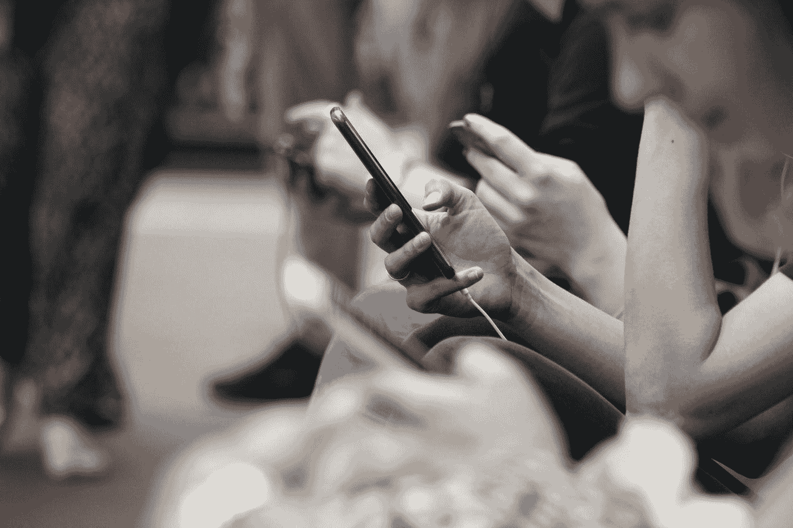

# 整理杂物，将你的生活最小化，将你的潜力最大化

> 原文：<https://medium.com/swlh/de-clutter-to-minimize-your-life-and-maximize-your-potential-c68bba04d711>

Photo by [Eli Francis](https://unsplash.com/@elifrancis?utm_source=medium&utm_medium=referral) on [Unsplash](https://unsplash.com?utm_source=medium&utm_medium=referral)

如今，我们的生活比以往更加复杂。每天都有如此多的压力要应对——让我们有一个栖身之所；支付账单；保住一份工作；取得好成绩；饮食健康；得到足够的锻炼；通勤上班；追求完美的身材；回复来自无限源的无限消息；跟上最新的技术发展；通过社交媒体展示我们最好的一面；养育完美的孩子；拯救地球免于毁灭；再加上成百上千个——难怪我们经常感到紧张和疲惫。

我们中的许多人时不时会幻想逃离这一切，去过一种简单的生活——也许是住在乡下的大篷车里，路上的房车里，或者是某个炎热地方未被发现的岛屿上。尽管确实有人选择了这些生活方式，但我们大多数人都觉得，我们无法牺牲生活的某些方面来迈出未知的一大步——这可能是因为家庭责任、对贫困的恐惧、财务义务或债务。

Photo by [Jack Anstey](https://unsplash.com/@jack_anstey?utm_source=medium&utm_medium=referral) on [Unsplash](https://unsplash.com?utm_source=medium&utm_medium=referral)

幸运的是，有很多其他的方法可以让我们不用采取这些极端的措施就能简化忙碌的生活，这样做有很多好处。人们经常发现他们有更多的时间从事自己喜欢的爱好和活动，有更多的时间社交，而花在打扫和整理的时间却更少了。许多人还报告说，他们受益于新发现的自由感、更大的内心平静、更好的心理健康、更少的花钱欲望、更有成效的生活和更少的总体压力。

这里有 15 种简单易行的方法来最小化和整理你的生活，让你更有创造力、更有效率、更清醒、更善于交际、更健康、压力更小。一开始你需要花一些时间将这些付诸实践，但是从长远来看你会节省很多时间！

# **更新您的电话和电子邮件联系人**

仔细检查你的电话和电子邮件地址簿中的所有联系人，删除任何超过一年没有联系的联系人(不包括任何你将来可能需要的重要联系人)。

检查所有剩余的联系信息是否是最新的，并更新那些没有正确信息的联系信息。从你可能放在包里、口袋里和成堆未分类的文件中的纸片和笔记本中添加任何新的联系人。还要添加与您打交道的企业和机构的详细联系信息，如保险公司、税务局、公用事业公司和银行。然后，在你的日历上安排一天，至少每年重复这个过程一次。

留出几个小时来优化你的电子邮件账户。如果你的收件箱里塞满了未打开的邮件，那么仔细检查并删除那些明显是垃圾邮件的邮件。如果你觉得一次做不完，那就努力每天删除这么多邮件，直到你从收件箱里清除了所有的垃圾邮件。你每天选择删除的数量应该比你每天收到的垃圾邮件的平均数量至少多五封。否则，随着越来越多的邮件来取代你删除的邮件，你将会输掉一场战斗。

这应该能很好地精简内容，这样你就能只得到你需要阅读的信息和你需要采取行动的信息。仔细检查这些，把它们归档或者删除那些不需要回复的。如果你还没有为归档设置收件箱文件夹，那么现在就花点时间设置它们。当你以后需要搜索某个特定联系人的信息时，它会节省你很多时间，而且它会让你的收件箱看起来漂亮简洁。

你现在应该只剩下需要回复的邮件，以及需要采取其他行动的邮件——例如提醒你做某事的邮件，如支付账单或重新订购处方。对于那些需要行动的任务，决定你什么时候去做它(记得先检查任何截止日期)，然后将任务插入到你的在线日历中(稍后会详细介绍)。然后你可以删除或归档这些电子邮件。

在这个阶段，你将只剩下需要回复的邮件。将这些事情从最紧急到最不紧急进行优先排序，然后尝试每天在 20 分钟内回复尽可能多的事情。如果可能的话，最好能每天同一时间留出这 20 分钟。在你每天开始回复邮件之前，先养成扫描并删除当天所有不需要的邮件的习惯。这样，你很快就会收到收件箱，你的大脑也会因此变得不那么混乱。

最后，你的电子邮件地址有可能出现在至少几个邮件列表上，这些邮件列表的所有者已经给你发送了无数的时事通讯或提供了几个月或几年的信息。其中许多很可能已经失去了效用，现在只是一个麻烦，但它们仍然不断堆积。下次你收到这些邮件时，只需花几秒钟点击邮件底部的退订链接。如果你对不想再收到的时事通讯坚持这样做，你很快就会发现收件箱变轻了。

# **排除杂念**

在当今这个不断联系的世界里，分心事物从无止境的来源轰炸着我们。社交媒体、短信、电话、接听电话信息、电子邮件、信件、互联网、电视、收音机、视频游戏、陌生来电者、我们周围的人——我们能完成任何事情真是奇迹！

Photo by [ROBIN WORRALL](https://unsplash.com/@robin_rednine?utm_source=medium&utm_medium=referral) on [Unsplash](https://unsplash.com?utm_source=medium&utm_medium=referral)

通常，我们会让自己的时间被别人的计划或自己无力抵抗诱惑所吞噬。为了真正控制我们自己的时间和生活，我们需要尽可能地消除——或者至少减少——许多潜在的干扰。

每天为自己的日程圈出几个小时将会成倍地提高你的工作效率，让你更容易专注于工作。试试这些建议:

-将手机设置为静音，同时检查，每天两次。如果你错过了一个重要的电话，打电话的人会给你留言，一旦你有空，你可以给他们回电话。这也有助于你在回电话前整理思绪。

-同样，在你事先决定好的时间，一天只查看和回复两次短信。

-每天在固定时间打开一两次电子邮件账户，尽可能直接处理收件箱中的任何邮件。

-在工作或做其他事情时，请关闭互联网浏览器。如果你正在做的事情与你的电脑无关，那就彻底关机。这将减少每 10 分钟查看一次脸书、推特或 Instagram，或者连续几个小时随意浏览网页的诱惑。

-限制甚至取消你看电视或玩电子游戏的时间，尤其是如果这已经成为你每天“放松”的习惯。你会发现你的思维变得更加活跃，你会有更多的时间去做其他令人愉快和富有成效的活动，其中许多活动会让你感到同样放松，如果不是更放松的话。

# **使用在线日历**

养成在网上日历中安排所有约会和未来重要任务的习惯，既能节省你的时间，又能确保你不会错过最后期限，或者忘记一个重要的会议。

使用在线日历——例如谷歌日历——的好处在于，无论你身在何处，你都可以在任何一台连接互联网的设备上访问它。这使您能够在预订时检查约会是否冲突，并在安排约会时立即记录它们。

在每年年初，为续订和年度事件输入年度提醒也是一个好主意，例如体检、MOT 测试、车辆服务、计算机软件更新、订阅续订、纳税申报截止日期、学期日期和假期日期等。

提前安排这些活动可以让你提前计划，避免任何意想不到的惊喜或潜在的尴尬。

# **为生日和周年纪念保留一个单独的可重复使用的日历，并设置提醒**

设置一个单独的日历，省略星期几，只显示日期，使其每年都可以重复使用。使用它来输入你需要记住的生日和周年纪念日，并养成在每周开始时检查它的习惯，以确保你不会忘记或错过任何人的特殊日子。当新的孩子、侄子、侄女或孙子出生时，或者当新的友谊建立时，记得加上这一点。

Photo by [freestocks.org](https://unsplash.com/@freestocks?utm_source=medium&utm_medium=referral) on [Unsplash](https://unsplash.com?utm_source=medium&utm_medium=referral)

# **提前购买贺卡和礼物**

从长远来看，保持一个不断变化的贺卡和礼物库存可以为你节省很多时间和金钱。每年一次，检查你是否有合适的卡片送给你经常给或送卡片的人，无论是生日还是周年纪念，检查你是否也有几张准备好的卡片，以防你需要它们。把你没有的东西列一个清单，然后同时去买，最好是在你喜欢的商店或网上零售店打折的时候。

如果你经常发送电子贺卡，许多网上贺卡零售商将允许你预先安排发送日期。每年这样做一次，你就不需要担心要记住一年中所有那些特殊的日子。

当批量购买礼物时，利用一月份的大减价。提前买好礼物意味着你可以避免一年中几次最后一刻的恐慌购物带来的压力和麻烦。

# **使用在线密码服务**

我们都这样做过——忘记那些你一年只访问一两次的网站的登录信息，甚至忘记那些你更频繁访问的网站的登录信息。是的，你可以要求你的网络浏览器记住电子邮件地址和密码；然而，这并不总是一个好主意。比如别人用你的设备可能会有安全问题；此方法可能无法同时在您的所有设备上运行；清除你的 cookie 历史记录可以在瞬间清除浏览器内存中所有存储的登录信息。

出于所有这些以及更多的原因，使用安全的在线密码服务要好得多，比如 [LastPass](https://www.lastpass.com/) 。你需要花一些时间来输入你已经有的登录信息，但是一旦你完成了，你只需要记住一个密码就可以访问你所有其他的登录信息。此外，当您将来在新网站注册时，只需点击一下鼠标，您就可以轻松地向 LastPass vault 添加新登录帐户。

# 清理你的衣柜

你可能听说过[项目 33](https://bemorewithless.com/project-333/)——这是一个极简主义的概念，通过创建一个“胶囊衣柜”来挑战你在 3 个月内穿 33 件或更少的衣服。即使你还没有准备好走这么远，定期清理一下你的衣柜也是非常有益的。令人难以置信的是，我们倾向于保留多少衣服，却从来不穿。

首先，把你所有的衣服堆在床上，分成四个盒子，分别贴上标签:保留、丢弃、捐赠和修补(如果你愿意，你可能还需要第五个贴有出售标签的盒子)。首先，挑选出你喜欢并经常穿的物品，把它们放在保管盒里。如果这些物品中的任何一个需要修理，把它们放在修理箱里。

从剩下的东西中，将你确定不喜欢或不再穿的东西分类放入两个独立的盒子中——将仍然可以穿的东西放入捐赠(或出售)盒中，将任何不再完好的东西放入垃圾箱中。

一定要尽快把要修补的、捐赠的或要装箱的物品拿出房子，以避免拖延和在以后虚弱的时候改变主意。

一旦你完成了这个过程，如果床上还有任何东西，很可能是你不确定的东西。我们称之为“可能”堆。如果你真的不准备放弃这些东西，把它们放在衣柜外的盒子里三个月。当三个月的时间到了(在你的日历上设置提醒，提醒你)，回顾盒子里的衣服，找回你错过的任何东西，觉得你想再穿一次。你可能会发现你现在已经准备好捐赠剩余的物品，但是如果你仍然不确定，那么再重复这个三个月的过程。

Photo by [Becca McHaffie](https://unsplash.com/@beccamchaffie?utm_source=medium&utm_medium=referral) on [Unsplash](https://unsplash.com?utm_source=medium&utm_medium=referral)

现在，不要买新衣服来替换你已经丢弃的衣服，而是用新的不同的方式组合你已经拥有的物品来创造新的装备。围巾、腰带和珠宝等配饰真的可以改变或搭配出一套你通常不会考虑穿的服装。

考虑每隔几个月和一群朋友举办或参加一次换衣派对，不断寻找机会让你的衣柜重获新生。

最小化你的衣柜有很多好处——省钱，更快更有创意地做出时尚决定，节约用水和洗衣时间，更不用说减少对环境的影响——你会想为什么几年前不这么做！

# **收拾你的家**

我们大多数人都有比我们真正需要的更多的东西来收拾我们的家。丢弃你不再使用或不再喜欢的东西会让你感觉负担和束缚减轻，它会释放空间，让你更清晰，也会让你的家更容易打扫。

Photo by [Douglas Sheppard](https://unsplash.com/@candjstudios?utm_source=medium&utm_medium=referral) on [Unsplash](https://unsplash.com?utm_source=medium&utm_medium=referral)

然而，整理似乎是一项艰巨的任务。通常最好的办法是[把工作分成更小的、可以完成的任务](https://www.marblecreations.co.uk/clutter-free-10-steps-declutter-home/)，每天只做一点点。遵循以下建议，避免精疲力尽，保持动力:

*   遵循你整理衣柜的相同步骤——五个盒子分别贴上标签:保留、捐赠、出售、分类和修补。
*   一次检查一个房间。
*   在进入下一个房间之前，每天花一个小时整理房间的一个小区域。
*   每周去一次当地的慈善商店，扔掉不需要的物品。
*   列出每周在网上销售的五件商品。
*   尽可能将任何东西数字化，以释放家中的物理空间——这可能包括扫描纸质文件和照片，以及将磁带、VHS 磁带和黑胶唱片转换为数字音频文件。处理纸质文件时，一定要购买一台像样的碎纸机。
*   向家人和朋友寻求帮助。
*   每次整理后，用你喜欢的东西奖励自己。

还有更多[创造性的方法来整理你的家](https://www.superiorfireplaces.co.uk/5-creative-ways-to-declutter-your-living-room/)。如果你能不再把它视为一件苦差事，你甚至会开始享受这个过程！

# **缩小你的房子**

无论你的成年子女是否已经飞离了老巢，或者所有的整理工作展现了你从未意识到自己拥有的广阔空间，有时缩小你的房子可能是一种极大的有益方式，可以最小化和简化你的生活。

这不仅能为你节省燃料费、维护费、家具费、装修费和(通常)市政税，还能为你节省维护、修理和清洁的时间。

一个额外的好处是，一个更小的家意味着不可能积累这么多杂物！

# **停止购买不必要的东西**

无论是衣服、书籍、小玩意、小摆设还是零食，当涉及到不必要的消费品时，我们大多数人都是傻瓜。我们无法抗拒减价或打折，于是堆积了大量我们不需要也从不使用的“东西”。

为了避免诱惑，请尝试实施以下做法:

工作或在线浏览时，使用广告拦截器拦截互联网广告。

当广告开始时，将电视静音或切换频道。

尽可能避免去市中心的购物中心。

取消订阅邮购目录和购物通讯。

去图书馆而不是买书和光盘。

用你已经有的衣服和配饰创造新的服装。

和朋友一起参加换衣晚会。

购买食品时，带一份清单去超市，以避免自发购买。

# **网上购物**

当你确实需要购买某样东西时，尽可能在网上购物，以避免交通拥挤、停车场拥挤、商店拥挤和排长队。

许多商品在网上都能买到，价格只是在高街的零头，即使把运费也算在内。比较价格也比亲自逛几十家商店容易得多。

网上购物还可以为你节省汽油、公共交通和停车费。它还会花费更少的时间，让你有时间从事更有效率或更愉快的活动。

# **通过银行支付账单**

网上银行账户让您可以选择为每月的定期账单付款设置直接借记或长期订单，与单独支付相比，节省了您大量的时间。它还可以帮助你更有效地做预算。

# **预先准备饭菜**

经过漫长而辛苦的一天工作后，当我们终于回到家时，我们很多人都不太想从头开始做饭。每周一次预先准备和冷冻一份食物将会节省你每天晚上的时间和精力，如果你选择需要更少配料的食物并大量购买，也可以节省你的钱。

储备不易腐烂的主食，如大米、意大利面、罐装豆类和豆类，并使用香料为你的食物增添更多风味。

# **养成日常习惯**

采用日常惯例有很多好处。这样做可以对你身心健康的许多方面产生积极影响，包括激素调节、睡眠周期、饮食习惯、消化和减压。它还可以提高生产力，减少拖延，让你有更多的时间做自己喜欢的事情，让你心情平静。

养成规律的就寝时间、锻炼和饮食习惯会让你感觉更有活力、更有动力、更专注。在你的生活中实现健康的平衡包括在制定日常计划时把这三个关键因素放在首位。

此外，试着从一张待办事项清单开始每一天，从最重要到最不重要排列任务的优先级。除了你的每日清单，做一个[主清单和每周项目清单](https://greatist.com/happiness/make-a-to-do-list-get-shit-done)以获得终极的、简化的效率。

# **付钱让某人做你讨厌或觉得困难的工作**

如果你想省钱，这可能看起来有些放纵，甚至有悖常理，但实际上，腾出时间去做其他更有成效的事情还是有很多好处的。

成功的商人明白外包他们没有资格或不愿意自己做的工作的价值。毕竟，如果老话“时间就是金钱”成立，那么在你不能快速或轻松完成的任务上花少量的钱是有意义的，这样你就可以把节省下来的时间集中在你最擅长的事情上——例如，做更多你擅长的工作，这可能会让你赚到同样多的钱，如果不是比你在这种帮助上花费的更多的话。

哈佛商学院助理教授阿什利·惠兰斯进行的一项研究发现，花钱节省时间的人明显比那些把钱花在物质上的人更快乐。因此，无论你的克星是清洁、园艺还是簿记，雇佣帮手可能是进一步提高和简化你生活的明智之举。

你有没有其他让生活最小化、简单化的小技巧？如果是这样，请在下面的评论中添加它们。