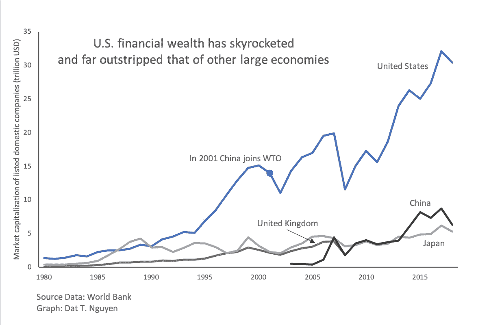

# 亲爱的弗里德曼先生，不要怪中国，要怪资本主义

> 原文：<https://medium.com/swlh/dear-mr-friedman-dont-blame-china-blame-capitalism-36e7519c1fc1>

## 全球化发言人庆祝特朗普的崛起，并谴责中国给美国带来的灾难

Photo by [chuttersnap](https://unsplash.com/@chuttersnap?utm_source=medium&utm_medium=referral) on [Unsplash](https://unsplash.com?utm_source=medium&utm_medium=referral)

上周在*《纽约时报》*的[专栏](https://www.nytimes.com/2019/05/21/opinion/china-trump-trade.html)中，[的千万富翁作家](https://www.huffpost.com/entry/billionaire-scion-tom-fri_b_26164)和美国超级富豪的代表和成员 Thomas Friedman 将美国的贸易赤字和竞争力归咎于中国。必须有人直面中国，他认为唐纳德·特朗普是这一职位的合适人选。

但中美之间真正的问题是资本主义、经济优势和利润。不要被弗里德曼用“欺骗”来描述中国保护其幼稚产业的努力而分散了注意力。长期以来，那些占据生产链高端部分的人都想从试图向上爬的竞争经济体中踢开梯子。在资本主义如火如荼的 19 世纪，与英国相比，德国和美国是后发展者。英国想要自由贸易，德国和美国说，不，谢谢。“欺骗”仅仅意味着另一种方式来规避别人为他们的利益而设置的规则。

在我们这个由民族国家组成的世界里，中国与全球资本主义经济中的任何国家竞争对手没有什么不同。在资本主义经济规则的驱动下，中国政府和美国政府一样，必须确保其公司能够主导全球市场。通过补贴、关税和其他手段实施的保护主义只是在竞争中领先的另一种方式。虽然美国经常选择军事手段来保持经济优势，但我们还没有看到中国也这样做。像任何资本主义国家一样，中国必须找到新的销售市场。因为她积累了大量的资本，这些资本必须不断寻找新的增长空间。

但这很难说是中国的错。在 19 世纪，她被迫签署不平等条约，见证了她的领土被外国殖民。全球资本家正在敲她的门。他们对向数亿中国消费者出售商品的可能性垂涎三尺。也许这不是巧合，当中国在 20 世纪 80 年代开始开放市场时，美国公司从国内撤资，公司利润和股票价格飙升，美国工资开始长期停滞至今。

美国公司和华尔街投资者从中国廉价的劳动力和宽松的监管中获利颇丰。利润导致股票价格指数飙升，填满了美国首席执行官和对冲基金经理的金库。但是美国人通过离岸或外包失去了工作。我们所谓的商业和政治领袖没有用利润再投资于美国的学校和工业，而是用利润来提高股票价格。

21 世纪初，我在加州的一家跨国美国科技公司工作。该公司每年解雇数百名工人。一年夏天，公司决定解散我所在的小组。那天有八个人被解雇了，不是因为业绩，而是因为我们公司把工作转移到印度更便宜。但是我从来没有因为发生的事情而责怪印度或者 H-1B 签证上的印度人。在我从裁员中幸存下来并被同一家公司重新聘用后不久，我目睹了比解雇经历本身更令人不安的事情。

在被解雇的那天，在一个小会议室里，围着一张长方形的桌子，我和我的同事和直接经理坐在一起。我们的高级经理走进房间，把我们的遣散费交给我们签字。然后他开始哭，眼泪顺着脸颊流下来。我认为他这样做是为了表明他很抱歉解雇我们，也许他别无选择。但是不久我们的高级经理被提升了。这一事件是我们经济体系的缩影。当公司宣布裁员时，他们的股票价格就会上涨。当中层管理人员解雇员工时，他们会得到晋升。这种逻辑是我们的资本主义制度的经济必要性的逻辑，这种制度现在已经席卷了世界各地，包括中国。

弗里德曼先生没有说错，中国希望与最好的美国公司竞争。这自然是全球资本主义的一部分，而不仅仅是中国。全球化和自由贸易是作者自己大力提倡的。正如弗里德曼所言，全球化能托起所有的船。但当一艘船试图比另一艘船浮得更高时，全球化就成了他和美国精英们的问题。在上世纪 80 年代和 90 年代初，日本被视为美国汽车制造商和半导体行业的威胁。但中国不是美国的附庸国。中国拥有人才、政府支持，更重要的是，[愿意与美国最优秀的](https://www.forbes.com/sites/rebeccafannin/2018/07/16/ai-superpowers-by-kai-fu-lee-defines-a-new-world-order-for-silicon-valley-china/#588f7d7c6f75)直接竞争，特别是在软件开发、人工智能和 5G 领域。

电信、半导体、软件开发等行业生产的高价值商品和服务可以赚取高额利润，没有哪个公司和国家愿意轻易放弃。美国公司希望保持他们的主导地位。中国公司想要挑战这种主导地位。但我认为中国还远没有达到那个位置。虽然她的国内市场受到保护，但全球市场由美国公司主导，尤其是科技公司。在中国的后院越南，脸书是最受欢迎的社交媒体平台。谷歌主导了亚洲搜索市场。

但是指责中国忽略了资本主义更深层次的恶性肿瘤，这种传染病正在摧毁我们的人类文明，并威胁到地球上所有其他生物。我们一直认为这是美国对中国。我们一直告诉自己我们被骗了。这种情绪就像我们指责某人引诱了我们的丈夫或妻子，而不是让我们的配偶承担责任。据说，探戈需要两个人。弗里德曼先生妖魔化中国的努力是为了转移我们对国内真正问题的注意力。