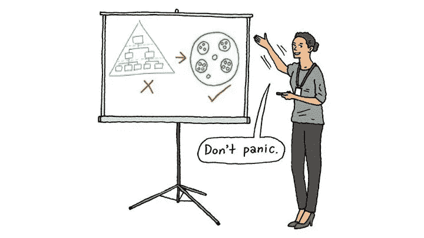

# 机器的死亡。千禧一代如何改写组织设计的规则

> 原文：<https://medium.com/swlh/death-of-the-machine-how-millennials-have-re-written-the-rulebook-on-organisation-design-f60e8c01a2a1>

Image CSL, HBR

千禧一代在劳动力中的优势，加上 Spotify 和脸书等纯数字巨头时代的到来，颠覆了长期以来关于工作组织的管理理论。

2014 年 3 月，捷步达康(Zappos)首席执行官谢家华站在…