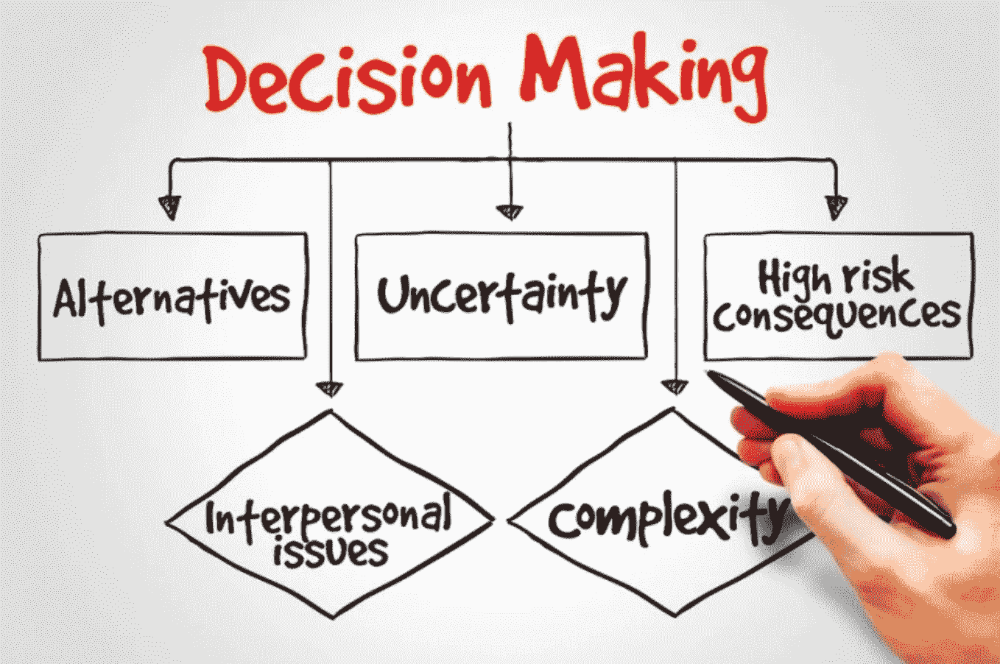

# 高增长环境中的决策

> 原文：<https://medium.com/swlh/decision-making-in-a-high-growth-environment-8a6d89f0a2e3>

做出艰难的决定没有简单的方法。我的方法带来了结构化工程师(我大学学习的开始)、心理学和行为学(我的大学学位)、军事思维(我职业生涯的前 10 年)和操作方法(我退伍后的角色)。

做决定可能很难，重要的是要记住没有…