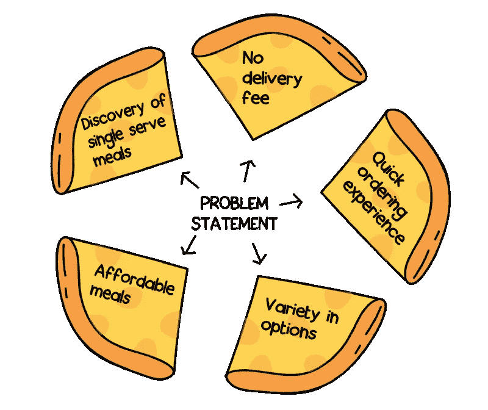
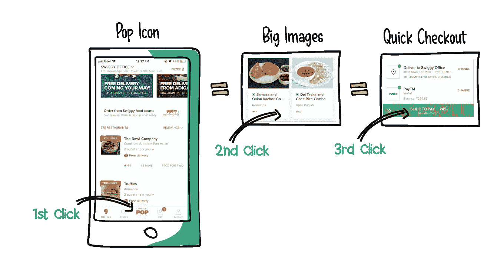
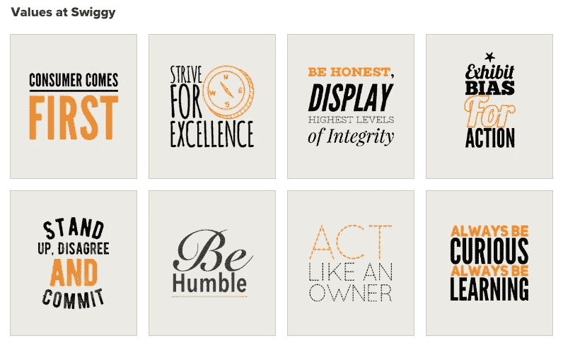

# 深潜:成为产品领导者的秘密

> 原文：<https://medium.com/swlh/deepdive-the-secret-of-being-a-product-leader-de524567a1f0>

在这么短的时间内，构建一个可扩展的产品，提供比竞争对手更好的用户体验，是一个不可思议的壮举。特别感兴趣，如果你是产品经理的话。我们与 Swiggy 的产品管理副总裁 Anuj Rathi 先生聊了聊，了解他的秘方，以及 UX、产品管理、创新和创造性思维的融合如何将 Swiggy 带到了一个新的水平。在本次聊天中，我们将深入探讨印度的产品管理领域，成为产品领导者所需的技能和素质，以及文化如何在您打造的产品中发挥重要作用。

Anuj Rathi- Vice President, Product Management at Swiggy

你好，Anuj，你已经在 Swiggy 工作了两年半多，这是它从一个小公司成长为有价值的独角兽的旅程的一部分。到目前为止你的体验如何？

**Anuj:** 太棒了。当我开始在这里工作时，我们在 7 个城市拥有大约 12000 家餐厅合作伙伴和 15000 家送货合作伙伴——从那时起，我们就一直保持着曲棍球棒曲线式的增长。这是一种深受消费者喜爱的产品。

我和我的团队通常处理这三件事:

> ● **构建产品**以更好的方式解决更多的客户问题
> 
> ● **它产生价值了吗？**创造影响力、影响力和长期价值
> 
> ● **建立一个组织。**培育卓越、所有权和消费者至上的文化。

> 从一开始就播种组织文化对于建立一个可持续发展的组织是极其重要的。我们经常看到初创公司线性地专注于建立增长和股东价值——但建立文化很重要，你的工作方式也很重要。我们采取适当的方法——在构建高度自信的存在性产品时没有捷径。对于实验产品，我们喜欢用快速失败和学习的方法来构建 MVP。对于实验性的，我们几乎从一开始就不考虑规模。而对于战略性的大赌注，我们适当地为快乐和规模建造它。这就是帮助该公司在如此短的时间内取得如此巨大成功的原因。

MF: 听起来很棒。为了让这一点对我们来说更加具体，我们已经看到了 Swiggy POP 和 Swiggy SUPER 这两个新功能。你能告诉我们你是如何实现 Swiggy POP 功能的吗，从概念到实现？我们想从你的角度了解一个产品经理的决策依据。

Swiggy POP 前阵子才开始，现在做的真的很好。我们实际上是从两端开始的。一个是，从用户的角度来看，我们大多数人都是办公室常客。

你需要去餐馆或点菜，第一件事是从菜单上选择。大多数餐厅在午餐时会有咖喱和蔬菜等选择，这通常是两到三个人的选择。你得混搭，选点什么。还有日常！最终发生的是很多食物被浪费掉，因为不是所有的餐馆都提供单人餐。没有任何产品可以解决这个问题，这是我们开始思考的第一件事。

对我们来说，另一个问题是，大多数餐馆的选择架构并不是很有帮助，特别是在你必须快速点一些健康、实惠、同时又可行的东西的情况下。

我们从多个角度考虑这些问题。从配送和餐厅端来说，既然订单是按需的，你怎么把配送成本降下来，把价值传递给消费者。你如何给餐馆更多的可预测性？

一旦我们掌握了这些问题，我们就想到创造一种解决方案来满足所有这些问题。我们考虑了一些想法。Swiggy POP 就是这样诞生的——它确实是一个闪光的亮点，结合了这两个问题并解决了它们。

[Story of how Swiggy POP was built](https://bytes.swiggy.com/story-of-how-swiggy-pop-was-built-773e34d4ff87)

这对我们来说是一个很大的赌注，因为以前从未尝试过这样的事情。Swiggy 的消费者互联网部分众所周知，但它也有一个庞大的运营部门。在客户管理方面，我们必须考虑我们的客户经理需要如何去现场说服餐厅经理相信这个故事，以及他们为什么应该在 POP 上销售。

构建像 POP 这样的产品需要大量的后端工作。从工程的角度来看，我们必须做很多简单的事情才能把它做好。我们需要确保

> ⓐ:我们正在关注正确的问题
> ⓑ:我们正在以一种全公司都明白我们在努力打造什么的方式来阐述这个问题
> ⓒ强调并确保这是我们的一个战略重点，而
> ⓓ则在设想消费者会如何看待这个问题。

甚至在开始生产这款产品之前，我们就收集了大量的消费者反馈。最后，当我们把它推向市场时，Swiggy POP 成了超级热门。

**MF:** 那么，当需要来自不同领域和团队的这种参与时，Swiggy 是如何协作的呢？当你构建如此大规模的东西时，许多团队将不得不一起工作，以确保一个产品或功能得到良好的结果。这是怎么发生的？

实际上，这是一个很好的问题。Swiggy 是一个三方市场。这与电子商务网站不同，电子商务网站是买方和卖方之间的双向市场，供应链离店面很远，而且是分散的。这使得这些参与者可以让不同的团队处理一个解决方案的不同方面，并减少协作。对我们来说不是这样。我们要考虑的每一种产品或功能都会触及我们市场的所有三个部分。例如，Swiggy POP 将触及供应商端、消费者端、运营端等。现在，这里有三个产品管理团队，三个工程和设计团队参与其中。与此同时，你将有线下供应和销售团队，以及运营团队也将参与其中。因此，几乎每个项目都会触及市场的每一部分。而且这不是一件坏事，事实上是一件大好事。

> 因为发展大规模协作力量的公司，将能够在市场上提供这样的产品。然而，不能有效合作的公司将不能很好地管理供应方，或者提供低于标准的客户体验，或者将缺少拼图的某一部分。所以我相信这其实是推出伟大产品的秘制酱。大规模协作。

事实上，即使在我们的产品管理团队中，你也应该知道交付技术，做一些交付。你要参加消费者电话会议，去餐馆拜访。因此，我们的日常工作充满了协作会议，与不同的团队一起工作，共同开发产品。

**MF:** 我们的下一个问题实际上是你是否整天都在开会！

**Anuj:***咯咯笑*看，产品负责人和产品经理是有区别的。产品负责人需要深刻了解组织中发生的各种事情。与此同时，你正在制定公司战略，会见许多领导团队。你正在会见产品经理，给他们如何解决问题的明确指导。你实际上是在这里建立了一种文化，你的产品经理会尽他们所能拿出最好的作品。

在这里绕道。当我在 Swiggy 组建产品管理团队时，我们雇佣了非常不同的人。我们不寻找经验丰富的产品经理。我们寻找的是非常坚韧不拔、善于沟通、有敏锐洞察力的年轻人。然后，我们对他们的某些能力进行了一季度又一季度的培训。我们让他们开始接受较小的挑战，然后带他们接受更大的挑战。我们确保它们学会并长出翅膀，这样它们就能独自飞翔。而做到这一点并不容易，是苦尽甘来。回到你的问题，这是我大部分时间去的地方，这也是为什么我觉得这些会议很棒。你不只是提出一个观点，而是在指导——不只是一个人，而是同时指导几个人。它没有给你时间慢慢思考，比如说，一次考虑一个产品——你必须从你的时间表中的其他地方偷时间。

> 但所有人都说，这些会议是一个播种文化、设定共同愿景和团结所有人的机会。在大公司，一致性有时会成为一个问题，这就是为什么我认为产品负责人需要战略性地利用这些会议，并将其作为一个机会，而不是逃避这些会议。

MF :我们是一家 UX 的 UI 设计公司。我们最感兴趣的是，在开发产品时，UX 是什么时候进入你的视野的？你给了我们一个 Swiggy POP 的好例子。在这种情况下，UX 是在产品开发阶段就进入画面，还是在其他一切都已敲定之后？

**Anuj:** 我要告诉你一些非常有趣的事情。

> 在 Swiggy，我们遵循一个我们定义为“展示，不要说”的流程我们不从其他任何东西开始，而是从消费者将拥有的体验开始。所有的战略决策都是在那之后做出的。

当你在为一个产品打造 UX 时，比方说你正在为 Swiggy POP 制作一个展示 20 道菜的屏幕——这个屏幕也在帮助我定义我的战略。用户对 20 道菜的反应会很好吗？应该有更多，还有多少？应该是什么样的菜？这将如何影响我的供应端？我需要有一个很好的混合蔬菜和非蔬菜，或烹饪吗？

如果我不展示出来，这不仅仅是对 UX 的考验，而是对整个产品本身的考验。因此，UX 变得极其重要——没有 UX，我们不会首先开始生产产品。可以肯定的是，这不仅仅是让 UX 正确，而是让整个产品正确，这将围绕消费者体验进行。我们从“墙”开始。它实际上是一面墙，随着想法和策略的形成，它慢慢开始被便利贴和纸线框填满。产品和设计团队就是这样走到一起的。从这面墙开始，我们逐渐过渡到更好看的线框，然后是原型。

最近我们也在做很多原型测试。不仅要寻求关于 UX 的反馈，还要为我们的供应方、运营等提出策略。比如像我上面说的，POP 菜单应该有多少个菜？最大和最小是多少？

这些妻子的名字也帮助我们进一步思考。我们能让用户只用三次点击就使用 POP 吗？不仅仅是选择一道菜，而是实际完成交易？如果我们必须把它从 10 分钟缩短到 10 秒钟，互动会怎么样？！在最终定稿之前，我们为 POP 做了许多 UX 迭代。

我们想知道更多关于你从产品经理到产品领导者的历程。你的角色如何调整——与现在相比，你在职业生涯开始时的优先事项和职责是什么？

**Anuj:** 不仅仅如此，这确实是一个根深蒂固的问题。我开始涉足这个领域的时候，印度还没有多少产品面向印度消费者。

> 产品管理不是一个定义明确的领域，人们不知道对产品经理有什么期望！一些人认为他们需要什么都做，在设计、工程、商业等方面都是最棒的。而其他人认为产品经理只是将业务需求转换成一种工程可以理解的文档。

从一开始，我就向首席执行官汇报，他们不一定是产品负责人，也不一定有指导产品经理的经验。所以这需要大量的自我学习。我认为当时很多印度产品经理都经历过这个阶段。

此外，即使是现在，在印度也有一点让事情变得有点困难，那就是，很多时候你会发现没有在科技公司工作过的高层领导。他们往往来自“线下”背景。当他们愿意理解产品管理时，这是非常好的，你需要与他们建立信任。

在我职业生涯的开始，我们不确定会发生什么。所以我有点不耐烦，我期望更快的决策和事情进展迅速。我不明白为什么在一个公司里事情不能更快地协调起来。我记得我经常想，每个人都很擅长自己的工作，但似乎没有人同意并达成共识！

这就是现在正在发生的变化，我可以保证至少在瑞士。我们定义产品经理的角色，并试图让他们更容易。作为一名产品负责人，我试图让他们明白为什么协调会很困难，因此你的沟通需要是一流的。人们需要看到愿景，因此你需要展示给他们看，而不是仅仅相信你的判断，然后很快就建立起来。我们正在合作建设它，而不是孤军奋战。希望这回答了你的问题？

**MF:** 绝对！这为我们的下一个问题提供了一个很好的引子，你对刚刚起步的年轻产品经理有什么建议？他们需要准备哪些在商学院学不到的东西？

**Anuj:** 哦，在这里我可以谈论很多很多的事情。我有机会指导很多产品经理，他们在生活中不是产品经理，但现在是全国最好的产品经理。

老实说，不是每个人都适合做产品经理。我绝对会在产品经理身上寻找三样东西或特质:

> ➀砂砾➁通信➂原始尖锐

勇气，意思是你愿意为了实现某件事走多远。你有多热情，有多好奇？你是一个愿意学习很多东西的人吗？我不认为这是一种你可以发展的特质。也许如果你不是超级坚韧不拔的人，你应该加入一家更大的公司，在那里你不必事事亲力亲为。

> 很多人问我为什么把沟通放在首位。本质上，你在工作中所做的一切都依赖于沟通。你是一个伟大的沟通者和故事讲述者吗？比方说，当你在用户之旅中与开发人员进行头脑风暴时，你是在表达自己吗？它真的像你想象的那样建成了吗？当你与高层领导沟通时，你能清晰地表达愿景并让他们相信这将赢得你的路线图之战吗？你可能是一个了不起的思想家，但是如果你不能与你周围不同类型的人有效地沟通，你就不会成为一个成功的产品经理。这有助于你在会议中，团结不同的人，作为艰难处境下的战斗口号。它帮助你建立文化。我认为产品经理也是一个组织的文化部长。这使得沟通成为你的武器库中需要的最高品质。

第三，你需要有原始的升半音。你需要能够正确地连接这些点，考虑短期和长期的计划和路线图，拥有解决问题的技能。在 Swiggy，当你面临挑战时，通常是三方面的市场挑战。一个人需要有原始的尖锐和解决问题的能力来克服它们。

所以这三件事很重要，按照这个顺序。你可以谈论 20 种不同的能力，但我认为这是最好的，这三样东西对于产品经理来说是非常必要的。在此之后是发展硬技能，这取决于你是想成为一名消费者互联网产品经理，还是一名 SaaS 公司的产品经理等等。

*你可以在* [*LinkedIn*](https://www.linkedin.com/in/anujrathi1/) 上找到 Anuj Rathi

*可以跟随*[*Swiggy bytes*](https://medium.com/u/b1fb0cb8c8e?source=post_page-----de524567a1f0--------------------------------)*了解 Swiggy* 的工程技术界的趣闻

*敬请关注本系列对不同组织领导团队的更多采访。您可以关注我们的*[*Twitter*](https://twitter.com/monsoonfishy)*/*[*insta gram*](https://www.instagram.com/monsoonfish/)*/*[*脸书*](https://www.facebook.com/monsoonfish)*/*[*LinkedIn*](https://www.linkedin.com/company/13404751/)

## 这篇文章发表在 [The Startup](https://medium.com/swlh) 上，这是 Medium 最大的创业刊物，拥有+424，678 名读者。

## 在这里订阅接收[我们的头条新闻](https://growthsupply.com/the-startup-newsletter/)。

