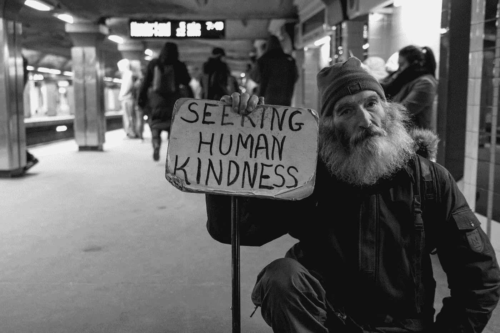

# 定义无家可归

> 原文：<https://medium.com/swlh/defining-homelessness-302949dd94bb>

# 对不同形式无家可归现象的思考

Photo by [Matt Collamer](https://unsplash.com/@breakyourboundaries4?utm_source=medium&utm_medium=referral) on [Unsplash](https://unsplash.com?utm_source=medium&utm_medium=referral)

当我们听到“无家可归者”这个词时，我们通常会想象一个不修边幅的人睡在街上或高速公路立交桥下，他们的财物被收集在他们周围。那些拥有的东西并不比他们能在偷来的购物车里推来推去的多的人。大多数人认为他们是危险的、有精神病的、肮脏的人，应该避开。

无家可归有许多不同的形式。其中一些是自我强加的，而另一些是政府制度、生活环境、资源的可获得性以及缺乏护理或援助所强加的。最终，这些不同类型的无家可归的影响会有所不同。不同形式无家可归的原因也各不相同。我怀疑这就是为什么没有人想出解决无家可归“问题”的办法。

# 有一个家意味着什么？

拥有一个家到底意味着什么？家是你头上的屋顶吗？住在不合标准的房子里是否构成拥有一个“家”？是指认同感吗？是指有自己的空间还是[自己的房间](/swlh/a-room-of-ones-own-how-i-am-finding-my-creative-space-3d3bea0d3fe5)？你必须拥有自己的家才能真正拥有一个家吗？

我个人从未拥有过房子或住宅。我住在别人拥有的房子里。我们结婚时，我的前夫小心翼翼地把我的名字从他拥有的房子的文件上抹去。当我们住在基地住房时，我们住在政府设施里。我租的公寓和房子不是我自己的。甚至我现在住的地方也是我伴侣的。没有房子确实会影响你对这个空间的拥有感。我很幸运头上一直有个屋顶，但那个屋顶永远是别人的屋顶。许多美国人(和其他国家的人)都有这样的经历——从未拥有过自己的空间。一个人连自己的房子都没有，怎么能找到自己的房间呢？有家就意味着拥有吗？还是租房就够了？

我和一名海军陆战队员结婚 14 年了。结果，我的孩子们在从一个地方搬到另一个地方的过程中长大。在大约 40 年的时间里，我在 6 个不同的州住过，住过 11 个不同的房子/联排别墅/公寓等等。，已经搬了 12 次或 13 次家(取决于我是否计算了我们在寻找住处和花光所有东西的首付时住在酒店的时间)。对我的孩子来说，这些数字非常接近。我们最近谈到，他们没有他们的一些朋友所拥有的东西，他们在同一个城市、同一个街区长大，上的是同一所学校。上周末我们看了**书市，我的一个孩子评论说，他们永远不会有那样的友谊，因为当你经常搬家时，朋友也会搬走。他们失去了联系。搬那么多地方会让你永远不会真正把一个地方和“家”联系起来。有一个家意味着有一个你认为是“家”或有认同感的地方吗？**

**当然，我们头上一直有个屋顶。我们从未不得不睡在人行道或街道上。我们从来不需要睡在车里。我们总是有地方可去。一个存放书籍、电影、视频游戏和其他物品的地方。我们的餐具室和冰箱里几乎总是有食物(尽管有时我不得不依赖别人提供食物)，孩子们也总是有自己的床可以睡。他们自己的空间——即使这些空间很小。拥有一个家仅仅意味着你头上有一个屋顶，你知道你每天都可以回到那里吗？一个你可以把自己的东西放在那里而不用担心被别人拿走的地方？**

**前几天看了一本书叫**奥斯威辛的纹身师。住在奥斯威辛集中营和比克瑙集中营的人们有了栖身之所。他们中的许多人在同一个地方住了好几年。这意味着他们有一个家吗？集中营能被称为“家”吗？第二次世界大战期间美国使用的拘留营怎么样？这些地方能被认为是“家”吗？一旦囚犯被“释放或逃跑”,大多数人就不能回到他们在战争开始前的家——尤其是在欧洲。纹身师讲述了他们在欧洲乡村寻找家园的故事。当你所拥有的一切都被夺走的时候，你怎么会有一个家呢？你没有钱买食物和衣服，更不用说房子了。你被释放了，但是你什么都没有。除了你的生活和你活下来的事实。对许多大屠杀幸存者来说,"有一个家"意味着什么？他们被从自己的家中带走，他们的家被摧毁或被他人夺走，被运到遥远的外国，被迫生活在悲惨的环境中，他们慢慢挨饿，不断被肢解，担心第二天就是他们的最后一天，他们所有的财产都被夺走。****

**对一个在监狱里的人来说，家是什么？他们头上有个屋顶，但他们并不拥有那个屋顶。他们可能不是自愿去那里的，或者是因为他们想去那里。监狱是一个家吗？他们几乎无法控制自己的身体自主权。他们没有选择家园或新家的自由。他们可以采取一些小措施，让他们的空间成为他们自己的。当他们搬进这个空间时，他们的大部分物品都被拿走了。但是他们的空间不能免于侵入或检查。这是家吗？**

**我目前正在读一本书:*亲爱的美国，一个无证公民的笔记*作者何塞·安东尼奥·巴尔加斯。这本书让我以另一种方式思考无家可归的问题。有一个家比有一个屋顶更重要吗？意味着有身份吗？是指对自己所生活的地域的归属感吗？成为公民？被记录在案？参与当地的社区活动？二战集中营暴行的幸存者被释放时是无证移民吗？他们手臂上有纹有囚犯编号的纹身。这足以让他们被“记录在案”吗？他们的身份被剥夺了。一个人是否有“家”，身份重要吗？**

**无证移民经常生活在被驱逐的恐惧中。他们的生活被他们的非法律或公民身份所定义。当你的存在是非法的，这意味着什么？这些人有“家”吗？也许他们有住的地方，但那是“家”吗？你能说他们有一个永久的“家”——土地或“家”吗？像瓦格斯这样被非法带到这里却不知情的人呢？当一个人在童年时被带到另一个国家保护自己并追求“美国梦”时会发生什么。他们对这个“家”的权利比那些幸运地赢得出生彩票并出生在这里的人少吗？他们有家吗？**

**几年前，我读了另一本书，名叫《善良日记》，作者是莱昂·洛格瑟蒂斯。事实上，我们有机会在一次签售会上见到他。他在演讲和签名的过程中与我的孩子建立了联系，并给我儿子买了一本书——《T2·查理和巧克力工厂》，并在里面给他写了一张纸条。我儿子还留着那本书。Logothetis 凭借陌生人的善良走遍全球。他抛弃了所有的财产，周游世界，依靠陌生人的善意来获得住宿、食物和人类所需的一切。我有朋友做过类似的事情——处理掉他们所有的财产或者把它们存放起来，辞掉工作，用他们的积蓄随心所欲地环游世界。这些人无家可归吗？**

**我花了这篇文章来探索无家可归的含义，试图探索什么属于“无家可归者”的范畴，什么不属于“无家可归者”的范畴。我也把这个问题翻过来问，拥有一个家意味着什么。根据定义，无家可归意味着没有家。那么，我们如何定义拥有一个家呢？它是你头上的屋顶吗？这是你自己的屋顶吗？是不是有地方住，这样你就不会露宿街头了？是不是有一个属于你自己的家园，并且把你当成自己的一员？**

**你怎么想呢?有一个家意味着什么？我不想在无家可归问题上挑起争议。我试图让人们注意到为什么这是一个有争议的问题。为什么不能“解决”无家可归的问题？我们甚至不能真正定义这个问题。我们努力找出并理解无家可归的根源和后果。最后，无家可归的人口——无论如何定义——是“其他人”的人口。当我们能够“他人”时，就更容易忽视他们的问题，也更难制定长期有效的解决方案。解决无家可归问题的第一步是界定无家可归意味着什么。**