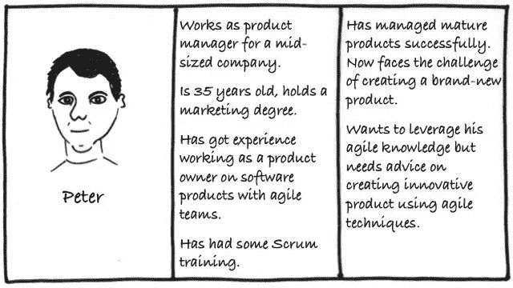
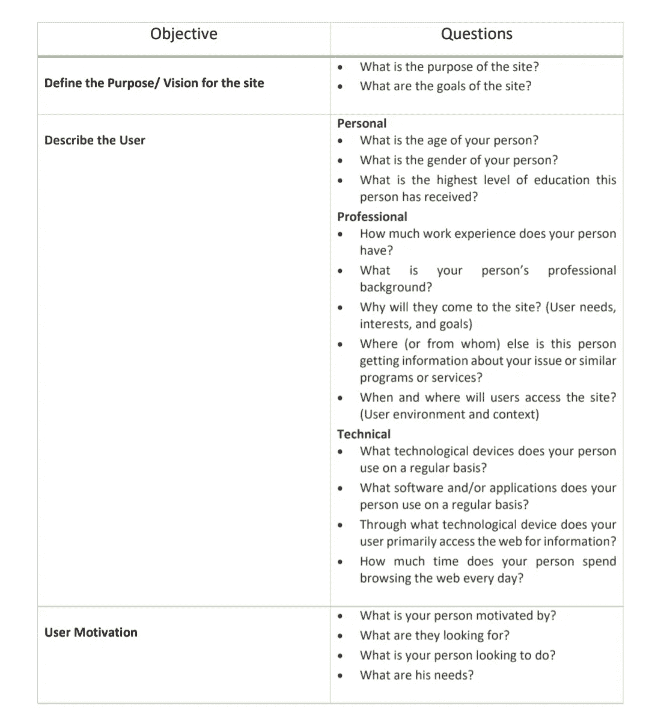

# 如何为你的企业创建用户角色？

> 原文：<https://medium.com/swlh/defining-user-personas-b01934ed2d26>

# 角色=个人+活动

人物角色是在用户研究的基础上创建的虚构角色，代表将使用服务/产品/网站的不同用户类型。创建人物角色有助于理解用户、他们的需求、体验、行为和目标。

在角色被很好地定义、研究和分析之后，用户体验的结果是最好的。人物角色的目标是为你的关键受众创建可靠和真实的表现。有效的人物角色代表了你网站的主要用户群，它清楚地描述了用户的期望以及他们使用网站的可能性。然而，人物角色是虚构的，描述真实人物的背景、目标、能力、局限性和价值观。

# 角色的类型

人物角色不仅仅是人；它们反映了目标用户在产品领域内的*真实*行为模式、态度、技能、动机和目标。

**a)目标导向的人物角色:**目标导向的人物角色的目标是检查你的用户希望用来实现他们的目标的过程和工作流程。已经做了足够的研究，现在开始为目标设计

**b)基于角色的人物角色:**对我们的用户在现实生活中通常扮演的角色进行分析，有助于做出更好的产品设计决策。

**c)吸引人物角色:**这个想法是通过使用人物角色来创建一个真正的用户 3D 渲染。人们与人接触越多，越觉得他们是“真实的”；他们就越有可能在设计时考虑这些问题，并希望为他们提供最好的产品。这些角色检查用户的情绪，他们的心理，他们的背景，并使他们与手头的任务相关。

虚构人物角色:虚构人物角色不是来自用户研究，而是来自 UX 设计团队的经验。它要求团队根据他们过去与用户群和产品的交互来做出假设，以呈现一幅画面。对目标导向的人物角色的补充

# 设计人物角色的步骤

1.  收集数据
2.  形成假设
3.  团队中的每个人都接受这个假设
4.  建立最终的人物角色数量
5.  描述人物角色
6.  为你的人物角色准备情境/场景
7.  获得组织的认可——吞吐量很重要
8.  不断调整——定期修改描述，更新人物角色

# 开发人物角色:最佳实践

1.  进行用户研究
2.  浓缩研究
3.  脑猝病
4.  细化搜索结果
5.  让结果更真实

为了进行用户研究，人物角色可以被很好地构造为:

1.  背景调查:背景调查是了解客户的第一步。研究行业，他们的简介，他们的竞争对手，仔细检查他们的社交媒体是研究你的客户的好方法，也是寻找信息的绝佳起点
2.  **定性研究:**这项研究通过客户访谈、面对面用户测试、幻灯片调查和在线聊天进行。这是与所研究的主题最直接的接触，通常能让你对你想学的东西有最好的个人判断
3.  **观察研究:**观察研究的核心是能够看到用户在自然环境中与网站互动的结果，因为它可以向研究人员展示用户在没有指导的情况下做了什么
4.  **定量研究:**一般网络和数据分析、事件跟踪、漏斗报告，以及其他关于网站的统计数据，这些数据对衡量用户在网站上的互动方式很有影响

# 人物角色的要素

人物角色通常包括以下关键信息:

1.  角色组(银行家、酒店经营者、网络管理员)
2.  虚构的名字
3.  职称和主要职责
4.  人口统计(年龄、教育、种族和家庭状况)
5.  他们试图使用网站完成的目标和任务
6.  他们的物理、社会和技术环境
7.  总结了与你的站点相关的人物角色最重要的内容
8.  代表该用户群的休闲图片

# 评估用户角色

在你开始设计用户界面或用户体验之前，评估人物角色可以提供功能性和命令性最强的信息。人物角色将打开用户行为，你的用户想要什么，他们需要什么，他们的价值观，他们的需求，能力，局限性，痛点，动机，可以根据以下方面进行评估:

1.  个人背景
2.  专业背景
3.  用户环境
4.  心理描记术
5.  最终目标

希望这有所帮助！干杯！

## 这篇文章发表在 [The Startup](https://medium.com/swlh) 上，这是 Medium 最大的创业刊物，拥有+428，678 名读者。

## 在这里订阅接收[我们的头条新闻](https://growthsupply.com/the-startup-newsletter/)。

