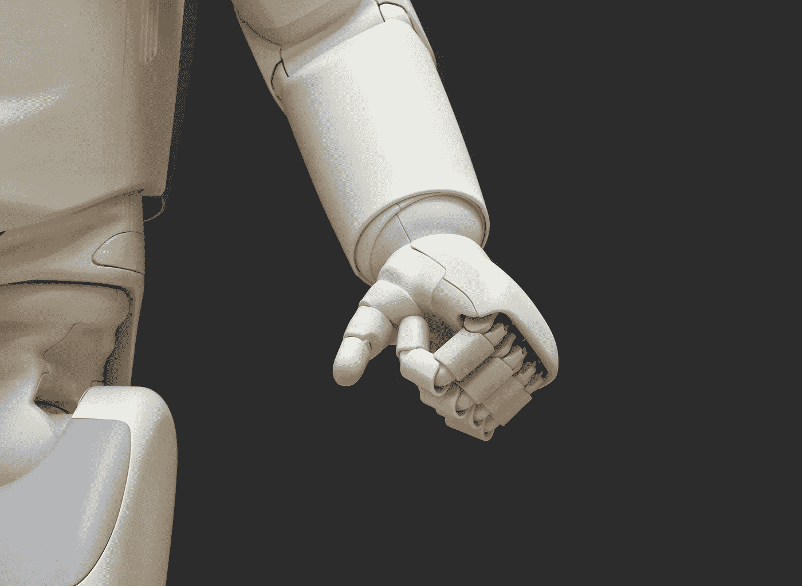

# 民主化人工智能(上)

> 原文：<https://medium.com/swlh/democratize-ai-part-i-ade3cc7f727d>

如何确保人类自主控制我们的计算“屏幕、场景和镜头”

Who is really in control here?

*Alexa、Siri 和 Google Assistant 等数字助理可能非常有用——但它们实际上效忠于亚马逊、苹果和谷歌，而不是使用它们的普通人。通过引入基于人工智能的数字代理，真正代表和倡导我们作为个人，而不是公司或政府机构，我们* …