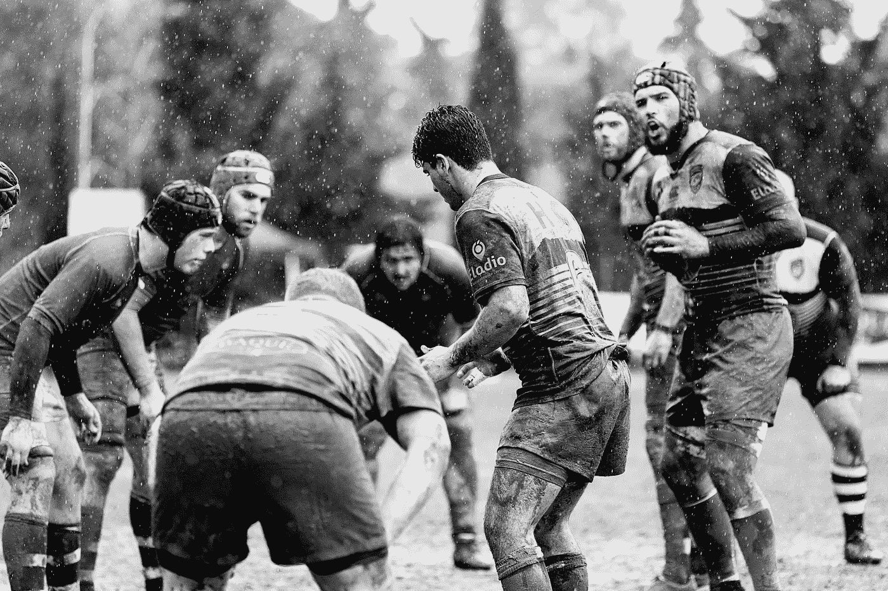

# 民主化你的产品储备——3 种模式

> 原文：<https://medium.com/swlh/democratize-your-product-backlog-3-patterns-a2b423cef028>

Photo by [Quino Al](https://unsplash.com/photos/Z9VQmkpxLNU?utm_source=unsplash&utm_medium=referral&utm_content=creditCopyText) on [Unsplash](https://unsplash.com/search/photos/rugby?utm_source=unsplash&utm_medium=referral&utm_content=creditCopyText)

作为一名产品负责人和业务分析师，我过去常常通过在待办事项梳理会议上我带来了多少功能、史诗和故事来衡量我的生产力。我曾经为自己写得很好的故事感到自豪，这些故事的接受标准符合“准备就绪”的定义。

这是我的角色，我的责任，我的贡献。