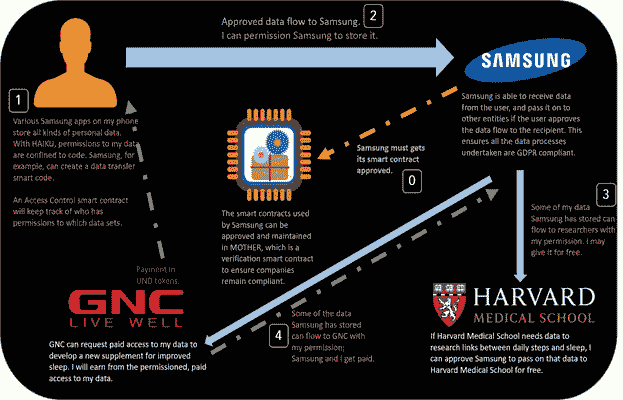
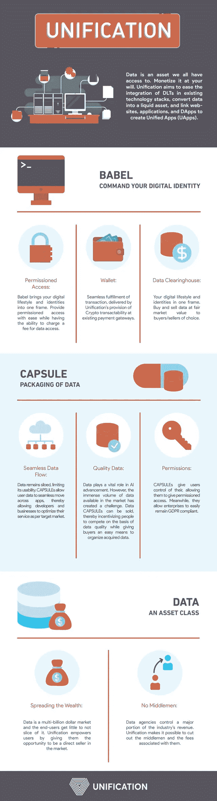
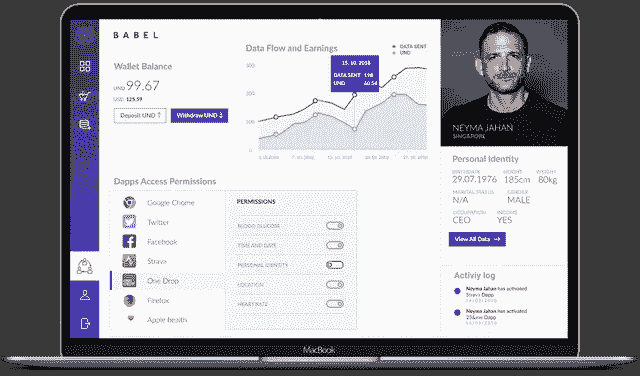

# 将数据市场产生的财富大众化

> 原文：<https://medium.com/swlh/democratizing-the-wealth-generated-by-the-data-market-45090ee6e7af>

> 最新的[加密货币新闻](https://www.coincurb.com/news/)、[空投清单](https://www.coincurb.com/airdrop/?status=active)、[赏金清单](https://www.coincurb.com/bountyc/?cat_id=188)、 [IEO 清单](https://www.coincurb.com/category/active-ico/)，请访问 CoinCurb.com。

分散式应用程序正在被越来越多的人采用，但是它们的使用速度极其缓慢，这对区块链技术来说是一个难以置信的不公平。

分布式总账技术面临的关键问题，尤其是那些应用智能合同的技术，是它们需要外部实体来塑造它们的系统以满足区块链的需求。然而，大多数用户太习惯于他们当前应用程序的便利性和熟悉性，以至于他们不愿意大规模采用分散式应用程序。

另一方面，企业通常更容易销售，因为它们主要关注的是利润而不是便利性。然而，即使在这种情况下，熟悉程度也很重要，因为当企业采用区块链技术时，同步是一个关键障碍。公司拥有成熟的技术体系，这些技术体系通常协调运行。DLT 的集成迫使他们重新构建他们的系统，这是大多数企业不愿意采取的昂贵的一步。

大规模利用分散应用程序的解决方案在于简化将区块链集成到企业已经建立的昂贵系统中的过程。

> 最新[加密货币新闻](https://www.coincurb.com/news/)、[空投清单](https://www.coincurb.com/airdrop/?status=active)、[赏金清单](https://www.coincurb.com/bountyc/?cat_id=188)、 [IEO 清单](https://www.coincurb.com/category/active-ico/)，请访问 CoinCurb.com。

# 适当的解决办法

主要的技术和金融公司已经投入了初始资源来研究区块链技术的优势。虽然这可能并不能证明人们渴望采用分散式网络，但却是人们对此感兴趣的证据。这是关键的起点。

一个新的区块链发展，统一，旨在通过使这一过程成为一个合乎逻辑的决定而不是一个负担，将这种兴趣转化为合法采用 DLT。Unification 的目标是通过确保其开发可以无缝集成到现有的技术堆栈中来实现这一目标。该规定使得区块链解决方案的采用方便地集成到机构决策者和劳动力参与者熟悉的系统中。

这篇文章很长。如果您喜欢视觉内容，您可以使用以下视频来深入了解 Unification 的目标，即通过区块链技术的优势将数据转化为流动资产。

# 愿景

Unification 设想了一个未来，数据是一种资产类别，DLT 是一种核心技术，可以为软件、应用程序和分散式应用程序增加有形价值。为了实现这一点，统一满足了采用的三个关键需求:

# 无缝的

Unification 的技术不仅可以集成到企业 SaaS 中，还可以集成到网站、应用程序和分散式应用程序中。通过使用其核心产品之一的俳句，Unification 能够将孤立的技术转化为连接良好的网络，成为更大的互联技术生态系统的一部分。

因此，俳句允许 Unification 将区块链实现的好处集成到各种现有技术中。这导致了统一应用程序(UApps)的产生。

UApps 的创建允许企业利用其他好处，特别是 Unification 的目标，即让数据成为高度流动的资产。这将在本文后面更详细地讨论。

下图分解了统一正在建立的数据生态系统:
*举例:我使用三星内置的健康应用程序，该程序可以跟踪我的睡眠情况。该应用程序还可以跟踪我的日常活动、卡路里消耗、行走的步数以及许多其他事情。总的来说，这是一个高质量的数据集，因为三星能够将所有这些数据与通过我的手机活动收集的所有其他数据点联系起来。*

> 最新的[加密货币新闻](https://www.coincurb.com/news/)、[空投清单](https://www.coincurb.com/airdrop/?status=active)、[赏金清单](https://www.coincurb.com/bountyc/?cat_id=188)、 [IEO 清单](https://www.coincurb.com/category/active-ico/)，请访问 CoinCurb.com。

# 容易的

区块链技术的问题之一是当前的产品要求企业系统采用原始的技术解决方案。虽然可以训练相关的工作人员掌握新的 ui 和输入命令，但是更广泛的消费者市场不愿意接受这样的转变。

因此，统一可确保用户终端体验不会因为提供区块链支持的优势而受损。事实上，统一为提升用户体验提供了便利。这方面的主要例子是，统一将允许网站、应用程序和分散应用程序(统称为统一应用程序)在现有网关上轻松进行加密货币支付。这创造了从现有用户体验到更新、更好的用户体验的无缝转变，这保持了用户天生寻求的熟悉和便利。

# 安全的

安全性是区块链技术的基本优势之一。目前对提高安全性和不惜一切代价提供安全性的关注，使得分布式账本技术对支付系统有意义，但在智能经济中不太适用，正如区块链 2.0 发展所希望的那样。

然而，Unification 已经开发了一种在不牺牲便利性和可伸缩性的情况下维持安全性的方法。统一创造了数据胶囊。

胶囊作为各种数据的技术包装单元。这一发展与 HAIKU 相一致，以确保 UApps 保持无缝性，并在不牺牲数据安全性的情况下在用户侧保持熟悉性。智能合同中内置的代码决定了用户许可的数据访问权限——代码就是法律。

胶囊附带 SDK，允许开发人员在统一的应用程序之间紧密集成数据流。

> 最新的[加密货币新闻](https://www.coincurb.com/news/)、[空投清单](https://www.coincurb.com/airdrop/?status=active)、[赏金清单](https://www.coincurb.com/bountyc/?cat_id=188)、 [IEO 清单](https://www.coincurb.com/category/active-ico/)，请访问 CoinCurb.com。

# 易接近

当前的应用分配网络不适合分散的应用。像 Play Store 和/或 App Store 这样的应用程序市场，经过一番争论后，允许分散的应用程序自行上市。然而，在这样的应用程序市场上市，否定了去中心化应用程序产生的原因。

成熟的应用程序市场将数据保存在集中的存储器中，存储用户信息，同时给予他们有限的使用许可权。

因此，Unification 正在创建一个旨在支持统一应用程序的应用程序市场，使 uapp 的分发渠道像已建立的应用程序市场一样容易访问。然而，这种可访问性不会以牺牲用户的权利为代价。BABEL 将坚持支持分散应用程序的安全性和自由性的价值观。巴别塔将提供各种原生功能:

# 钱包

为了确保统一生态系统和 UApp 网络的用户体验和交易吞吐量的最小摩擦，BABEL 将为用户提供一个本地的安全钱包，允许他们访问 UApp 市场并随意购买。这种用户体验对于用户(甚至企业)已经适应的应用购买交互来说是熟悉的。

不过，钱包的本地化将标志着 UApp marketplace 和当前应用市场之间的一个关键区别，后者依赖外部支付渠道，如支付卡，来处理价值转移。BABEL 将取消限制开发者收入的中间商，将用户与开发商直接联系起来。

# 市场

BABEL 将使 UApp 开发者能够接触到大众，而不会丧失对其开发的广泛权利，这是目前应用市场的规范。市场的提供确保了开发者的努力集中在创建创新的解决方案和令人满意的应用上，而不是吸引观众。

目前，大量的分散式应用程序，无论其开发的新颖性和质量如何，都不能访问应用程序市场，因为它们的开发者不希望通过将 DApp 的访问放在集中式平台上来玷污他们的工作。因此，开发商必须努力通过内部营销来吸引用户。支持去中心化运动核心方面的市场确保开发者的才能被恰当地用于 UApps 的主要开发，而不是它们的营销。

> 最新的[加密货币新闻](https://www.coincurb.com/news/)、[空投清单](https://www.coincurb.com/airdrop/?status=active)、[赏金清单](https://www.coincurb.com/bountyc/?cat_id=188)、 [IEO 清单](https://www.coincurb.com/category/active-ico/)，请访问 CoinCurb.com。

# 身份中心和数据清理

BABEL 将允许最终用户管理他们的胶囊，并查看可以访问它们的 UApps。因此，BABEL 将所有与用户身份相关的权限放在一个方便的框架中。通过这个仪表板，用户可以控制、编辑、添加和删除对其数据的许可访问，甚至控制许可数据访问的基础。

愿意提供其数据用于价值转移的用户将能够这样做。由于 BABEL 有一个内置的钱包，它将支持数据的本地交易。企业、研究人员和所有其他数据消费者将能够直接为他们的数据付费。这极大地改善了用户对其数据的控制，并确保他们的信息不会落入邪恶实体之手。

此外，BABEL 支持以用户为中心的数据交换所的能力是，数据的质量将大大提高，用户将最终进入数据市场的一部分。在这种互利的互动中，数据消费者将直接从用户那里获得高质量的数据；随着数据交付机构的取消，中间人费用将被取消，从而使数据密集型业务的运作更加负担得起。将支付的资金将直接给日常个人，从而最终允许大众分享数据产业中漂浮的数十亿美元。

> 最新的[加密货币新闻](https://www.coincurb.com/news/)、[空投清单](https://www.coincurb.com/airdrop/?status=active)、[赏金清单](https://www.coincurb.com/bountyc/?cat_id=188)、 [IEO 清单](https://www.coincurb.com/category/active-ico/)，请访问 CoinCurb.com。

# 数据流动性

Unification 为打算集成 DLT 的企业和寻求方便地访问分散应用程序的用户提供了一整套解决方案。由于俳句作为一种连接协议，它连接了孤立开发的数据流——网站、应用程序、分散的应用程序等。—通过数据胶囊。

这些胶囊有效地将用户在他们的数字生活方式中的聚合数据标记化。这为用户提供了一种简单的方法来控制数据的安全性和许可访问，包括数据的购买和交易。

# 对数据的需求

机器学习和人工智能的重大技术进步是通过数据实现的。通过对大量数据的研究和分析，药物、医疗保健技术和药物使用的改进成为可能。企业也依靠数据来确保高效运营，在保持精益库存的同时跟上消费市场的趋势。世界各地的公司都在不断地需要数据，如果数据得到许可，将迫切需要为这个市场提供流动性。

在这种情况下，流动性意味着以适当的市场估值购买大量数据的可行渠道。

统一使企业能够将 DLT 集成到他们的系统中，从而使他们能够轻松地访问需要用户许可的数据。与此同时，数据的符号化将为其附加一个有形的价格，巴别塔接口将提供钱包和方便的数据流动。

这确保了数据可以非常容易地买卖，并且拥有数据的人有适当的访问权限。

在这个竞争日益激烈的世界中，DLT 和数据市场是一种新的非常有价值的资源。统一使得将 DLT 集成到现有基础设施中成为可能，同时确保用户获得去中心化的好处。然而，Unification 开发组合中的特定服务将确保分散化不会限制当今依赖数据的商业和技术运营的增长。相反，它确保数据市场比以往任何时候都更具流动性，同时保持安全性和 GDPR 合规性。

> 最新的[加密货币新闻](https://www.coincurb.com/news/)、[空投清单](https://www.coincurb.com/airdrop/?status=active)、[赏金清单](https://www.coincurb.com/bountyc/?cat_id=188)、 [IEO 清单](https://www.coincurb.com/category/active-ico/)，请访问 CoinCurb.com。

# 潜在的主要用例

此外，考虑到 Unification 允许开发人员创建 UApps，这些 UApps 可以从 Unification 正在创建的其他协议中受益，BABEL 可能是以胶囊形式分发新一代交换的关键手段，这些交换是为令牌化数据的交易而设计的。这些数据小球将允许用户把他们的数字生活组织成一个易于管理的包。胶囊中保存的部分或全部数据可以被拍卖，放在订单簿中，或在可能是革命性的交易所进行交易，这些交易所可以基于 Unification 的技术创建，并通过 BABEL 分发。

# 更深入的观察

令牌化改变了软件销售的动态。

人们现在可以通过交易所直接买卖令牌，这些令牌授予对分散软件的访问权。传统上，只有特许批发商和零售商出售软件许可证。统一可以使创建有效适用于数据的相同交易令牌系统成为可能。这一发展使人们能够控制自己的数据，包括将数据直接出售给数据消费者的能力。然而，人们不会出去寻找数据购买者，公司也不会想从个人那里购买数据。

因此，最大的销售力量将是收集应用程序。他们将出售它，但要得到人们的许可。然而，事实并非如此，因为消费者从人们手中直接购买数据可以变得极其简单和高效。

可以为整个胶囊创建数据交换。由于俳句允许通过标题组织数据，数据购买者可以限制购买他们想在交易所购买的数据胶囊。现在，我们可以使用数字资产交易所来购买不同公司的代币。我们可能很快就会转而使用数字资产交易所的基础设施，从特定地点购买特定年龄人群的数据胶囊。

考虑到可以购买数据的国家和合理年龄组的数量有限，可以为每个国家每个年龄的数据胶囊创建一个数字资产市场。虽然 200 个国家和 80 个年龄数据的乘积，即 16000 个市场，在这样一个数据交易系统开始时可能看起来太大了，但它提供了一个未来可以实现的愿景。在早期，可以创建针对年龄组和大型区域覆盖的市场。

这里有一段视频可以让你更深入地理解这个概念。

# 发育进度

统一是由对软件和数据行业有深刻见解的专业人士领导的一项发展。关键的开发角色由有着 Zynga 和 Yahoo 等大型技术公司工作经验的人才担任。与此同时，该项目的业务方面由一名前 Ripple 业务开发官负责。

该项目已经在世界各地的各种大型区块链展览会上进行了推介，它甚至利用这些活动来展示巴别塔的功能。

鉴于 Unification 是涉及功能产品的少数 ico 的一部分，该项目很快吸引了一系列机构投资者和合作伙伴，包括 stereotic、Alpha Chain、HINT Chain 等。虽然开发过程进展顺利，但该项目的社区增长是合理规划的，以确保利用分散社区的传统营销方法，但需要进行必要的改进。

Unification 是为数不多的主持空投的项目之一，该项目将为技术套件上的公用事业发行代币，而不是钱包中的可出售资产。

这表明该项目真正认识到了令牌的用途:访问软件的手段。空投只是作为一个软件的有限条款，允许用户测试它；这类似于新用户在现有服务部门内获得的服务的免费有限期限接入。

这一举动表明，该项目的创始团队真正意识到了加密空间，并打算为区块链空间提供宝贵的资源，而不会犯他们的前任所犯的错误(和滥用)。

最后，值得一提的是，统一将是其创始人所设想的数据生态系统的技术、区块链和协议层。这将使其他人，也就是社区，能够利用 Unification 的开发，并将其集成到他们自己的应用程序、DApps、软件等中。全新的 UApps 可以建立在 Unification 的基础设施之上。这确保了数据经济的民主化仍然掌握在社区手中。

> 最新的[加密货币新闻](https://www.coincurb.com/news/)、[空投清单](https://www.coincurb.com/airdrop/?status=active)、[赏金清单](https://www.coincurb.com/bountyc/?cat_id=188)、 [IEO 清单](https://www.coincurb.com/category/active-ico/)，请访问 CoinCurb.com。

