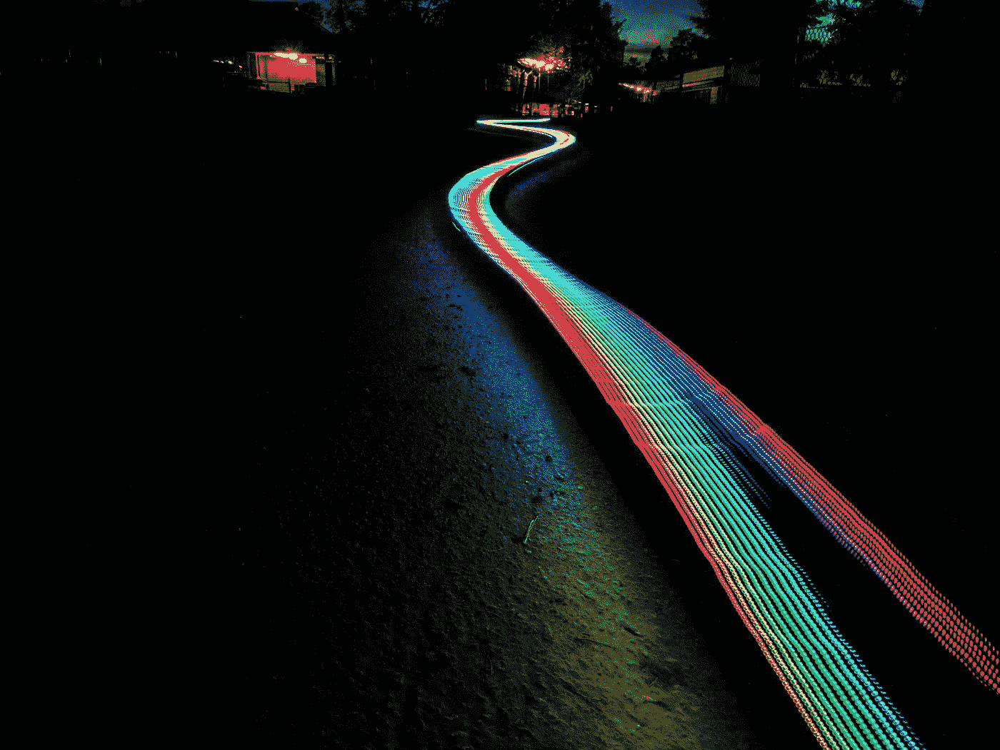

# 揭开电动势的神秘面纱

> 原文：<https://medium.com/swlh/demystifying-emf-a3091b5f9d6d>

## 电磁场、光波和人类不可见辐射的介绍。

Photo by Tobias Carlsson on Unsplash

电磁辐射或*电磁场(EMF)* 在我们的环境中无处不在，很难避免。EMF 既有自然产生的(例如来自太阳的可见光),也有人工产生的(来自 LED 的光；AM/FM 收音机、智能手机和 Wi-Fi 路由器的通信波；医疗检查用的 x 光片…