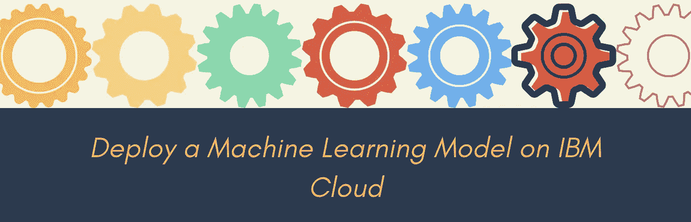

# 在 IBM Cloud 上部署 scikit-learn 模型

> 原文：<https://medium.com/swlh/deploy-sckilit-learn-models-on-ibm-cloud-134b76ad866e>

我[上周](/@lidderupk/data-science-without-much-coding-thats-the-future-like-it-or-not-️-ff518fe10a48)写了数据科学行业如何走向无代码的前景，其中**一些平凡的和度量驱动的任务正在自动化，中间决策正在为数据科学家做出**。不要误解我。作为一名实践数据科学家，您仍然需要了解不同的模型、超参数，并对整个过程有一种直觉。您仍将花费…