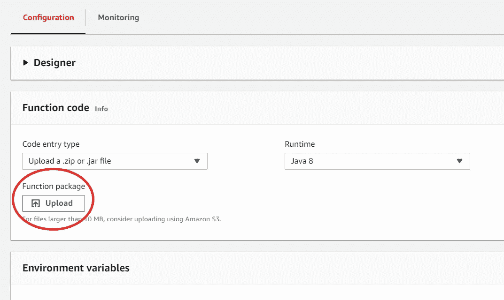

# 使用 Maven 将 Java 包部署到 AWS Lambda

> 原文：<https://medium.com/swlh/deploying-a-java-package-to-aws-lambda-with-maven-8ecb25ce6443>


Picture by: Valve Software [CC BY-SA 4.0 ([https://creativecommons.org/licenses/by-sa/4.0](https://creativecommons.org/licenses/by-sa/4.0))]

将代码部署到 AWS Lambda 可能是一件轻而易举的事情，尤其是当您使用的语言可以在 Lambda 的内部文本编辑器中编写时，比如 Node.js 或 Python，而不是 Java。

为了在 Java 中将一个函数部署到 Lambda，首先需要将它打包到一个 jar 或 zip 文件中。尽管这看起来是一个简单的任务，但对于缺乏 Maven 和 Gradle 经验的 Java 开发人员来说，这可能是一个挑战。

现在，这很好。然而，问题是，为了让它在适当的。拉链还是。jar 格式，需要使用包管理器，如 [Maven](https://maven.apache.org/index.html) 或 [Gradle](https://gradle.org/) 。(利用 [AWS SDK](https://aws.amazon.com/tools/) 的 Eclipse 插件[是另一种选择)。](https://docs.aws.amazon.com/lambda/latest/dg/java-author-using-eclipse-sdk-plugin.html)

在本教程中，我将使用命令行引导您完成 Maven 的整个过程。

**入门:**

*   安装所需的软件
*   创建新项目来测试 Lambda

**为 Maven 配置项目:**

*   确保项目可以用 Maven 编译
*   为 Maven 添加 AWS 依赖项

**整理完毕**

*   编译项目
*   将项目上传到 Lambda

# 入门指南

在我们需要将我们的包部署到 lambda 之前，我们首先需要确保我们已经安装了 maven，并且我们有一个可以与 AWS Lambda 接口的 Java 项目。

## 安装所需的软件

在你做任何事情之前，[在你的电脑上安装 maven](https://maven.apache.org/download.cgi) 。一旦你安装好了，进入你的终端，运行`mvn --version`来检查它的配置是否正确

您应该会得到类似于以下内容的响应:

```
Apache Maven 3.6.0 (97c98ec64a1fdfee7767ce5...; 2018-10-24T14:41:47-04:00)
```

## 创建新项目来测试 Lambda

在您最喜欢的 Java IDE(我的是 [Intellij](https://www.jetbrains.com/idea/) )中，创建一个新的 *maven* 项目。在您的 *src* 目录中，创建一个名为 *example 的包。然后在*示例*中，创建一个名为 *Hello 的新 Java 类。*删除自动生成的代码，添加以下代码(取自 [AWS 文档](https://docs.aws.amazon.com/lambda/latest/dg/java-handler-io-type-stream.html)):*

```
package example;import java.io.InputStream;
import java.io.OutputStream;
import com.amazonaws.services.lambda.runtime.RequestStreamHandler;
import com.amazonaws.services.lambda.runtime.Context;public class Hello implements RequestStreamHandler{
    public void handleRequest(InputStream inputStream, OutputStream outputStream, Context context) throws IOException {
        int letter;
        while((letter = inputStream.read()) != -1)
        {
            outputStream.write(Character.toUpperCase(letter));
        }
    }
}
```

在本教程中，我将使用 [Git Bash](https://git-scm.com/downloads) for Windows。然而，任何终端都可以工作。打开终端后，使用`cd <path to directory>`导航到想要在 Lambda 上部署的项目的根目录。

**注意:**如果 mvn isntall 说您指向了错误的路径，请将 JAVA_HOME 环境系统变量设置为程序文件中的 jdk

# 为 Maven 配置项目

如果您最初创建的项目是一个 maven 项目，那么您应该已经准备好编译它并将其升级到 AWS Lambda！

否则，按照下面的步骤将其配置为一个。

## 确保项目可以用 Maven 编译

首先，您需要在项目的主目录中添加一个 pom.xml(项目对象模型)。pom.xml 包含项目的元数据，比如什么类应该被视为项目入口点，以及项目需要什么依赖项。

你可以在 maven 网站上的这里找到 pom.xml 示例的列表[。您还可以使用下面的代码片段作为模板来构建 pom.xml 文件。](https://maven.apache.org/guides/introduction/introduction-to-the-pom.html)

```
<project>
  <modelVersion>4.0.0</modelVersion>
  <groupId>com.mycompany.app</groupId>
  <artifactId>my-app</artifactId>
  <version>1</version>
</project>
```

要使用命令行添加该文件，请导航到您的主项目目录，即包含 *src* 文件夹的目录，并运行`touch pom.xml`

这将创建一个 pom.xml 文件。接下来，键入`vim pom.xml`在 vim 编辑器中打开文件。按`i`键进入*插入*模式，同时按<shift>insert>将上述代码从剪贴板中粘贴出来。

按<escape>退出 vim 的插入模式，然后输入`wq!`并按<输入>保存并退出 Vim</escape>

## 为 Maven 添加 AWS 依赖项

为了与 AWS lambda 接口，您需要在代码中导入 *RequestStreamHandler* 。

使用 Maven，任何导入都需要在 pom.xml 文件中指定，在这里它们被称为*依赖项。*

对于 *RequestStreamHandler* 您需要的特定依赖关系是 *aws-lambda-java-core* 依赖关系。要将它添加到 pom.xml 文件中，请再次在 Vim 中打开它，并将下面的代码添加到`<project>...</project>`标记中。

```
<dependencies>    
    <dependency>
        <groupId>com.amazonaws</groupId>
        <artifactId>aws-lambda-java-core</artifactId>
        <version>1.0.0</version>
    </dependency>
</dependencies>
```

单独的依赖关系包含在`<dependency>`标签中，而那些依赖关系包含在`<dependencies>`标签中。

当使用 maven 编译项目时，这些依赖项列表将用于从在线存储库中下载相应的源代码到您的项目中。

# 收尾工作

一旦你建立了一个项目并准备好与 AWS Lambda 集成，就该用 Maven 编译它了！

## 编译您的项目

在您的终端中，导航到主*项目*目录。这个目录包含您的 pom.xml 和 *src* 目录。

运行`mvn install`

如果您的代码编译成功，您应该会看到这样的输出(**图 1** )以及*构建成功*:


**Fig. 1\.** Maven built successfully (Picture by: Michael Madden)

## 将项目上传到 Lambda

一旦编译成功，就该上传。jar 文件 maven 已创建。

这个文件将位于 maven 创建的*目标*目录中。该文件的路径将是

```
<Your Project directory>/target/<NameOfProject-SNAPSHOT.jar>
```

在 AWS 中打开 Lambda 控制台，转到要上传该项目的函数，选择 *upload zip 或。jar 文件如* ***图 2*** *所示。*



**Fig. 2\.** Upload the .jar file (Picture by: Michael Madden)

恭喜你！您已经成功地将 Java 包部署到 AWS Lambda 了！