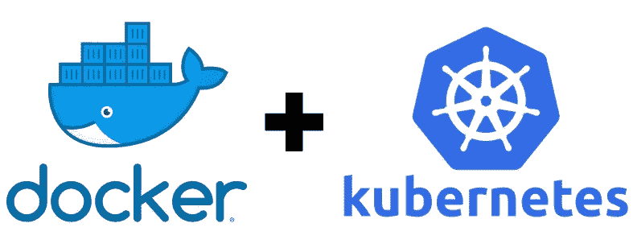

# 使用 Docker 在 Kubernetes 上部署 NodeJs (ExpressJs)项目，同时进行 kubernetes HTTPS 活动健康检查

> 原文：<https://medium.com/swlh/deploying-nodejs-expressjs-project-with-docker-on-kubernetes-along-with-a-kubernetes-https-5d62b059d205>

*先决条件:Nodejs 理解，Kubernetes/Docker 架构理论*

我们将学习如何:

1.将 expressjs 应用程序(docker 映像)部署到 kubernetes